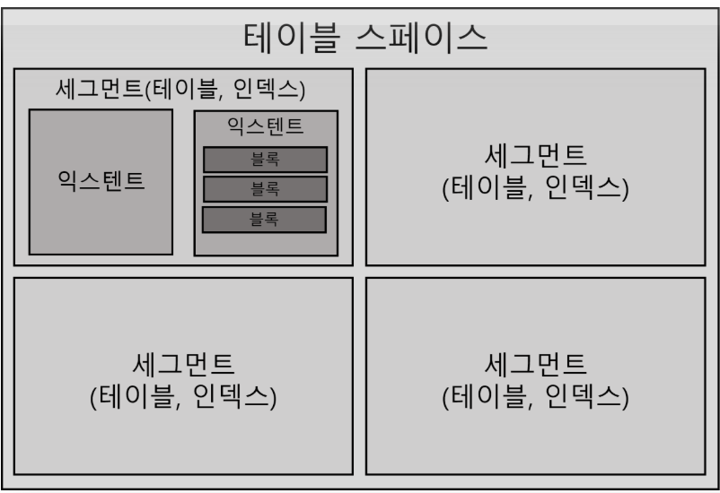

# 1.2.2 바인드 변수의 중요성 

이어서
## 공유 기능 SQL

라이브러리 캐시에서 SQL을 찾기 위해 사용하는 키 값이 'SQL 문 그 자체'이므로 

아래는 모두 다른 SQL이다. 

의미적으로는 모두 같지만, 

실행할 때 각각 최적화를 진행 / 라이브러리 캐시에서 별도 공간 사용

```sql
SELECT * FROM emp WHERE empno = 7900;
select * from EMP where EMPNO = 7900;
select * from emp where empno = 7900;
select * from emp where empno = 7900 ;
select * from emo where empno = 7900  ;
select * from scott.emp where empno =7900;
select /* comment */ * from emp where empno =7900;
select /*+ first_rows */ * from emp where empno = 7900;
```


> ### 상황 
> 
> - 500만 고객을 보유한 어떤 쇼핑몰
> - 로그인 모듈 담당 개발자가 프로그램을 아래와 같이 작성.
>     ```java
>       public void login(String login_id) throws Exception {
>       String SQLStmt = "SELECT * FROM CUSTOMER WHERE LOGIN_ID = " + login_id + "";
>       Statement st = con.createStatement();
>       ResultSet rs = st.executeQuery(SQLStmt);
>       
>           if (rs.next()) {
>               // do anything
>           }
>       
>           rs.close();
>           st.close();
>       }
>       
>     ```
> - 12시 정각부터 딱 30분간 큰 할인 이벤트를 하기로 함. 
> - 500만 명중 20%에 해당하는 100만 고객이 이벤트 당일 12시를 전후해 동시에 시스템 접속을 시도할 경우 어떤 일이 발생할까?
 
#### 로그인이 제대로 처리되지 않을 것이다.

DBMS에 발생하는 부하는 대개 과도한 I/0가 원인이다.

위의 상황은 I/0가 겨의 발생하지 않음에도 불구하고 

- CPU 사용률은 급격히 올라감 
- 라이브러리 캐시에 발생하는 여러 종류의 경합 문제
  - 각 고객에 대해 동시다발적으로 발생하는 SQL 하드파싱 때문 
    - 그 순간 라이브러리 캐시(V$SQL)를 조회해 보면, 아래와 같은 SQL로 가득 차 있다.

로 가득 차 있다.
```sql
SELECT * FROM CUSTOMER WHERE LOGIN_ID = 'oraking'
SELECT * FROM CUSTOMER WHERE LOGIN_ID = 'javaking'
SELECT * FROM CUSTOMER WHERE LOGIN_ID = 'tommy'
SELECT * FROM CUSTOMER WHERE LOGIN_ID = 'karajan'
...
```

로그인 프로그램을 이렇게 작성하면. 고객이 로그인한 때마다 아래와 같이 DBMS 내부 프로시저를 하나씩 만들어서 라이브러리 캐시에 적재하는 샘이다. 
> 내부 프로시저 만드는 역할 - SQL 옵티마이저와 로우 소스 생성기가 담당한다고 앞서 설명했다.
```sql
create procedure LOGIN_ORAKING() {}
create procedure LOGIN_JAVAKING() {}
create procedure LOGIN_TOMMY() {}
create procedure LOGIN_KARAJAN(){}
...
```

- 위 프로시저의 내부 처리 루틴은 모두 같다
  - ➡️ 프로시저를 여러 개 생성이 아닌, 아래처럼 로그인ID를 파라미터로 받는 프로시저 하나를 공유하면서 재사용하는것이 좋다.
```sql
create procedure LOGIN (login_id in varchar2 ) {}
```

이처럼 파라미터 Driven 방식으로 SQL을 작성하는 방법이 바인드 변수다.

#### 수정하기
앞서 예를 든 쇼핑몰에서 로그인 프로그램을 아래와 같이 수정하고. 다시 실시한다.
```java
public void login(String login_id) throws Exception {
    String SQLStmt = "SELECT * FROM CUSTOMER WHERE LOGIN_ID = ?";
    PreparedStatement st = con.prepareStatement(SQLStmt);
    st.setString(1, login_id);
    ResultSet rs = st.executeQuery();

    if (rs.next()) {
        // do anything
    }

    rs.close();
    st.close();
}

```

하드파싱 이외에 다른 문제가 숨어 있는게 아니라면 할인 이벤트는 순조롭게 진행될 것이다. 

라이브러리 캐시를 조회해 보면, 로그인과 관련해서 아래 SQL 하나만 발견된다.
```sql
SELECT FROM CUSTOMER NHERE LOGIN ID = :1
```
이 SQL에 대한 하드파싱은 최초 한 번만 일어나고. 캐싱된 SQL을 100만 고객이 공유하면서 재사용한다.

# 1.3 데이터 저장 구조 및 I/O 메커니즘

I/O 튜닝이 곧 SQL 튜닝이라고 헤도 과언이 아니다. 

SQL 튜닝 원리를 제대로 이해하려면 I/O에 대한 이해가 중요하다. 

데이터 저장구조, 디스크 및 메모리에서 데이터를 읽는 메커니즘을 차례로 살펴보자.

# 1.3.1 SQL이 느린 이유

SQL이 느린 이유는 십중팔구 디스크 I/O 때문이다.

## I/O란 무엇일까? 

I/O = 잠(SLEEP)

OS 또는 I/O 서브시스템이 I/O를 처리하는 동안 프로세스는 잠을 자기 때문에 필자는 I/O = 잠(SLEEP) 이라 표현한다. 

프로세스가 일하지 않고 잠을 자는 이유는 여러 가지 가 있지만, I/O가 가장 대표적이고 절대 비중을 차지한다. 

> (메모리 캐시 I/O)는 뒤에서 다문다. 그때까지 I/O는 디스크 I/O물 말한다.

프로세스(Process)는 실행 중인 프로그램이며, 아래와 같은 생명주기를 갖는다.


- 생성(new) 이후 종료(terminated) 전까지 준비(ready)와 실행(running)과 대기(waiting) 상태를 반복한다. 
- 실행 중인 프로세스는 interrupt에 의헤 수시로 실행 준비 상태(Runnable Queue)로 전환했다가 다시 실행 상태로 전환한다. 

> 여러 프로세스가 하나의 CPU를 공유할 수 있지만. 특정 순간에는 하나의 프로세스만 CPU를 사용할 수 있기 때문에 이런 메커니즘이 필요하다.

interrupt 없이 열심히 일하던 프로세스도 디스크에서 데이터를 읽어야한 CPU를 OS에 반환하고 수면(waiting) 상태에서 I/O 완료를 기다린다. 

1. 정해진 OS 함수를 호출(I/O Call)하고 
2. CPU를 반환한 채 알람을 설정하고 
3. 대기 큐(Wait Queuc)에서 잠을 잔다.

프로세스가 잠을 자니 I/0가 많으면 성능이 느릴 수밖에 없다.

> 긴차세대 구축 사업을 거쳐 2017년에 새롭게 오픈한 대형 시스템 기준

- I/O Call 속도는 Single Block I/0 기준으로 평균 10ms쯤 된다. 
  - 초당 100 블록쯤 읽는 셈
- 큰 캐시를 가진 SAN 스토리지는 4~8ms쯤 된다. 
  - 초당 125~250 블록쯤 읽는 셈
- SSD까지 활용하는 최근 스토리지는 1~2ms, 
  - 초당 500~1,000 블록쯤 읽는 셈

스토리지 성능이 빨라지고 있지만, 기대에는 못 미친다. 

어떤 SQL이 Single Block I/0 방식으로 10,000 블록을 읽는다면, 가장 최신 스토리지에서도 10초 이상 기다려야 한다. 

- 전반적으로 I/0 튜닝이 안 된 시스템이라면,
  - 많은 프로세스에 의해 동시다발적으로 발생하는 I/O Call 때문에 디스크 경합이 심해지고 그만큼 대기 시간도 늘어난다. 
    - 10초가 아니라 20초를 기다려야 할 수도 있다는 뜻이다. 
      - SQL이 느린 이유가 바로 여기에 있다. 디스크 I/0 때문이다. 

I/O 메커니즘을 자세히 설명하기에 앞서 데이터베이스 저장 구조부터 살펴보자.

## 1.3.2 데이터베이스 저장 구조
데이터를 저장하려면 먼저 테이블스페이스를 생성해야 한다. 

- 테이블스페이스: 세그먼트를 담는 콘테이너로서. 여러 개의 데이터파일(디스크 상의 물리적인 OS 파일)로 구성된다.



테이블스페이스를 생성했으면 위처럼 세그먼트를 생성한다. 

- 세그먼트: 테이블, 인덱스처럼 데이터 저장공간이 필요한 오브젝트 
- 테이블, 인텍스를 생성할 때 데이터를 어떤 테이블스페이스에 저장할지를 지정한다.
- 세그먼트는 여러 익스텐트로 구성된다. 
  - 파티션 구조가 아니라면 
    - 테이블도 하나의 세그먼트
    - 인덱스도 하나의 세그먼트다. 
  - 테이블 또는 인텍스가 파티션 구조라면
    - 각 파티션이 하나의 세그먼트가 된다. 
- LOB 컬럼은 그 자체가 하나의 세그먼트를 구성하므로 자신이 속한 테이블과 다른 별도 공간에 값을 저장한다.
- 익스텐트: 공간을 확장하는 단위
  - 테이블이나 인덱스에 데이터를 입력하다가 공간이 부족해지면 해당 오브젝트가 속한 테이블스페이스로부터 익스텐트를 추가로 할당받는다. 
  - 익스텐트는 연속된 블록들의 집합이기도 하다.(그림처럼 연속된 여러 개의 데이터 블룩으로 구성)

- 익스텐트 단위로 공간을 확장하지만, 사용자가 입력한 레코드를 실제로 저장하는 공간은 데이터 블록이다. 

> 참고로, DB2, SQL Server 같은 DBMS는 블록 대신 페이지(page)라는 용어를 사용한다. 

한 블록은 하나의 테이블이 독점한다. 
- ➡️ 한 블록에 저장된 레코드는 모두 같은 테이블 레코드다.
 
> 다중 테이블 클러스터일 때는 한 블록에 여러 테이블 레코드가 같이 저장될 수 있다. 테이블 클러스터에 대해서는 3장 1절 7항(0.1.7)에서 다룬다.


한 익스텐트도 하나의 테이블이 독접한다. 
- ➡️ 한 익스텐트에 담긴 블록은 모두 같은 테이블 블록이다. 

> 참고로, MS-SQL Server는 한 익스텐트를 여러 오브책트가 같이 사용할 수도 있다.

### 데이터파일 간의 관계
테이블스페이스, 세그먼트, 익스텐트, 블록 간 관계뿐 아닌, 이들과 데이터파일 간의 관계도 알아둘 필요가 있다.

세그먼트 공간이 부족해지면 테이블스페이스로부터 익스텐트를 추가로 할당받는다.

세그먼트에 할당된 모든 익스텐트가 같은 데이터파일에 위치하는 것이 아닌, 서로 다른 데이터파일에 위치할 가능성이 더 높다. 

- 하나의 테이블스페이스를 여러 데이터파일로 구성하면, 파일 경합을 줄이기 위해 DBMS가 데이터를 가능한 한 여러 데이터파일로 분산해서 저장하기 때문이다.


