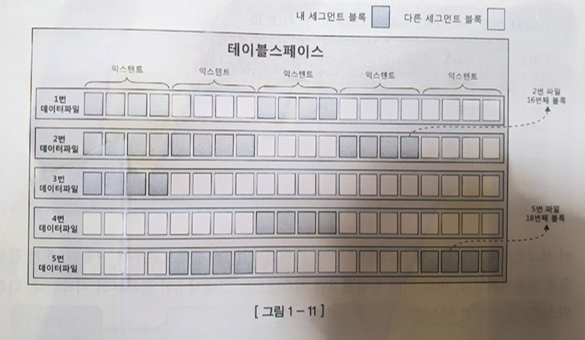

# SQL 처리 과정과 IO

---


### 



 - 익스텐트 내 블록은 서로 인접한 연속된 공간이지만, 익스텐트끼리는 연속된 공간이 아니다
 - 세그먼트에 할당된 익스텐트 목록을 조회할 수 있다.
   - Oracle은 세그먼트/익스텐트 관리가 굉장히 세밀하게 되어 있고 DBA_EXTENTS, DBA_SEGMENTS와 같은 데이터 딕셔너리 뷰를 통해 조회한다.

```oracle-sql
-- 특정 테이블의 익스텐트 목록 조회
SELECT segment_name,
       segment_type,
       tablespace_name,
       file_id,
       block_id,
       blocks
FROM dba_extents
WHERE segment_name = 'MY_TABLE';

-- 세그먼트 레벨 정보
SELECT segment_name,
       segment_type,
       tablespace_name,
       bytes/1024/1024 AS size_mb,
       extents
FROM dba_segments
WHERE segment_name = 'MY_TABLE';

```
 - PostgreSQL은 세그먼트라는 용어를 직접적으로 사용하지 않고 relfilenode 기반으로 파일 단위와 페이지 단위로 관리한다. 익스텐트 대신 8KB 블록을 연속으로 할당한다.

```postgres-sql

-- 테이블 파일 크기 확인
SELECT relname AS table_name,
       pg_relation_size(oid) AS table_bytes,
       pg_size_pretty(pg_relation_size(oid)) AS pretty_size
FROM pg_class
WHERE relname = 'my_table';

-- 세그먼트 파일명 조회
SELECT relfilenode
FROM pg_class
WHERE relname = 'my_table';
```

 - PostgreSQL에서는 익스텐트 개념이 없고 대신 내부적으로 1GB 단위로 세그먼트 파일을 나눈다.

 - MySQL InnoDB 스토리지 엔진은 익스텐트 단위로 64개의 페이지(16KB × 64 = 1MB)를 관리한다.
 - 오라클처럼 직접 조회하는 SQL 뷰는 없고 InnoDB 시스템 테이블 또는 INFORMATION_SCHEMA에서 간접적으로 확인한다.

 - 이를 통해 각 RDB에서 데이터베이스에서 특정 세그먼트가 디스크에서 어떻게 물리적으로 저장되어 있는지를 알 수 있다.

 - 오라클 기준

   | SEGMENT\_NAME | FILE\_ID | BLOCK\_ID | BLOCKS | BYTES   |
   | ------------- | -------- | --------- | ------ | ------- |
   | MY\_TABLE     | 7        | 128       | 64     | 524,288 |
   | MY\_TABLE     | 7        | 192       | 64     | 524,288 |

 - 이와 같이 해당 블록 아이디에 대해 얼마 만큼의 불록과 크기를 가지는지 알 수 있다.

> DBA(Data Block Address)
> 
> 모든 데이터 블록은 디스크 상 몇 번 데이터파일의 몇 번째 블록인지를 나타내는 자신만의 고유 값을 가진다. 이 주소값을 DBA라 하고 데이터를 읽으려면 DBA를 확인한다.
> 
> 인덱스를 통한 테이블 레코드를 읽을 때는 인덱스 ROWID를 이용하고 DBA + ROW 번호(블록 내 순번)로 구성 되므로 이를 분해하면 읽어야 할 테이블 레코드가 저장된 DBA를 알 수 있다.
> 테이블을 스캔할 떄는 테이블 세그먼트 헤더에 저장된 익스텐트 맵을 이용한다. 익스텐트 맵을 통해 각 익스텐트의 첫 번째 블록 DBA를 알 수 있다. 익스텐트는 연속된 데이터 블록의 집합이니 테이블 스캔시 연속된 블록을 읽으면 된다.

- 용어 정의
  - 블록 : 데이터를 읽고 쓰는 단위
  - 익스텐트 : 공간을 확장하는 단위. 연속된 블록의 집합
  - 세그먼트 : 데이터 저장공간이 필요한 오브젝트(테이블, 인덱스, 파티션, LOB 등)
  - 테이블스페이스 : 세그먼트를 담는 컨테이너
  - 데이터파일 : 디스크 상의 물리적인 OS 파일

### 1.3.3 블록 단위 I/O

 - 클라우드에 위치한 문서는 파일 단위로 저장하고 파일 단위로 읽는다.
 - 이때 파일 단위가 2GB라 가정하면 이 데이터를 읽고 쓰는 것은 부담이 매우 크다. 테이블 세그먼트 단위로 나누어 만약 이 단위가 100MB라 해도 부담이 크다.
 - 익스텐트는 공간을 확장하는 단위이고 블록이 DBMS가 데이터를 읽고 쓰는 단위이다.
 - 데이터 I/O 단위는 블록이므로 특정 레코드 하나를 읽고 싶어도 해당 블록을 통째로 읽는 수 밖에 없다.
 - OS 플랫 폼마다 블록 크기를 별도로 지원하고 각 DBMS도 사이즈 크기를 별도로 지원한다.

| DBMS               | 기본 블록(Page) 크기            | 변경 가능 여부                                                                | 비고                                |
| ------------------ | ------------------------- | ----------------------------------------------------------------------- | --------------------------------- |
| **Oracle**         | **8KB (8192 bytes)**      | 테이블스페이스 생성 시 2KB, 4KB, 8KB, 16KB, 32KB 선택 가능                            | 블록 크기 = `DB_BLOCK_SIZE`           |
| **PostgreSQL**     | **8KB**                   | 컴파일 시에만 변경 가능 (일반 운영 중 변경 불가)                                           | `BLCKSZ` 파라미터                     |
| **MySQL (InnoDB)** | **16KB (16384 bytes)**    | `innodb_page_size`로 4KB, 8KB, 16KB, 32KB, 64KB 중 선택 (InnoDB 테이블스페이스 단위) |                                   |

 - 대표적인 RDBMS에서 제공하는 블록 크기는 위과 같고 1KB의 데이터를 읽는다 해도 전체 블록을 읽어야 한다.
 - 테이블 뿐만 아닌 인덱스도 블록 단위로 데이터를 읽고 쓴다.


### 1.3.4 시퀀셜 액세스 vs 랜덤 액세스
 - 테이블 또는 인덱스 블록을 액세스(읽는) 방식으로는 시퀀셜 액세스와 랜던 액세스로 2가지가 있다.
   - 시퀀셜 액세스는 논리적, 물리적으로 연결된 순서에 따라 차례대로 블록을 읽는 방식이다. 인덱스 리프 블록은 앞뒤를 가리키는 주소값을 통해 논리적으로 서로 연결되어 있다.
   - 이 주소 값에 따라 앞 또는 뒤로 순차적으로 스캔하는 방식이 시퀀셜 액세스다.


   - 위 이미지에서 인덱스 쪽 굵은 실선 화살표이다.
   - 테이블 블록 간에는 논리적인 연결고리를 가지고 있지 않는다. 그래서 각 DB는 시퀀셜 방식으로 액세스 하는 방식을 각자 갖는다.
   - Oracle에서는 이를 세그먼트 헤더와 익스텐트 맵(Extent Map) 으로 관리한다.
   - MySQL은 오라클과 비슷하지만 명칭만 다르며, PK 기반 B+Tree로 관리되므로 PK 순으로 조회할 때는 이미 인덱스 시퀀셜 액세스가 가능하다.
   - Postgresql은 파일을 순차로 읽는다. 별도의 세그먼트 헤더 블록 없이도 파일 자체가 이미 순서 정보를 제공한다.

| DBMS               | 세그먼트/테이블 메타 관리              | Extent 관리     | 풀 스캔 시 시퀀셜 액세스 방식                  |
| ------------------ | --------------------------- | ------------- | ---------------------------------- |
| **Oracle**         | Segment Header + Extent Map | 64KB\~1MB 가변  | Segment Header 맵 참조                |
| **MySQL (InnoDB)** | Tablespace Header(FSP\_HDR) | 1MB(64 Page)  | FSP\_HDR 참조 + PK B+Tree 구조로 시퀀셜 가능 |
| **PostgreSQL**     | OS 파일 단위                    | 1MB 그룹        | 파일 순서 그대로 읽기                       |

   - 익스텐트 내의 블록을 포함해 테이블에 할당된 모든 블록을 순차적으로 읽는 것이 Table full scan이다.
   - 시퀀셜 액세스 그림을 보면 인덱스의 리프 노드만 순차적으로 읽기 때문에 풀스캔은 아니다.

 -  랜덤 액세스는 논리적, 물리적 순서를 따르지 않고 레코드 하나를 읽기 위해 한 블록식 접근하는 방식이다. 위 이미지에서 점선 화살표가 이에 해당한다.


| 구분     | **시퀀셜 액세스**              | **랜덤 액세스**           |
| ------ | ------------------------ | -------------------- |
| 방식     | 리프 노드를 **체인으로 순차적으로 탐색** | 특정 리프 노드를 **바로 점프**  |
| 블록 I/O | **연속적** → 디스크 효율 높음      | **비연속적** → 랜덤 I/O 많음 |
| 사용 사례  | 범위 검색, ORDER BY          | PK 조회, 특정 값 탐색       |


### 1.3.5 논리적 I/O vs 물리적 I/O
- DB 버퍼캐시
   - 디스크 I/O가 SQL 성능을 결정한다. SQL을 수행하는 과정에서 계속해서 데이터 블록을 읽는데, 자주 읽는 불록은 매번 디스크에서 읽는 것은 비효율적이므로 DBMS에서 데이터 캐싱 메커니즘은 필수이다.
   - 앞서 2절에서 SGA의 구성요소로 라이브러리 캐시를 봤는데, DB 버퍼캐시도 SGA의 가장 중요한 구성요소 중 하나이다.
   - 라이브러리 캐시가 SQL과 실행계획, DB 저장형 함수/프로시저 등을 캐싱하는 코드 캐시라 한다면 DB 버퍼는 데이터 캐시이다.
   - 데이터 블록을 캐싱해 DB I/O를 줄이는데 목적이 있다.
