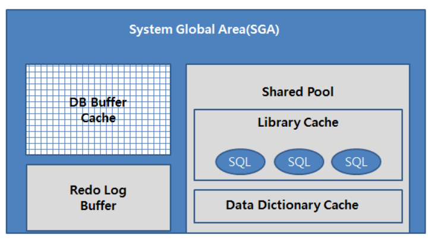
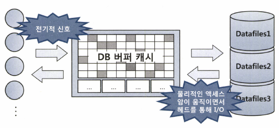

# SQL 처리 과정과 IO
## 1.3.5 논리적 I/O vs 물리적 I/O

### DB 버퍼캐시
- 디스크 I/O가 SQL 성능을 결정한다. 
- SQL을 수행하는 과정에서 계속해서 데이터 블록을 읽는데, 자주 읽는 불록은 매번 디스크에서 읽는 것은 비효율적이므로 DBMS에서 데이터 캐싱 메커니즘을 활용한다.



- DB 버퍼캐시도 SGA의 가장 중요한 구성요소 중 하나이다.
   - 라이브러리 캐시가 SQL과 실행계획, DB 저장형 함수/프로시저 등을 캐싱하는 코드 캐시라 한다면 DB 버퍼는 데이터 캐시이다.
- 디스크에서 읽은 데이터 블록을 캐싱해 같은 블록에 대한 반복적인 I/O Call을 줄일 수 있다.


- 서버 프로세스와 데이터 파일 사이에 버퍼 캐시가 존재하며, 데이터 블록을 읽을 때는 항상 버퍼캐시부터 탐색한다.

#### 오라클SQL*Plus 의 버퍼캐시 사이즈 확인법
```sql 
-- V$SGA 뷰를 통해 확인한다.
show sga
```

#### 논리적 블록 I/O
- SQL을 처리하는 과정에서 발생한 총 블록 I/O를 말한다.
- 거의 항상 메모리상의 버퍼 캐시를 경유하기 때문에 메모리 I/O가 곧 논리적 I/O라고 볼 수도 있다.
  - 다만 메모리를 경유하지 않는 Direct Path I/O까지 고려한다면 논리적 I/O 는 메모리 I/O와 Direct Path I/O를 더한 개념이다.
- SQL을 수행하며 읽은 총 블록 I/O가 논리적 I/O다.
  - SQL을 수행하기 위해서는 데이터가 담긴 블록을 읽어야 한다. 
  - SQL이 참조하는 테이블에 데이터를 입력하거나 삭제하지 않는 상황에서 조건절에 같은 변수 값을 입력하는 경우 매번 읽는 블록의 수는 같다.

#### 물리적 블록 I/O
- 디스크에서 발생한 총 블록 I/O를 말한다.
  - 읽어야 할 블록이 버퍼캐시에 없을 때에만 디스크를 액세스하므로 논리적 블록 I/O의 일부만 물리적으로 I/O 가 발생한다.
- 전기적 신호인 메모리 I/O에 비해 액세스 암을 통해 물리적으로 작동하므로 비교적 상당히 느리다.
  - 보통 10,000배 정도 느리며, 경합이 심한 경우 더 느리다.
- 물리적 I/O는 실행할 때마다 다른데, 연속해서 실행하는 경우 DB 버퍼캐시에서 해당 테이블 블록의 점유율이 높아지기 때문이다.
  - 한참 뒤 실행하면, DB 버퍼캐시가 다른 테이블 블록으로 채워지기 때문에 물리적 I/O 가 다시 늘어나게 된다.

#### 적정 블록 I/O 량
- SQL을 수행하는데 필요한 논리적 일량은 모두 다른다.
  - 아무리 최적화 해도 해당 SQL이 하고자 하는 일이 무엇이냐에 따라 블록 I/O 발생량은 천차만별이다.
- 검색 범위, 조인하는 테이블 갯수, 대상 테이블 크기, 인덱스 구조 등에 의해 결정된다.

### 버퍼캐시 히트율(Buffer Cache Hit Ratio, BCHR)
- 전통적인 지표
- 전체 읽은 블록 중에서 물리적인 디스크 I/O를 수반하지 않고 곧바로 메모리에서 찾은 비율을 나타낸다.
  - 온라인 트랜잭션을 주로 처리하는 애플리케이션이라면 시스템 레벨에서 평균 99%의 히트율을 달성해야 한다.
  - 핵심 트랜잭션이 시스템 부하의 대부분이므로, 핵심 트랜잭션 위주로 튜닝하여 달성할 수 있다.

#### BCHR 공식
- (캐시에서 곧바로 찾은 블록 수 / 총 읽은 블록 수) * 100
- ((논리적 I/O - 물리적 I/O) / 논리적 I/O) * 100
- (1 - 물리적 I/O / 논리적 I/O) * 100

#### 성능 향상을 위한 방안
- 물리적 I/O = 논리적 I/O * (100% - BCHR)
- SQL 성능을 향상하려면 물리적 I/O 가 아닌 논리적 I/O를 줄여야 한다.
  - 논리적 I/O는 일정하므로 물리적 I/O는 BCHR에 의해 결정된다.
  - BCHR은 시스템 상황에 따라 달라지므로 결국 물리적 I/O는 통제 불가능한 외생변수다.
    - 메모리 증설 을 통해 DB 버퍼 캐시를 늘리는 방법 외엔 줄일 방법은 없다.
  - 즉, SQL 성능을 높이기 위해서 할 수 있는 일은 논리적 I/O를 줄이는 일뿐이다.
  - 논리적 I/O를 줄이면 결국 물리적 I/O도 줄어든다.
- 논리적 I/O를 줄이기 위해서는 SQL을 튜닝해서 읽는 총 블록 개수를 줄인다.
  - 논리적 I/O는 항상 일정하게 발생하지만, SQL 튜닝을 이용해서 줄일 수 있는 통제 가능한 내생변수다.

#### SQL 트레이스를 통해 수집한 Call 통계 보를 활용해 BCHR 계산
- Query(Consistent 모드로 읽은 블록 수)와 Current(Current 모드로 읽은 블록 수) 항목을 더한 값이 논리적 I/O 이며 Disk 항복은 디스크에서 물리적으로 읽은 블록의 갯수를 의미한다.
  - Consistent 모드(트랜잭션 시작 시점의 과거 데이터)나 Current 모드(최신 커밋된 데이터)는 MVCC 와 관련된 모
- BCHR = (1 - (Disk / (Query + Current)))

## 1.3.6 Single Block I/O vs Multiblock I/O
- 캐시에서 찾지 못한 데이터 블록은 I/O Call을 통해 디스크에서 DB 버퍼캐시로 적재하고서 읽는다. 
- I/O Call 할 때, 한 번에 한 블록씩 요청하기도 하고, 여러 블록씩 요청하기도 한다.

### Single Block I/O
- 한 번에 한 블록씩 요청해서 메모리에 적재하는 방식
### Multiblock I/O
- 한 번에 여러 블록씩 요청해서 메모리에 적재하는 방식

#### Single Block I/O 대상 오퍼레이션
- 인덱스를 이용할 때는 기본적으로 인덱스와 테이블 블록 모두 Single Block I/O 방식을 사용한다.
1. 인덱스 루트 블록 읽는 경우
2. 인덱스 루트 블록에서 얻은 주소 정보로 브랜치 블록 읽는 경우
3. 인덱스 브랜치 블록에서 얻은 주소 정보로 리프 블록을 읽는 경우
4. 인덱스 리프 블록에서 얻은 주소 정보로 테이블 블록을 읽는 경우

#### Multiblock I/O 대상 오퍼레이션
- 반대로, 많은 데이터 블록을 읽을 때는 Multiblock I/O 방식이 효율적이다. 
- 인덱스를 이용하지 않고 테이블 전체를 스캔할 때 이 방식을 사용한다. 
- 대용량 테이블을 풀 스캔할 때 Multiblock I/O 단위를 크게 설정하면 성능이 좋아질 수 있다.