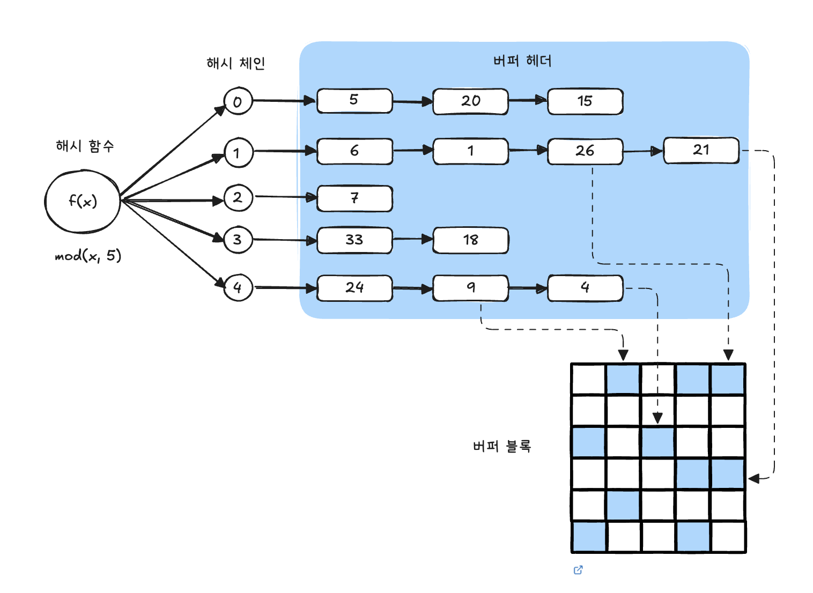

## 1.3.6 Single Block I/O vs. Multi Block I/O
### MultiBlock I/O
- 캐시에서 찾지 못한 특정 블록을 읽으려고 I/O call 할 때 디스크 상에 그 블록과 `인접한` 블록들을 한꺼번에 읽어 캐시에 미리 적재하는 기능
- DBMS 블록 사이즈에 상관 없이, OS 단에서는 보통 IMB 단위로 I/O를 수행하며 이는 OS 에따라 다를 수 있다.
- 책에서는 이를 1MB 크기의 `손수레` 라고 표현한다.- 테이블 전체 블록을 읽을 때는 손수레에 한 번에 담을 수 있는 만큼 최대한 많이 담아야 유리하다.
- 이 양은 `db_file_multiblock_read_count` 파라미터로 정한다.
```sqlSQL> show parameter db_file_multiblock_read_count
NAME                             TYPE     VALUE
-------------------------------- -------- -----
db_file_multiblock_read_count    integer  16

SQL> alter session set db_file_multiblock_read_count = 128;

세션이 변경되었습니다.
```

- 일반적으로 OS레벨 I/O 단위가 1MB, 오라클 레벨 I/O 단위가 8KB 이므로 이 파라미터를 128로 설정하면 담을 수 있는 만큼 최대한 담게 된다. `(8KB * 128 = 1MB)`
- 이 이상 설정해도 OS 레벨 이상의 데이터 크기를 읽을 수 없으므로 소용없다. (오라클 레벨에서 그렇게 설정해도 OS 는 자신의 I/O 단위만큼씩만 읽는다.)

> 인접한 블록? <br>
>  같은 익스텐트에 속한 블록을 의미한다. 이는 MultiBlock I/O 방식으로 읽더라도 익스텐트 경계를 넘지 못한다는 뜻이다. (한번의 I/O에서는 한 익스텐트 내의 연속된 블록까지만 읽을 수 있다.) <br>
>  예를 들어, 한 익스텐트에 20개 블록이 담겨 있고 Multiblock I/O 단위가 8이라고 할 때 세 번째 I/O Call에서는 네 개 블록만 읽게 된다 (8 + 8 + 4)
>>건재상 벽돌이 떨어졌다고 해서 바로 다른 건재상을 찾는 것이 아니라, 손수레에 담긴 벽돌을 일단 작업장으로 옮긴 후 다른 건재상을 찾는다.

#### MultiBlck I/O 중간에 왜 SingleBlock I/O가 나타나는가

Multiblock I/O 단위를 4(연속적으로 읽을 수 있는 익스텐트 내의 블럭 최대 수)라고 가정하자. 그리고 익스텐트 맵을 통해 읽어야 할 블록이 `1번부터 10번까지` 있다고 하자. 이때 버퍼 캐시에 `1번, 6번, 8번 블록`이 이미 존재한다고 가정해 보자.

- 1번 블록은 캐시에서 바로 찾았으므로 디스크 I/O가 발생하지 않는다.
- 2번에서 5번까지는 캐시에 존재하지 않으므로 4블록을 한꺼번에 Multiblock I/O 방식으로 디스크에서 읽는다.
- 6번 블록은 캐시에 있으므로 디스크 I/O가 발생하지 않는다.
- 7번 블록은 캐시에 없지만, 연속된 8번 블록은 이미 캐시에 있다. 이 경우 7~8번을 Multiblock으로 읽을 수 없으므로, 오라클은 7번 블록만 Single Block I/O 방식으로 디스크에서 읽는다.
- 9번과 10번은 모두 캐시에 없고, 10번은 익스텐트의 마지막 블록이므로 Multiblock I/O 방식으로 두 블록을 함께 읽는다.

정리하면, Multiblock I/O는 연속된 블록을 한꺼번에 읽을 수 있을 때만 동작한다. 
그러나 그 범위 안에 이미 캐시에 존재하는 블록이 섞여 있으면 Multiblock I/O는 깨지고, 해당 블록은 Single Block I/O로 처리된다. 따라서 Full Table Scan 과정에서도 Multiblock과 Single Block이 뒤섞여 나타나는 것이다.

## 1.3.7 Table Full Scan vs. Index Range Scan

#### 테이블에 저장된 데이터를 읽는 방식
  - 테이블 전체를 스캔해서 읽는 방식 (Table Full Scan)
    - 테이블에 속한 블록 `전체` 를 읽어서 사용자가 원하는 데이터를 찾는 방식
  - 인덱스를 이용해서 읽는 방식 (Index Range Scan, **인덱스를 이용한 테이블 액세스**)
    - 인덱스에서 `일정량` 을 스캔하면서 얻은 `ROWID`로 테이블 레코드를 찾아가는 방식
      - ROWID : 테이블 레코드가 디스크 상에 어디 저장되었는지 가리키는 위치 정보

#### Table Full Scan 찾아내기식 실행계획 분석은 SQL 성능을 향상하는 데 큰 도움이 되지 않는다.

- 대부분의 쿼리 툴이 실행계획에서 `Table Full Scan`을 빨간색으로 표시해준다.
- 인덱스를 사용해야 하는 상황에 `Table Full Scan` 하는 경우는 의미가 있겠지만, 인덱스가 SQL 성능을 떨어뜨리는 경우도 상당히 많다. 
- 한번에 많은 데이터를 처리하는 집계용 SQL, 배치 프로그램 등에서는 상당수가 `Table Full Scan`으로 유도하면 성능이 빨라진다.
  - 조인을 포함한 SQL이면, 조인 메서드로 해시 조인을 선택해주면 된다.
>### 참고
> - Nested Loop Join: 드라이빙 테이블에서 추출한 건마다 상대 테이블을 반복적으로 탐색한다. → 건수가 많아질수록 반복 횟수가 폭증한다. 
> - Sort Merge Join: 두 집합을 각각 정렬한 뒤 병합한다. 대량 데이터에서는 정렬 비용이 크다. 
> - Hash Join: 한 집합을 메모리에 해시 테이블로 만든 뒤, 다른 집합을 스캔하며 해시 탐색으로 매칭한다. 정렬 과정이 없고, 블록 단위로 처리 가능하다. <br> 
> #### Full Scan + Hash Join의 조합
> - Full Scan은 어차피 테이블 전체를 읽으므로 "대량 데이터"를 가져오는데 최적화되어 있다. 
> - 해시 조인은 정렬이 필요 없고, 대량 데이터 매칭을 효율적으로 수행한다. 
> - 대용량 테이블을 Full Scan으로 읽고, 바로 해시 조인으로 매칭시키면 디스크 I/O와 CPU 사용량의 균형이 맞아 성능이 좋아진다.


#### 인덱스를 이용하는데 왜 성능이 더 느릴까?

- Table Full Scan은 시퀀셜 액세스 + MultiBlock I/O 방식으로 디스크 블록을 읽는다.
  - 한 블록에 속한 레코드를 한 번에 읽어 들이고, 캐시에서 못찾으면 한번의 `I/O Call`을 통해 인접한 수십~수백 개 블록을 한꺼번에 I/O 하는 매커니즘이다. 
  - 스토리지 스캔 성능이 좋아지는 만큼 성능도 좋아진다.
  - 시퀀셜 액세스 + MultiBlock I/O 가 아무리 좋아도, 큰 테이블에서 소량 데이터를 검색할 때는 인덱스를 이용해야 한다. 
- Index Range Scan 을 통한 테이블 액세스는 랜덤 액세스와 Single Block I/O 방식으로 디스크 블록을 읽는다. 
  - 캐시에서 블록을 못 찾으면 `레코드 하나를 읽기 위해 매번 잠을 자는 I/O 매커니즘` 이다.
  - 따라서 많은 데이터를 읽을 때는 Table Full Scan 보다 불리하다.
  - 이 방식을 사용하는 SQL은 스토리지 스캔 성능이 수십 배 좋아져도 성능이 조금 밖에 좋아지지 않는다.
  - 게다가 이 방식은 읽었던 블록을 반복해서 읽는 비효율이 있다. (논리 I/O 측면에서도 불리)
    - 한 블록에 평균 500 레코드가 있으면 같은 블록을 최대 500번 읽을 수 있다. 
    - 인덱스를 이용해 `전체 레코드`를 액세스 한다면 모든 블록을 평균 500번씩 읽게 되는 셈이다.
    - 각 블록을 단 한번만 읽는 Table Full Scan보다 훨씬 불리하다.

>- 인덱스는 큰 테이블에서 아주 적은 일부 데이터를 빨리 찾기 위한 도구일 뿐이므로 모든 성능 문제를 인덱스로 해결하려 해선 안된다. <br> 읽을 데이터가 일정량을 넘으면 인덱스보다 Table Full Scan이 유리하다.
>- 책에서는 짧은 기간에 뛰어난 성과를 보인 프로젝트 내에서 대부분의 SQL 개선 포인트가 `힌트를 이용한 Table Full Scan 유도` 였다는 경험을 공유하며, 예상 카디널리티가 일정량을 넘어서는 경우에 인덱스를 사용하는 것을 주의할 것을 권한다.

## 1.3.8 캐시 탐색 매커니즘
- Direct Path I/O 를 제외한 모든 블록 I/O는 메모리 버퍼 캐시를 경유한다.
- 버퍼 캐시 탐색 과정을 거치는 오퍼레이션
    - 인덱스 루트 블록을 읽을 때
    - 인덱스 루트 블록에서 얻은 주소 정보로 브랜치 블록을 읽을 때
    - 인덱스 브랜치 블록에서 얻은 주소 정보로 리프 블록을 읽을 때
    - 인덱스 리프 블록에서 얻은 주소 정보로 테이블 블록을 읽을 때
    - 테이블 블록을 Full Scan 할 때
        - 이 경우에는 읽어야 할 블록 목록을 익스텐트 맵에서 얻는다.

#### 버퍼 캐시 구조

###### 그림 1.27 - 해시함수로 모듈러 함수를 사용하는 경우를 표현하고 있다



> 참고로 모든 데이터 블록은 디스크 상에서 몇 번 데이터파일의 몇 번째 블록인지를 나타내는 자신만의 고유 주소를 가지며, 이를 DBA라고 부른다. (파일 번호 + 블록 번호)
- 예를 들어 버퍼 캐시에서 20번 블록을 찾고자 한다
    - 블록 번호를 5로 나누면 나머지가 0이므로, 이 블록이 캐싱되어 있다면 버퍼 헤더가 첫 번째 해시 체인(해시 값 = 0)에 연결되어 있을 것이므로 항상 첫 번째 해시 체인만 탐색하면 된다.
- 다른 예로 27번의 경우,
    - 블록 번호를 5로 나누면 나머지가 2이다. 만약 이 블록이 캐싱돼 있다면 버퍼 헤더는 세 번째 해시 체인(해시 값 = 2)에 있을 것이다.
    - 그림의 세 번째 해시 체인에는 27번 블록이 보이지 않는다.
    - 세 번째 체인에 없다고 해서 다른 해시 체인을 탐색할 필요가 없다.
    - 디스크로부터 읽어서 세 번째 체인에 연결해 읽으면 된다.

```
			해시 알고리즘              포인터
찾으려는 블록 ------------> 버퍼 헤더 ---------> 버퍼 블록 액세스
```

- 찾으려는 블록을 찾을 때 이처럼 해시 알고리즘으로 버퍼 헤더를 찾고, 거기서 얻은 포인터로 버퍼 블록을 액세스 하는 방식을 사용한다
    - 버퍼 헤더에는 “실제 블록 데이터”가 담긴 **버퍼 블록**의 메모리 주소(포인터)가 담겨있다.

> 해시 구조의 특징
> - 같은 입력 값은 항상 동일한 해시 체인(=버킷)에 연결됨
> - 다른 입력 값이 동일한 해시 체인에 연결될 수 있음
> - 해시 체인 내에서는 정렬이 보장되지 않음

#### 메모리 공유자원에 대한 액세스 직렬화
- 버퍼캐시는 SGA(System Global Area) 구성요소이므로 버퍼캐시에 캐싱된 버퍼블록은 모두 공유자원이다.
  공유 자원은 말 대로 모두에게 권한이 있기 때문에 누구나 접근할 수 있다.
- 문제는 하나의 버퍼 블록을 두 개 이상 프로세스가 `동시에` 접근하려고 할 때 발생한다.
- 동시에 접근하면 블록 정합성에 문제가 생길 수 있기 때문이다.
  따라서 자원을 공유하는 것처럼 보여도 내부에선 한 프로세스씩 순차적으로 접근하도록 구현해야 하며, 이를 위해 직렬화 (Serialization) 매커니즘이 필요하다. (줄세우기)

> 책에서는 공유 경제, 카 쉐어링 서비스를 예로 들며 한 자동차를 여럿이 함께 사용하는 것 처럼 보이지만, 어느 한순간에는 한 사람만 자동차를 사용할 수 있으며, 누군가 자동차를 사용하는 순간 다른사람은 줄 서서 기다려야 한다 라는 예시를 들며 실제로는 `같이쓰는게 아닌 교대로 쓰는거다` 라는 내용을 전달한다.

- 경제를 `캐시` 로 치환해 보았을 때도 공유 캐시의 특정 자원을 두 개 이상 같이 사용할 수 없으며, 같이 사용하는 것 처럼 보이지만 특정 순간에는 한 프로세스만 사용 할 수 있으며 그 순간 다른프로세스는 줄 서서 기다려야 한다.
- 이런 줄서기가 가능하도록 지원하는 매커니즘이 `latch` 이다.

>### 캐시 버퍼 체인 래치
>대량의 데이터를 읽을 때 모든 블록에 대해 해시 체인을 탐색한다.<br>
>DBA를 해시 함수에 입력하고 거기서 반환된 값으로 스캔해야 할 해시 체인을 찾는다. 해시 체인을 스캔하는 동안 다른 프로세스가 체인 구조를 변경하는 일이 생기면 곤란하다. <br>
>이를 막기 위해 해시 체인 래치가 존재한다. 위의 그림에서 0부터 4까지 다섯 개 체인 앞쪽에 자물쇠가 있다고 생각하면 된다. 자물쇠를 열 수 있는 키를 획득한 프로세스만이 체인으로 진입할 수 있다. (같은 체인에는 한번에 하나의 프로세스만 접근할 수 있다

SGA를 구성하는 서브 캐시마다 별도의 래피가 존재하는데, 버퍼 캐시에는 `캐시버퍼 체인 래치`, `캐시버퍼 LRU 체인 래치` 등이 작동한다. 빠른 데이터베이스를 구현하려면 버퍼 캐시 히트율을 높여야 하지만, 캐시 I/O도 생각만큼 빠르지 않을 수 있다. 이들 래치에 의한 경합이 생길 수 있기 때문이다.

캐시버퍼 체인 뿐 아니라 버퍼블록 자체에도 직렬화 매커니즘이 존재한다. 이것이 `버퍼 Lock`이며, 이런 직렬화 매커니즘에 의한 캐시 경합을 줄이려면 `SQL 튜닝을 통해 쿼리 일 량 (논리적 I/O) 자체를 줄여야 한다.`


>### 버퍼 Lock
>읽고자 하는 블록을 찾았으면 캐시버퍼 체인 래치를 곧바로 해제해야 한다. 그래야 해당 래치가 풀리기를 기다리던 다른 프로세스들이 작업을 재개할 수 있다.<br>
>그런데 래치를 해제한 상태로 버퍼 블록 데이터를 읽고 쓰는 도중에 다른 프로세스가 같은 블록에 접근해서 데이터를 읽고 쓴다면 데이터 정합성에 문제가 생길 수 있다. <br>
>이를 방지하기 위해 오라클은 버퍼Lock을 사용한다. 캐시 버퍼 체인 래치를 해제하기 전에 버퍼 헤더에 Lock을 설정하므로써 버퍼 블록 자체에 대한 문제를 해결하는 것이다.
>>Low Lock을 설정하는 행위도 블록을 변경하는 작업이다. Low Lock을 설정하는 순간 거의 동시에 다른 프로세스가 해당 블록을 읽는다면 문제가 생긴다. 그 뿐 아니라 같은 블록에서 서로 다른 로우를 동시에 읽고 쓰는 경우를 막기 위해서도 버퍼 Lock은 필요하다.
