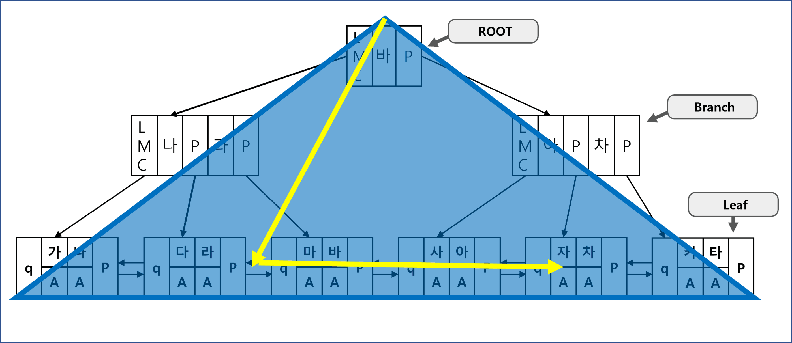
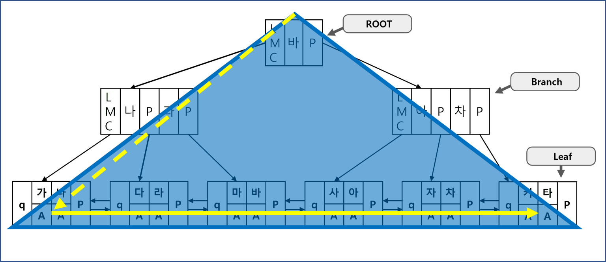
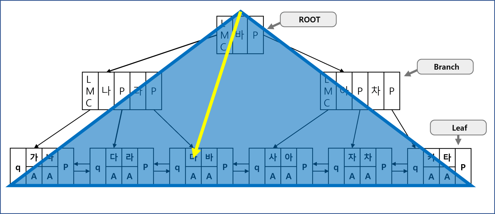
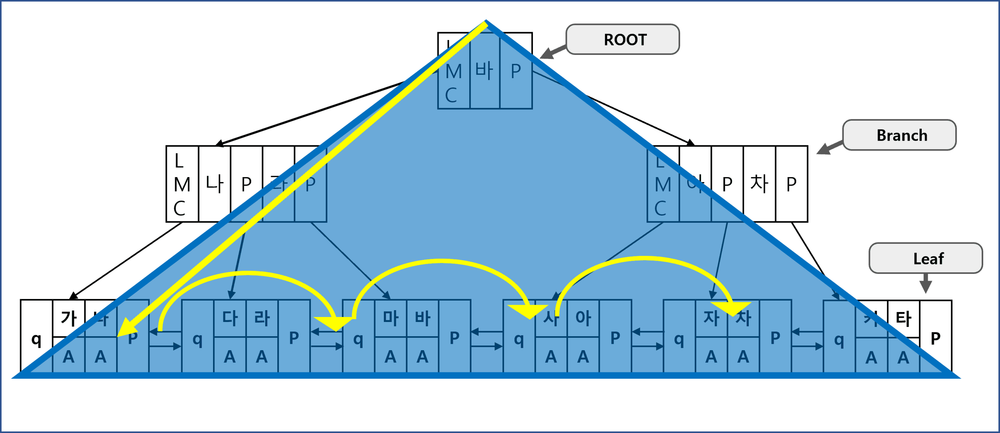

# 2.3 인덱스 확장기능 사용법

## 2.3.1 Index Range Scan

- B* Tree 인덱스의 가장 일반적이고 정상적인 형태의 액세스 방식을 말한다.
- 인덱스 루트에서 리프 블록까지 수직적 탐색을 수행한 다음, '필요한 범위(Range)'만 스캔한다.
- 인덱스 Range Sacn 을 사용하려면 항상 선두 컬럼을 가공하지 않은 상태로 조건절에 사용해야 한다.
    - 즉, 가공되지 않은 형태로 선두 컬럼을 조건절에 사용하면 Index Range Scan은 무조건 가능하다는 의미
- 그러나, 성능은 인덱스 스캔 범위, 테이블 액세스 횟수를 얼마나 줄일 수 있느냐로 결정되므로, Index Range Scan을 수행한다고 해서 항상 성능적으로 좋은 쿼리가 되는 것은 아니다.

```sql
INDEX (RANGE SCAN) OF 'SOME_IDX' (INDEX)
```
- 실행 계획에서 위와 같이 작성된다.

## 2.3.2 Index Full Scan

- 수직적 탐색없이 인덱스 리프 블록을 처음부터 끝까지 수평적으로 탐색하는 방식이다.
    - 리프 블록의 첫번째 주소는 인덱스 헤더에 저장되어 있다.
- Index Full Scan은 대개 데이터 검색을 위한 최적의 인덱스가 없을 때, 차선으로 선택된다.
    - 인덱스 선두 컬럼이 조건절에 없는 경우 Index Range Scan을 수행하지 못하고, 조건절의 컬럼이 인덱스 내에 후행 컬럼으로 있다면 Index Full Scan을 수행하여 필요한 레코드 탐색을 할 수 있다. 


```sql
INDEX (FULL SCAN) OF 'SOME_IDX' (INDEX)
```
- 실행 계획에서 위와 같이 작성된다.

### Index Full Scan의 효용성
- 사실 인덱스 선두 컬럼이 조건절에 없으면 옵티마이저는 먼저 'Table Full Scan'을 고려한다.
    - 그러나 대용량 테이블인 경우 Table Full Scan에 따른 부담이 크게 되므로, 옵티마이저는 인덱스 활용을 다시 고려한다.
- 데이터 저장 공간은 '컬럼 길이 * 레코드 수'에 의해 결정되기 때문에 인덱스가 차지하는 면적은 테이블보다 당연히 작다.
    - 만약 인덱스 스캔 단계에서 대부분의 레코드를 필터링하고 아주 일부만 테이블 액세스가 필요한 상황이라면, 면적이 작은 인덱스 테이블을 먼저 스캔하는 방법이 더 유리하다.
    - 즉, 결과적으로 전체 중 극히 일부 레코드만 조회하게 되는 경우를 말할 수 있다.
    - 이 경우 옵티마이저는 Index Full Scan을 차선책으로 선택한다.


### 인덱스를 이용한 소트 연산 생략
- 인덱스를 Full Scan 하는 경우에도 Range Scan과 마찬가지로 결과 집합이 인덱스 컬럼 순으로 정렬되므로, Sort Order By 연산을 생략할 목적으로 사용할 수 있다.
    - 이 경우엔 차선책이라기 보다 옵티마이저가 전략적으로 선택한 경우라고 할 수 있다.
- 예를 들어 대부분의 레코드가 조건절에 해당해서 다량의 테이블 액세스가 발생하는 경우, Index Full Scan을 하는 것이 오히려 Table Full Scan 보다 불리하다.
    - 만약 조건절에 인덱스 선두 컬럼이 포함되어서 Index Range Scan을 하는 경우라도 마찬가지다.
- 그럼에도 옵티마이저가 인덱스를 선택하는 경우가 있는데, 사용자가 아래와 같이 first_rows 힌트로 옵티마이저 모드를 바꾸는 경우이다.
```sql
select /*+ first_rows */ *
from table_name
where ...
```
- 소트 연산 생략하고 전체 집합 중 처음 일부를 빠르게 출력할 목적으로 옵티마이저가 Index Full Scan 방식을 선택하게 된다.
    - 이 선택은 부분 범위 처리가 가능한 상황에서 극적인 성능 개선 효과를 가지고 온다.
    - 사용자가 만약 부분 범위 처리를 활용하고자 하는 처음 의도와 달리 fetch를 멈추지 않고 데이터를 끝까지 읽는다면 Table Full Scan 보다 훨씬 더 많은 I/O를 일으키고 결과적으로 수행 속도도 훨씬 더 느려질 수 있으므로 주의가 필요하다.

## 2.3.3 Index Unique Scan

- 수직적 탐색만으로 데이터를 찾는 스캔 방식을 말한다.
- Unique 인덱스를 '=' 조건으로 탐색하는 경우에 작동한다.


```sql
INDEX (UNIQUE SCAN) OF 'SOME_IDX' (INDEX)
```
- 실행 계획에서 위와 같이 작성된다.

- Unique 인덱스가 존재하는 컬럼은 중복 값이 입력되지 않게 DBMS가 데이터 정합성을 관리해준다.
    - 즉, '=' 조건으로 검색하는 경우 정확히 데이터를 한 건 조회하게 되므로 더 이상 수평적으로 탐색할 필요가 없다.

### 유니크 인덱스와 Index Range Scan
- Unique 인덱스라고 해도 범위검색 조건(between, 부등호, like)으로 검색할 때는 Index Range Scan으로 검색된다.
    - 해당 경우에는 수직적 탐색만으로는 조건에 해당하는 여러 레코드를 찾을 수 없기 때문
- 또한 Unique 결합 인덱스에 대해 일부 컬럼만으로 검색할 때도 Index Ragne Scan을 수행한다.
    - 물론 선두 컬럼은 포함되어야 한다.

## 2.3.4 Index Skip Scan
- 인덱스 선두 컬럼을 조건절에 사용하지 않으면 옵티마이저는 기본적으로 Table Full Scan을 선택한다.
    - Table Full Scan 보다 I/O를 줄일 수 있거나, 정렬된 결과를 쉽게 얻을 수 있다면 Index Full Scan을 사용하기도 한다.
- 오라클에서 9i버전 이후로 선보인 인덱스 선두 컬럼이 조건절에 없어도 인덱스를 활용하는 새로운 스캔 방식이 Index Skip Scan이다.
    - 참고) PostgreSQL은 공식적으로 9.2 버전부터 "Index Skip Scan"을 지원한다.
- Index Skip Scan은 루트 또는 브랜치 블록에서 읽은 컬럼 값 정보를 이용해 조건절에 해당하는 레코드를 포함할 '가능성'이 있는 리프 블록만 골라서 액세스 하는 스캔 방식을 말한다.
    - 이 스캔 방식은 조건절에 빠진 인덱스 선두 컬럼의 Distinct Value 개수(카디널리티)가 적고 후행 컬럼의 Distinct Value 개수가 많을 때 유용하다.

```sql
select /*+ index_ss(table_name SOME_IDX) */ *
form table_name
where ...
```
- Index Skip Scan 방식을 유도하는 경우 index_ss, 방지하는 경우 no_index_ss 힌트를 사용할 수 있다.



## 참고 용어
### NDV(Number of Distinct Value), 카디널리티(Cardinality), 선택도(Selectivity), 밀도(Density)

#### NDV(Number of Distinct Value)
- NDV는 특정 컬럼에 unique한 값이 얼마나 있는지 나타낸다.
- 중복되는 값이 존재하지 않는 primary key와 같이 unique한 속성을 지닌 컬럼의 경우는 테이블의 행수와 개수가 일치한다.

#### 카디널리티(Cardinality)
- 카디널리티(Cardinality)는 특정 데이터 집합의 유니크(Unique)한 값의 개수이다.
- NDV와 값이 같다.

#### 선택도(Selectivity)
- 선택도 = (카디널리티 / 총 레코드 수) * 100 : 카디널리티 기준 선택도

- 선택도는 데이터 집합에서 특정 값을 얼마나 잘 골라낼 수 있는지에 대한 지표이다.
    - 전체 레코드 중에서 조건절에 의해 선택될 것으로 예상되는 레코드의 비율(%)이다.
    - 선택도가 1이라는 뜻은 모든 값이 유니크하다는 의미다.
- 선택도는 데이터베이스에서 인덱스를 생성할 컬럼을 고를 때 자주 사용한다.
    - 선택도가 높은 컬럼에 인덱스를 걸면 인덱스가 특정 레코드를 잘 골라내어 인덱스 효율이 높아진다.
    - 반대로 선택도가 낮은 컬럼에 인덱스를 걸게 되면 인덱스 효율이 낮아지고 결국 풀 테이블 스캔으로 플랜이 풀리게 될 수 있다.
---
- Selectivity = (조회하는 row / 테이블의 총 row) * 100 : 조건절 기준 선택도
위에서 표현하는 선택도에서는 선택도가 낮을 수록 인덱스 효율이 좋다. (5 ~ 10%가 적당하다)

#### 밀도(Density)
- 밀도 = 1 / NDV