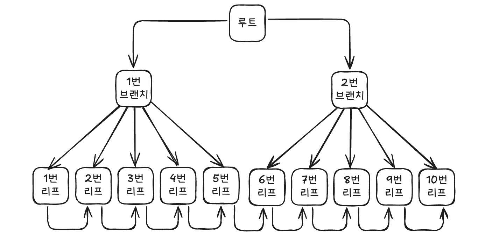
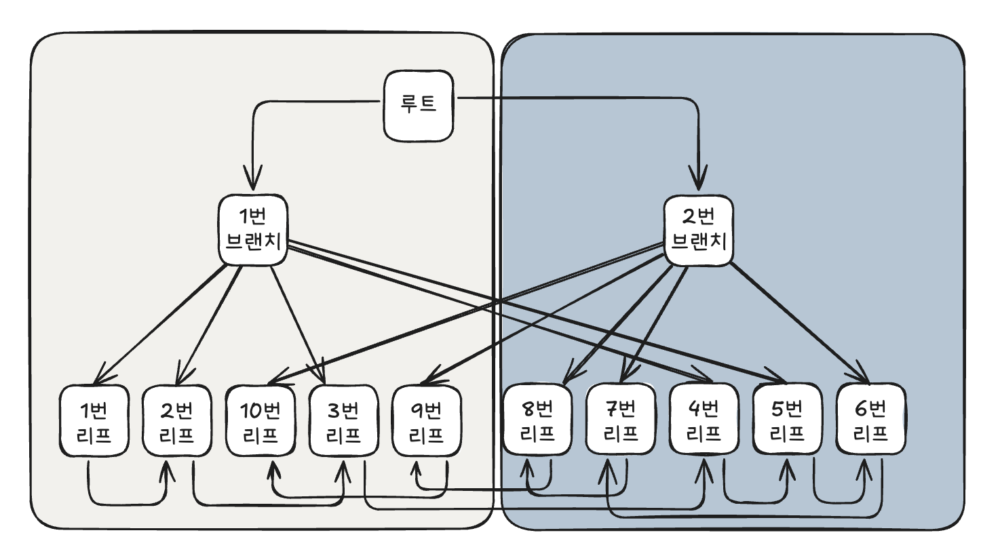

# 2.3 인덱스 확장기능 사용법
## 2.3.4 Index Skip Scan
### Index Skip Scan이 작동하기 위한 조건
- Index Skip Scan 은 선두컬럼이 없을 때만 작동하는 것은 아니다.
    - 선두컬럼에 대한 조건절은 있고, 중간 컬럼에 대한 조건절이 없는 경우에도 Skip Scan을 사용할 수 있다.
##### PK
```sql
일별업종별거래_PK: 업종유형코드 + 업종코드 + 기준일자
```

##### 업종유형코드에 대한 조건절이 있고, 업종 코드에 대한 조건절이 없는 경우
```sql
SELECT /*+ INDEX_SS(A 일별업종별거래_PK) */
       기준일자, 업종코드, 체결건수, 체결수량, 거래대금
  FROM 일별업종별거래 A
 WHERE 업종유형코드 = '01'
 AND 기준일자 BETWEEN '20080501' AND '20080531';
 
Execution Plan
---------------------------------------------------------
0  SELECT STATEMENT Optimizer=ALL_ROWS (Cost=91 Card=7 Bytes=245)
1 0  TABLE ACCESS (BY LOCAL INDEX ROWID) OF '일별업종별거래' (TABLE) (Cost=91 ...)
2 1    INDEX (SKIP SCAN) OF '일별업종별거래_PK' (INDEX (UNIQUE)) (Cost=102 ...)
```

만약 위 SQL에 Index Range Scan을 사용한다며 업종유형코드 = '01' 인 인덱스 구간을 모두 스캔해야한다.<br>
`Index Skip Scan` 을 사용한다면 업종유형코드 = '01'인 구간에서 기준일자가 '20080501' 보다 크거나 같고 '20080531' 보다 작거나 같은 레코드를 `포함할 가능성이 있는 리프블록` 만 골라서 액세스할 수 있다.

##### Distinct Value가 적은 두개의 선두 컬럼(업종유형코드, 업종코드)이 모두 조건절에 없는 경우
```sql
SELECT /*+ INDEX_SS(A 일별업종별거래_PK) */
       기준일자, 업종코드, 체결건수, 체결수량, 거래대금
  FROM 일별업종별거래 A
WHERE 기준일자 BETWEEN '20080501' AND '20080531';
 
Execution Plan
---------------------------------------------------------
0  SELECT STATEMENT Optimizer=ALL_ROWS (Cost=91 Card=37 Bytes=1K)
1 0  TABLE ACCESS (BY LOCAL INDEX ROWID) OF '일별업종별거래' (TABLE) (Cost=91 ...)
2 1    INDEX (SKIP SCAN) OF '일별업종별거래_PK' (INDEX (UNIQUE)) (Cost=90 Card=1)
```

위와 같이 Distinct Value가 적은 두개의 선두 컬럼이 모두 조건절에 없는 경우에도 유용하게 사용할 수 있다.

##### 선두 컬럼이 부등호, BETWEEN, LIKE 같은 범위검색 조건인 경우
선두 컬럼이 부등호, BETWEEN, LIKE 같은 범위검색 조건일 때도 **Index Skip Scan**을 사용할 수 있다.

##### Index
```sql
일별입출금거래_X01 : 기준일자 + 업종유형코드
```

##### query

```sql
SELECT /*+ INDEX_SS(A 일별입출금거래_X01) */
       기준일자, 영업코드, 계좌건수, 체결수량, 거래대금
  FROM 일별입출금거래 A
 WHERE 기준일자 BETWEEN '20080501' AND '20080531'
   AND 업종유형코드 = '01';
```

만약 위 SQL에 `Index Range Scan`을 사용한다면, 기준일자 BETWEEN 조건을 만족하는 인덱스 구간을 `모두` 스캔해야 한다.<br>
반면, **Index Skip Scan**을 사용한다면 기준일자 BETWEEN 조건을 만족하는 인덱스 구간에서 `업종유형코드 = '01'인 레코드를 포함할 가능성이 있는 리프 블록`만 골라서 액세스할 수 있다.


> 이처럼 Index Range Scan 이 불가능하거나, 효율적이지 못한 상황에서 `Index Skip Scan` 이 종종 빛을 발한다. 부분 범위 처리가 가능하다면 Index Full Scan이 도움이 되기도 한다. <br> 
> <br>하지만 이는 최선책이 될 수 없으며, 인덱스는 기본적으로 최적의 `Index Range Scan`을 목표로 설계해야 하며, 수행 횟수가 적은 SQL을 위해 인덱스를 추가하는 것이 비효율적일 때 이 스캔방식을 차선책으로 활용하는 전략이 바람직하다.

## 2.3.5 Index Fast Full Scan

Index Fast Full Scan은 말 그대로  Index Full Scan 보다 빠르다.<br>
그 이유는 논리적인 인덱스 트리 구조를 무시하고 인덱스 세그먼트 전체를 MultiBlock I/O 방식으로 스캔하기 때문이다.

관련 힌트는 `index_ffs` 와 `no_index_ffs` 이다.

##### 인덱스 구조 (논리적 순서)



그림에서 화살표는 인덱스의 논리적인 연결 구조를 표현한 것이다. <br> 리프 블록 간에 실제로는 양방향 연결 리스 구조를 갖지만, 단순하게 표현하고 단방향 연결 리스트 구조로 표시했다.

##### 인덱스 구조 (물리적 순서)
위의 블록들을 물리적 순서에 따라 배치했다.<br>
물리적 순서로 배치했지만 논리적 순서를 화살표로 표시했다.



- Index Full Scan이 블록을 읽어들이는 방식 (논리적 구조를 따른다)
```
	루트 -> 브랜치1 -> 1번 -> 2번 -> 3번 -> 4 -> 5 -> 6 -> 7 -> 8 -> 9 -> 10
```

- Index Fast Full Scan이 블록을 읽어들이는 방식 (물리적으로 디스크에 저장된 순서대로 블록들을 읽는다.)
> Index Fast Full Scan 도 Table Full Scan과 마찬가지로 읽어야 할 익스텐트 목록을 익스텐트 맵에서 얻는다.
>  `세그먼트 헤더 접근 → 익스텐트 맵 확인 → 익스텐트 목록 확보 → 익스텐트별 블록 순차 읽기`
```sql
/*루트와 두개의 브랜치 블록도 읽지만 필요없는 블록이므로 버린다*/

(왼쪽 익스텐트)              
1 -> 2 -> 10 -> 3 -> 9

(오른쪽 익스텐트)
8 -> 7 -> 4 -> 5 -> 6
```

`Index Fast Full Scan` 은 MultiBlock I/O 방식을 사용하므로 디스크로부터 대량의 인덱스 블록을 읽어야 할 때 큰 효과를 발휘한다.
- 속도는 빠르지만, 인덱스 리프노드가 갖는 연결 리스트 구조를 무시하므로 결과집합이 인덱스 키 순서대로 정렬되지 않는다.
- 쿼리에 사용한 컬럼이 모두 인덱스에 포함돼 있을 때만 사용할 수 있다
- `Index Full Scan`, `Index Range Scan`과 달리 인덱스가 파티션 돼 있지 않아도 병렬 쿼리가 가능하다
    - 병렬 쿼리 시에는 `Direct Path I/O 방식`을 사용하기 때문에 I/O 속도가 더 빨라진다
> `Direct Path I/O : 버퍼 캐시를 거치지 않고, 데이터 블록을 곧바로 PGA(프로세스 전용 메모리)로 읽어오는 방식


#### Index Full Scan / Index Fast Full Scan 특징 요약

| Index Full Scan              | Index Fast Full Scan       |
| ---------------------------- | -------------------------- |
| 인덱스 구조를 따라 스캔                | 세그먼트 전체를 스캔                |
| 결과집합 순서 보장                   | 결과집합 순서 보장 안 됨             |
| Single Block I/O             | Multiblock I/O             |
| (파티션 돼 있지 않다면) 병렬스캔 불가       | 병렬스캔 가능                    |
| 인덱스에 포함되지 않은 컬럼 조회 시에도 사용 가능 | 인덱스에 포함된 컬럼으로만 조회할 때 사용 가능 |

## 2.3.6 Index Range Scan Descending

Index Range Scan과 기본적으로 동일한 스캔 방식이며, 인덱스를 뒤쪽부터 앞쪽으로 스캔하기 때문에 내림차순으로 정렬된 결과집합을 얻는다는 점만 다르다.

##### 내림차순 정렬시의 인덱스 활용
```sql
SQL> select * from emp
     where empno > 0
     order by empno desc;

Execution Plan
------------------------------------------------------------
0    SELECT STATEMENT Optimizer=ALL_ROWS
1  0   TABLE ACCESS (BY INDEX ROWID) OF 'EMP' (TABLE)
2  1     INDEX (RANGE SCAN DESCENDING) OF 'PK_EMP' (INDEX (UNIQUE))

```

- EMP 테이블을 EMPNO 기준으로 `내림차순 정렬` 하고자 할 때, EMPNO 컬럼에 인덱스가 있으면 옵티마이저가 알아서 인덱스를 거꾸로 읽는 실행계획을 수립한다.
- 만약 옵티마이저가 인덱스를 거꾸로 읽지 않는다면 `index_desc` 힌트를 이용해 유도할 수 있다.

```sql
SQL> create index emp_x02 on emp(deptno, sal);

SQL> select deptno, dname, loc
         , (select max(sal) from emp where deptno = d.deptno)
    from dept d;

Execution Plan
------------------------------------------------------------
0   SELECT STATEMENT Optimizer=ALL_ROWS
1  0  SORT (AGGREGATE)
2  1    FIRST ROW
3  2      INDEX (RANGE SCAN (MIN/MAX)) OF 'EMP_X02' (INDEX)
4  0  TABLE ACCESS (FULL) OF 'DEPT' (TABLE)
```

- 위처럼 MAX 값을 구하고자 할 때도 해당 컬럼에 인덱스가 있으면 인덱스를 뒤에서 부터 한 건만 읽고 멈추는 실행계획이 자동으로 수립된다.