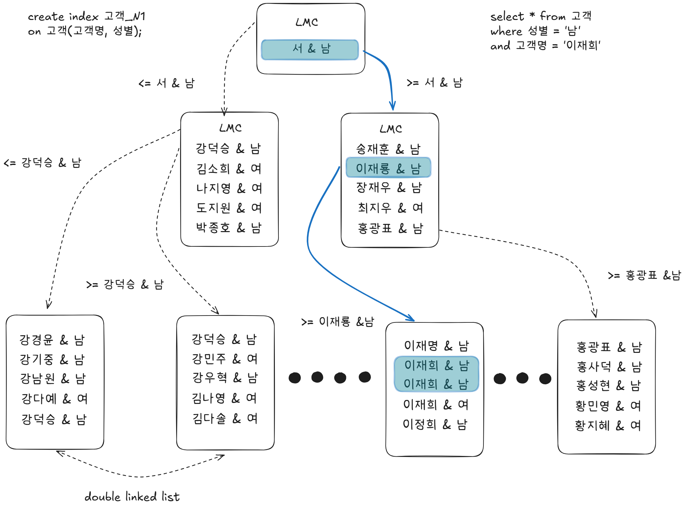
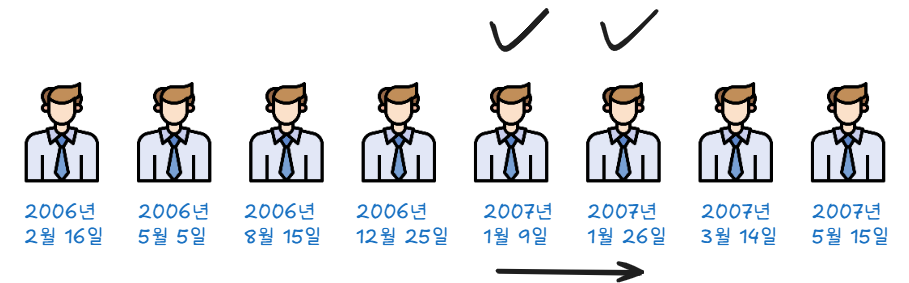
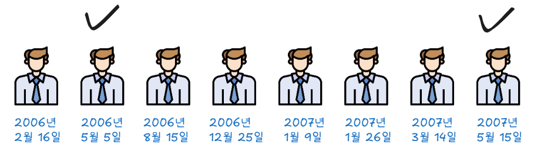

## 결합 인덱스 구조와 탐색

두개 이상의 컬럼을 결합해서 인덱스를 만들 수 있다.<br>

### 성별과 고객명 기준으로 만든 인덱스 구조

이재희라는 이름을 찾는 과정
1. 찾고자 하는 값보다 큰 첫번째 레코드를 만난다. (성별이 '남'이면서 '최'씨 성을 가진 레코드)
2. 레코드에서 그 레코드가 가리키는 하위 블록으로가서 탐색 후 만날수 없으므로
3. 직전 LMC가 가리키는 하위 블록으로 이동 후 탐색하면 찾는것보다 큰 값(정재우)를 만남
4. 정재우 하위블록 탐색 후 만날수 없으므로 직전 레코드(이재룡)가 가리키는 하위 블록이동
5. 스캔하면서 이재희보다 큰값을 만나면 멈춘다

수직적 탐색을 거쳐서 찾은 인덱스 스캔 시작점이 성별 = '남'인 레코드가 아니라
성별 = '남' 이면서 고객명 = '이재희'인 레코드라는 사실을 기억해야한다.

### 컬럼 순서를 바꿔 고객명과 성별 순으로 구성한 인덱스


인덱스를 고객명 + 성별로 구성하든 성별 + 고객명으로 구성하든 인덱스 블록 개수는 동일하다
인덱스 선두 컬럼을 모두 "=" 조건으로 검색할 때는 어느 컬럼을 인덱스 앞쪽에 두든 블록 I/O 개수가 같으므로 성능 또한 동일하다


>만약 강덕승 & 남이 엄청나게 많아진다면? 값의 분산도가 낮아지게 되고 읽어야 할 리프 노드들이 많아질 것이다. 그렇게 되면 수평 탐색으로 읽어야 할 리프블록들의 수가 많아진다. **인덱스 탐색시 카디널리티가 중요한 이유**이다.

### 인덱스 틀린 예제
```sql
select 이름,성별
from 사원
where 성별 = '여자' and 이름 = '유관순'
```
총 사원 50명, 유관순 2명

1. 인덱스를 성별 + 이름순으로 구성한 경우
성별 = 여자인 레코드 25건을 찾고 이후 이름을 검사해 최종 2명 출력 -> 25번의 검사
2. 인덱스를 이름 + 성별순으로 구성한 경우
   이름 = 유관순인 레코드 2건을 찾고 이후 성별을 검사해 최종 2명 출력 -> 2번의 검사

이 예제에서 말하는 건 선택도가 낮은 '이름' 컬럼을 앞쪽에 두고 결합인덱스를 생성해야 검사 횟수를 줄여 성능에 유리하다. 

하지만 이건 잘못된 정보이다.
B-tree 인덱스는 엑셀과 같은 평면구조가 아니다. 다단계 구조이며 루트에서 브랜치를 거쳐 리프 블록까지 탐색하면서 '여자'이면서 '유관순'인 첫 번째 사원을 바로 찾아간다.
정확히 말하면 유관순이 아닌 레코드를 만날때 까지 세건을 스캔한다.

따라서 어느 컬럼을 앞에 두든 일량에는 차이가 없다. 인덱스 구성에 따라 성능 차이가 나는 것은 맞지만 위 예제처럼 설명해선 안된다.

# 2.2 인덱스 기본 사용법
인덱스 기본 사용법은 인덱스를 Range Scan 하는 방법을 의미한다. 인덱스를 Range Scan 할 수 없게 되는 이유를 알고 나면, 인덱스를 Range Scan 하는 방법도 자연스럽게 터득할 수 있다.
## 인덱스를 사용한다는 것
인덱스 컬럼(선두 컬럼)을 가공하지 않아야 인덱스를 정상적으로 사용할 수 있다.
정상적으로 사용한다는 표현은 리프 블록에서 스캔 시작점을 찾아 스캔하다가 중간에 멈추는 것을 의미한다.
즉 블록 일부만 스캔하는 인덱스 Range Scan을 의미한다.

인덱스 컬럼을 가공해도 사용가능하지만  시작점을 찾을 수 없고, 멈출 수도 없어 리프 블록 전체를 스캔해야만 한다.
즉 전체를 스캔하는 Index Full Scan 방식으로 작동한다.

## 인덱스를 RangeScan 할 수 없는 이유
"인덱스 컬럼을 가공하면 인덱스를 정상적(Range Scan)으로 사용 할 수 없다"

인덱스 컬럼을 가공했을 때 인덱스를 정상적으로 사용할 수 없는 이유는 인덱스 스캔 시작점을 찾을수 없기 때문이다.
일정 범위를 스캔하려면 시작지점과 끝지점이 있어야 한다.

### 2007년 1월에 태어난 학생
```sql
where 생년월일 between '20070101' and '20070131'
```



1. 07년 1월 1일 이후에 태어난 학생을 찾고 순서대로 스캔
2. 07년 2월 1일 이후에 태어난 첫번째 학생을 만나는 순간 종료

### 년도와 상관없이 5월에 태어난 학생
```sql
where substr(생년월일, 5, 2) = '05'
```



스캔 시작점과 종료지점을 알수 없으므로 전교생을 다 스캔해야한다.
인덱스에서는 가공되지 않은 값이 저장되어 있는데, 가공된 값을 기준으로 검색하려면
스캔 시작점과 끝지점을 찾을 수 없다.

```sql
where nvl(주문수량, 0) < 100
```

아래와 같이 쿼리하면 고객명, 전화번호 인덱스 각각에 대해 Index Range Scan이 가능하다.

```sql
select *
from 고객
where 고객명 = :cust_nm -- 고객명이 선두 컬럼인 인덱스 Range Scan
union all
select *
from 고객
where 전화번호 = :tel_no
and (고객명 <> :cust_nm or 고객명 is null)
```

OR 조건식을  SQL 옵티마이저가 위와 같은 형태로 반환할 수 있는데 , 이를 'OR Expansion'이라고 한다.
아래는 use_concat힌트를 이용해  OR Expansion을 유도 했을 때 의 실행계획이다 
Index Range Scan이 작동했음을 확인할 수 있다.
```sql
select /*+ use_concat */ * from 고객
where (전화번호 = :tel_no OR 고객명 = :cust_nm)
Execution Plan   
----------------------------------------------------------------
0  SELECT STATEMENT  Optimizer=ALL_ROWS (Cost=4 Card=2 Bytes=78)
1   0  CONCATENATION
2   1   TABLE ACCESS (BY INDEX ROWID) OF '고객' (TABLE) (Cost=2 Card=1 ...)
3   2    INDEX (RANGE SCAN) OF '고객명_IDX' (INDEX) (Cost=1 Card=1)
4   1   TABLE ACCESS (BY INDEX ROWID) OF '고객' (TABLE) (Cost=2 Card=1 ...)
5   4    INDEX (RANGE SCAN) OF '고객_전화번호_IDX' (INDEX) (Cost=1 Card=1)
```
위와 같은 쿼리 변환이 일어나지 않는다면, OR 조건식에는 Index Range Scan이 불가능하다 


