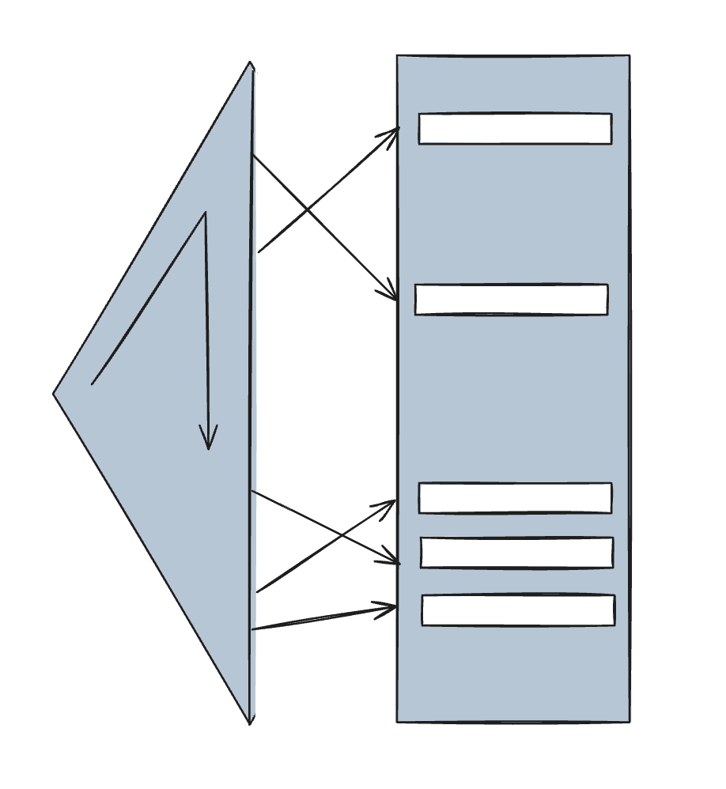
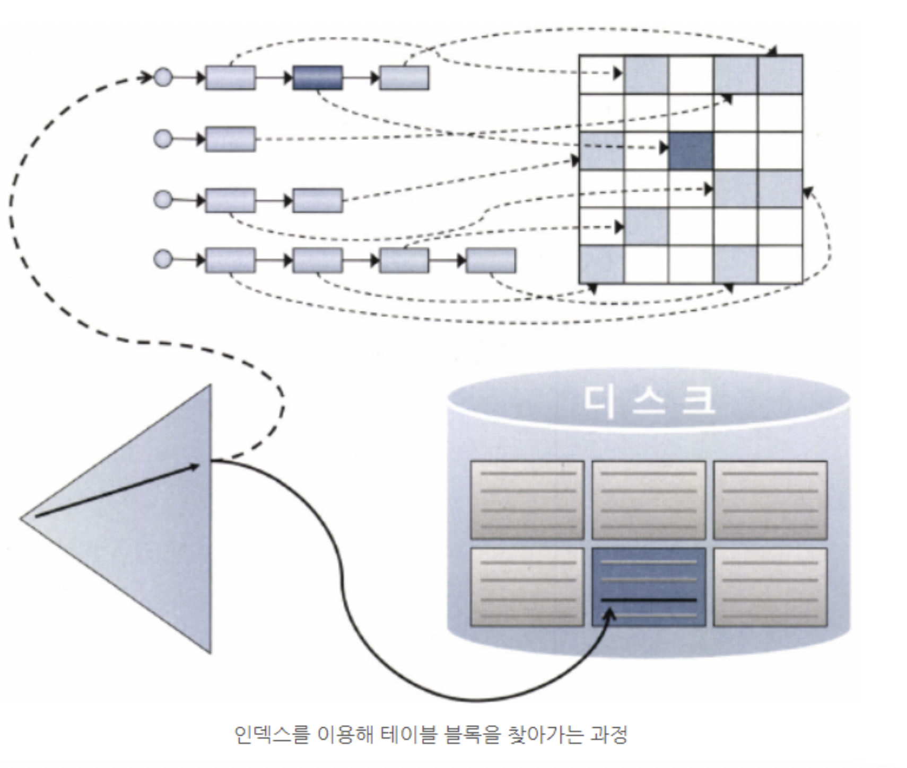
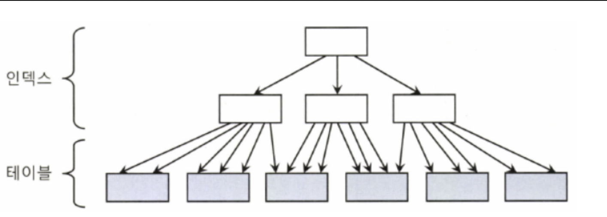
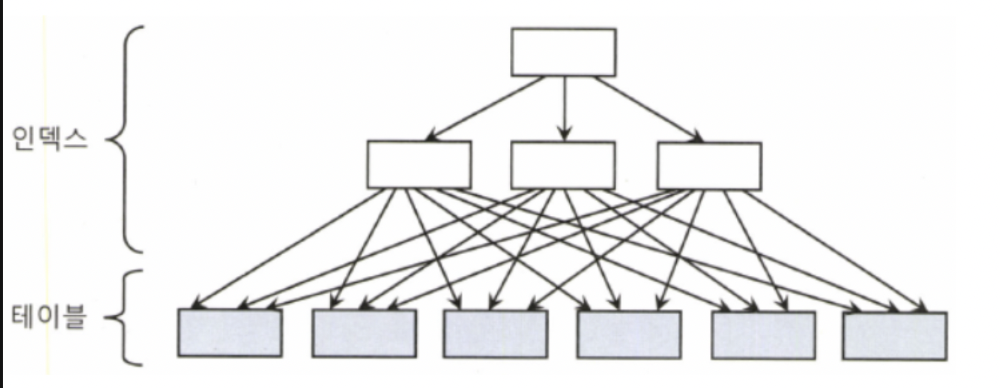

# 3.1 테이블 액세스 최소화

## 3.1.1 테이블 랜덤 액세스

### 인덱스 ROWID는 물리적 주소? 논리적 주소?

- SQL이 참조하는 컬럼을 인덱스가 모두 포함하는 경우가 아니면 인덱스를 스캔한 후에 반드시 테이블을 액세스한다.


- 인덱스를 이용해 테이블을 액세스하는 SQL 실행계획
```SQL
SQL> select * 
     from 고객 
     where 지역 = '서울';

Execution Plan
------------------------------------------------------------
0  SELECT STATEMENT Optimizer=ALL_ROWS
1   0  TABLE ACCESS BY INDEX ROWID OF '고객' (TABLE) /*테이블을 액세스 하는 부분*/
2   1   INDEX RANGE SCAN OF '고객_지역_IDX' (INDEX)

```

인덱스를 스캔하는 이유는 검색 조건을 만족하는 `소량`의 데이터를 인덱스에서 빨리 찾고, 거기서 테이블 레코드를 찾아가기 위한 주소값, 즉 ROWID를 얻으려는 데 있다.

- 인덱스는 데이터파일 번호, 오브젝트 번호, 블록 번호 같은 물리적 요소로 구성되어 있어 물리적 주소라고 생각할 수 있지만, ROWID는 논리적 주소에 가깝다.
    - 물리적으로 직접 연결되지 않고 테이블 레코들르 찾아가기 위한 논리적 주소 정보를 담고 있기 때문이다

>	- **물리적 주소 (Physical Address)**  
       실제 하드웨어 메모리나 디스크 상의 위치. CPU 메모리 접근이라면 DRAM의 특정 셀, 디스크라면 섹터와 블록 위치.<br>
       - 예: "메모리 칩의 0x1A2B 위치" <br>
       - 예: "디스크 3번 Cylinder, 7번 Sector"<br><br><br>
       - **논리적 주소 (Logical Address, Virtual Address)**  
       OS나 DBMS 같은 **추상화 계층**에서 관리하는 주소.  
       하드웨어의 실제 위치와 1:1로 고정 매핑되지 않고, **매핑 테이블**을 통해 변환됨.<br>
       - 예: "가상 메모리 0x00400000" → 실제 물리 메모리 0x1A2B로 매핑.<br>
       - DB에서는 "ROWID" 같은 값이 여기에 해당.

- 인덱스 ROWID는 디스크 상에서 테이블 레코드를 찾아가기 위한 논리적 위치 정보를 담는다.
- 프로그래밍에서 말하는 포인터가 아니, 테이블 레코드와 물리적으로 직접 연결된 구조는 더더욱 아니다.

### 메인 메모리 DB와 비교

- 메인 메모리 DB는 데이터를 모두 메모리에 로드해 놓고 메모리를 통해서만 I/O를 수행하는 DB라고 할 수 있다.
- 그런데 잘 튜닝된 OLTP(Online Transaction Processing)성 DB 시스템이라면 버퍼캐시 히트율이 99% 이상이다. 대부분 데이터를 디스크를 경유하지 않고 메모리에서 읽는다는 뜻이다.
- 그런데도 메인메모리 DB만큼은 빠르지 않으며 대량 데이터를 인덱스로 액세스할때는 엄청난 차이가 난다.
    - 어떤 메인 메모리 DB의 경우는 인스턴스를 기동하면 디스크에 저장된 데이터를 버퍼캐시로 로딩하고, 이어서 인덱스를 생성한다.
    - 이때 인덱스는 오라클처럼 디스크 상의 주소정보를 갖는게 아니라 `메모리 상의 주소정보, 즉 포인터` 를 갖는다.
    - 인덱스를 경유해 테이블을 인덱스하는 비용이 오라클과 비교할 수 없을 정도로 낮다.
- 오라클은 테이블 블록이 수시로 버퍼캐시에서 밀려났다가 다시 캐싱되며, 그때마다 다른 공간에 캐싱되기 때문에 인덱스에서 포인터로 직접 연결할 수 없는 구조다.
- 메모리주소 정보 (포인터)가 아닌, 디스크 주소정보(DBA)를 이용해 해시 알고리즘으로 버퍼 블록을 찾아간다.
- 이는 메인메모리 DB의 우원성을 강조하려는것이 아니며, 일반 DBMS에서 인덱스 ROWID를 이용한 테이블  액세스가 생각만큼 빠르지 않은 이유를 얘기하는 것이다.

### I/O 메커니즘 복습

- DBA는 디스크상에서 블록을 찾기위한 주소 정보이다. 하지만 매번 디스크에서 블록을 읽을수는 없다.
-  I/O 성능을 높이려면 버퍼캐시를 활용해야 한다. 그래서 블록을 읽을 때는 버퍼캐시를 먼저 확인한다.
    - 읽고자 하는 DBA를 해시 함수에 입력해서 해시 체인을 찾고, 버퍼 헤더를 찾는다.
- 캐시에 적재할 때와 읽을 때 같은 해시 함수를 사용하므로 버퍼 헤더는 항상 같은 해시 체인에 연결된다.
    - 하지만 실제 데이터가 담긴 버퍼 블록은 매번 다른 위치에 캐싱되는데, 그 메모리 주소값을 버퍼 헤더가 가지고 있다.
- DBA로 버퍼블록을 찾는 과정

```
	   (해싱알고리즘)          
	DBA ---------> 버퍼헤더 -----포인터-----> 버퍼블록
 ```

- Full Scan
```          
 익스텐트 맵----> DBA
```
- 인덱스로 테이블 블록을 액세스하는 과정



```
	                     분해
	리프블록 -----> ROWID -------DBA정보
	
	      (해싱알고리즘)          
	-> DBA ---------> 버퍼헤더 -----포인터-----> 버퍼블록
 ```

- ROWID(실선)는 포인터가 아니다. 디스크 상에서 테이블 레코드를 찾아가기 위한 논리적인 주소 정보다.
- ROWID가 가리키는 테이블 블록을 버퍼캐시에서 먼저 찾아보고(점선), 없는 경우만 버퍼캐시에 적재 후 디스크에서 블록을 읽는다
- 모든 데이터가 캐싱되어 있더라도 테이블 레코드를 찾기 위해 매번 DBA 해싱과 래치 획득 과정을 반복해야한다.
    - 동시 액세스가 심할 때는 캐시버퍼 체인 래치와 버퍼 Lock에 대한 경합까지 발생한다.
    - 이처럼 인덱스 ROWID를 이용한 테이블 액세스는 생각보다 고비용 구조다.


### 인덱스 ROWID는 우편주소

디스크 DB의 ROWID를 우편주소에, 메인 메모리 DB가 사용하는 포인터를 전화번호에 비유할 수 있다.
- 전화통신은 물리적으로 연결된 통신망을 이용하므로 전화번호를 누르면 곧바로 상대방과 통신할 수 있다
- 우편통신은 봉투에 적힌 대로 우체부 아저씨가 일일히 찾아다녀야 한다.

```
- 우편주소: 서울시 중구 무교동 123번지 00타워 10층  
- ROWID: 7번 데이터 파일 123번 블록에 저장된 10번째 레코드  
```

오라클에서 하나의 레코드를 찾는 데 있어 가장 빠르다고 알려진 `ROWID` 기반 테이블 액세스가 얼마나 복잡한 연산인지 정확히 이해해야 한다.  
실행계획에서 `TABLE ACCESS BY INDEX ROWID` 오퍼레이션을 보면, 단순한 접근이 아니라 내부적으로는 복잡한 처리과정을 거친다는 점을 떠올려야 한다.

```sql
SQL> select * 
     from 고객 
     where 지역 = '서울';

Execution Plan
------------------------------------------------------------
0  SELECT STATEMENT Optimizer=ALL_ROWS
1   0  TABLE ACCESS BY INDEX ROWID OF '고객' (TABLE)
2   1   INDEX RANGE SCAN OF '고객_지역_IDX' (INDEX)
```

## 3.1.2 인덱스 클러스터링 팩터

클러스터링 팩터(CF)는 특정 컬럼을 기준으로 같은 값을 가진 데이터가 물리적으로 얼마나 모여 있는지를 나타내는 정도를 의미한다.
- CF가 좋은 컬럼에 생성된 인덱스
  
    - 분가한 열 명의 자녀가 모두 한 동네에 모여 살면 CF가 좋기 떄문에 부모가 자녀들 집을 모두 방문하는데 하루면 충분하다
    - 테이블 액세스 량에 비해 블록 I/O가 적게 발생함을 의미한다.

- CF가 나쁜 컬럼에 생성된 인덱스
  
    - 여러 지방에 뿔뿔이 훝어져 산다면 몇 날 며칠이 걸릴지 모른다
    - 인덱스 순서와 테이블 순서가 불일치 → 디스크 블록 랜덤 액세스 증가