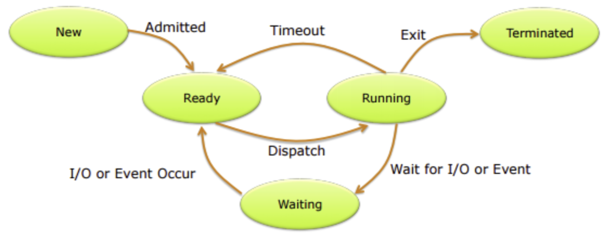

# 3.2 부분범위 처리 활용

이번에는 테이블 랜덤 액세스로 인한 인덱스 손익분기점의 한계를 극복할 히든카드를 추가로 소개한다.

부분범위 처리 원리를 활용하면 인덱스로 액세스할 대상 레코드가 아무리 많아도 아주 빠른 응답 속도를 낼 수 있다.

부분범위 처리에 원리를 살펴보자.

---

## 3.2.1 부분범위 처리

- 공사장에서 집짓기
  - 미장공이 시멘트를 이용해 벽돌을 쌓고
  - 운반공이 벽돌을 실어 나른다. 
    - 쌓여 있는 벽돌을 한 번에 모두 실어 나를 수 없어, 수레를 이용해 일정량씩 나누어 운반한다. 
    - 운반공은 미장공이 벽돌을 더 가져오라는 요청(Fetch Call)이 있을 때만 벽돌을 실어 나른다. 
    - 추가 요청이 없으면 운반 작업은 거기서 멈춘다.

- DBMS
  - 클라이언트에게 데이터를 전송할 때, 일정량씩 나누어 전송한다. 
  - 전체 결과 집합 중 아직 전송하지 않은 분량이 많이 남아 있어도 서버 프로세스는 클라이언트로부터 추가 Fetch Call을 받기 전까지 멈춰 기다린다.

OLTP 환경에서 대용량 데이터를 빠르게 핸들링할 수 있는 원리가 여기에 있다.

### 예시

마우스로 클릭하면 아래 JAVA 메서드를 호출하는 실행 버튼이 있다.

SQL문에 사용한 **BIG_TABLE**이 1억 건에 이르는 대용량 테이블이어도 실행 결과는 버튼을 클릭하자마자 곧바로 화면에 출력된다.

```java
private void execute(Connection con) throws Exception {
    Statement stmt = con.createStatement();
    ResultSet rs = stmt.executeQuery("select name from big_table");
    for (int i = 0; i < 100; i++) {
        if (rs.next())
            System.out.println(rs.getString(1));
    }
    rs.close();
    stmt.close();
}
```

#### 1억 건짜리 테이블인데도 결과를 빨리 출력할 수 있는 이유

DBMS가 데이터를 모두 읽어 한 번에 전송하지 않고, 먼저 읽는 데이터부터 일정량(Array Size)만 전송하고 멈추기 때문이다. 

데이터를 전송하고 나면 서버 프로세스는 CPU를 OS에 반환하고 대기 큐에서 잠시 쉰다.



다음 Fetch Call을 받으면 대기 큐에서 나와 그다음 데이터부터 일정량을 읽어서 전송하고, 또다시 잠시 쉰다.

### 부분범위 처리

이처럼 전체 쿼리 결과 집합을 쉼 없이 연속적으로 전송하지 않고 사용자로부터 Fetch Call이 있을 때마다 일정량씩 나누어 전송하는 것을 **부분범위 처리**라고 한다.

- 데이터를 전송하는 단위인 **Array Size**는 클라이언트 프로그램에서 설정한다.
  - JAVA의 Array Size 
    - 기본값은 10, 
    - `Statement` 객체의 `setFetchSize` 메서드를 통해 설정을 변경가능.

Array Size가 10인 상태에서 JAVA 프로그램이 데이터를 읽어 들이는 메커니즘은 아래와 같다.

1. 최초 `rs.next()` 호출 시, Fetch Call을 통해 DB 서버로부터 전송받은 데이터 10건을 클라이언트 캐시에 저장
2. 이후 `rs.next()` 호출 시, Fetch Call 없이, 캐시에서 데이터 조회
3. 캐시에 저장한 데이터를 모두 소진한 상태에서 `rs.next()` 호출 시 추가 Fetch Call을 통해 10건을 전송받는다.
4. 100건을 다 읽을 때까지 2~3번 과정을 반복한다.

100개 레코드를 전송받아 콘솔에 출력(내부적으로 연속해서 10번의 Fetch Call 발생)하고 

곧바로 `ResultSet`과 `Statement` 객체를 닫았으므로, 위 JAVA 프로그램은 BIG_TABLE에 데이터가 아무리 많아도 오래 걸릴 이유가 없다.

> 어떤 오라클 튜닝 서적을 보면 쿼리 수행 시 결과 집합을 버퍼 캐시에 모두 적재하고 나서 사용자에게 전송한다고 설명하기도 한다. 
>
> 만약 이 방식 처리한다면 위 JAVA 프로그램은 결코 빠를 수 없기에 여기서 개념을 다시 정립해야 한다고 한다.

### 정렬 조건이 있을 때 부분범위 처리

쿼리문에 아래와 같이 `ORDER BY`를 추가해도 부분범위 처리가 작동할까?

```java
Statement stmt = con.createStatement();
ResultSet rs = stmt.executeQuery(
    "select name from big_table order by created"
);
```

DB 서버는 **모든** 데이터를 다 읽어 `created` 순으로 정렬을 마치고서야 클라이언트에게 데이터를 전송하기 시작한다.

즉, **전체범위 처리**다. 

Sort Area와 Temp 테이블스페이스까지 이용해 데이터 정렬을 마치고 나면 그때부터 일정량씩 나누어 클라이언트에게 데이터를 전송한다.

- 해결책
  - `created` 컬럼이 선두인 인덱스가 있으면 부분범위 처리가 가능하다.
    - 인덱스는 항상 정렬된 상태를 유지하므로 전체 데이터를 정렬하지 않고도 정렬된 상태의 결과 집합을 바로 전송할 수 있기 때문이다.

### Array Size 조정을 통한 Fetch Call 최소화

부분범위 처리 원리를 이해했다면 네트워크를 통해 전송해야 할 데이터량에 따라 Array Size를 조절할 필요가 있음을 직감했을 것이다.

| 상황                     | 권장 설정     | 이유                                            |
| ---------------------- | --------- | --------------------------------------------- |
| **대량 데이터 전체 전송**       | **크게 설정** | 데이터를 모두 내려받아야 하므로 Fetch Call 횟수를 줄여 전송 효율 극대화 |
| **앞쪽 일부 데이터만 조회 후 중단** | **작게 설정** | 불필요한 데이터 전송을 방지하여 네트워크·서버·클라이언트 자원 절약         |

> 방금 본 JAVA 프로그램에서 만약 Array Size를 1,000으로 설정한다면, 사용하지도 않고 버릴 뒤쪽 900개 레코드를 읽어서 전송하는 과정에 네트워크와 서버, 클라이언트 자원만 낭비하게 된다.

### 쿼리 툴에서 부분범위 처리

이번에는 토드(TOAD)나 오렌지 같은 쿼리 툴에서 부분범위 처리가 어떻게 작동하는지 확인해 보자.

#### 오렌지에서 쿼리를 수행하면

BIG_TABLE이 아무리 커도 결과는 **0.1초만에** 나온다.

```sql
select * from big_table;
```

결과가 빨리 나오지만 전체 데이터를 모두 읽은 것은 아니다.

전체 데이터 중 먼저 읽은 100개만 출력한 것이다.

오렌지(Orange)에 설정된 옵션(**Tool → Orange Options**)을 보면 그 이유를 쉽게 알 수 있다.

##### Orange Options

- **Array Size**가 20으로 설정
  - 이는 서버에 Fetch Call 한 번으로 데이터를 **20개씩** 요청하도록 설정돼 있는 것이다.
- 쿼리를 수행하자마자 100개를 출력한 이유는 **Initial Fetch**가 100으로 설정돼 있기 때문이다.

Initial Fetch는 100, Array Size는 20으로 설정했으므로, 오렌지는 쿼리를 수행하자마자 Fetch Call을 연속해서 **다섯 번** 발생시킨다.

화면에 100개 레코드가 출력된 상태에서 사용자가 101번째 레코드를 읽으려고 스크롤하는 순간, 추가 Fetch Call이 발생한다. 이때부터는 20개씩 출력된다.

#### 오라클 기본 쿼리 툴: SQL*Plus에서 테스트

이번에는 오라클 기본 쿼리 툴인 **SQL*Plus**에서 같은 테스트를 해 보자.

```sql
SQL> show arraysize
arraysize 15

SQL> select object_id, object_name from big_table;
```

Array Size가 15로 설정돼 있다.

그런데 쿼리를 수행해 보면 중간에 멈추지 않고 데이터를 계속 출력한다.
마치 부분범위 처리가 작동하지 않는 것처럼 보인다.

같은 DB 서버에 접속했는데 어떤 쿼리 툴에서는 부분범위 처리가 작동하고, 어떤 쿼리 툴에서는 작동하지 않는 이유는 무엇일까?

> 참고로 MS-SQL Server 사용자가 주로 사용하는 쿼리 분석기(Query Analyzer)에서도 쿼리를 수행해 보면 멈추지 않고 전체 데이터를 출력한다.

모든 DBMS는 결과 집합을 부분범위 처리 방식으로 조금씩 나누어 전송한다.

그러나 중간에 멈췄다가 사용자의 추가 요청 시 데이터를 계속 가져올지 여부는 클라이언트 프로그램 구현에 달려 있다.

| 구분             | 전송 방식                                                  | 특징                                        | 예시 툴                                               |
| -------------- | ------------------------------------------------------ | ----------------------------------------- | -------------------------------------------------- |
| **부분범위 처리 지원** | 데이터를 **조금씩 나누어 전송**, 사용자가 추가 요청(스크롤 등) 시 다음 데이터를 Fetch | 대량 데이터도 **빠른 초기 응답** 가능, 필요 시만 추가 네트워크 사용 | **TOAD**, **Orange**                               |
| **전체 전송 방식**   | 쿼리 실행 시 **전체 데이터를 한 번에 전송 및 출력**                       | 초기 응답이 느릴 수 있으나 구현이 단순                    | **Oracle SQL*Plus**, **SQL Server Query Analyzer** |

## 3.2.2 부분범위 처리 구현

### 부분범위 처리를 활용하지 않은 예시
- 쉽고 단순한 방식

```java
public class AllRange {
    public static void execute(Connection con) throws Exception {
        int arraysize = 10;
        String SQLStmt = "select object_id, object_name from all_objects";

        Statement stmt = con.createStatement();
        stmt.setFetchSize(arraysize);
        ResultSet rs = stmt.executeQuery(SQLStmt);

        while (rs.next()) {
            System.out.println(rs.getLong(1) + ":" + rs.getString(2));
        }

        rs.close();
        stmt.close();
    }

    public static void main(String[] args) throws Exception {
        Connection con = getConnection();
        execute(con);
        releaseConnection(con);
    }
}
```
### 부분범위 처리를 활용한 코딩 예시

- 핵심
  - 출력 레코드 수가 Array Size에 도달하면 멈췄다가(4번 라인), 
  - 사용자 요청이 있을 때 다시 데이터를 Fetch하는 부분(26~31번 라인)

개발자가 일일이 이렇게 구현할 수는 없으므로, 실제로는 개발 프레임워크에 미리 구현돼 있는 기능을 활용한다.

```java
import java.io.*;
import java.sql.*;

public class PartialRange {

    public static int fetch(ResultSet rs, int arraysize) throws Exception {
        int i = 0;
        while (rs.next()) {
            System.out.println(rs.getLong(1) + " : " + rs.getString(2));
            if (++i >= arraysize) return i;
        }
        return i;
    }

    public static void execute(Connection con) throws Exception {
        int arraysize = 10;
        String SQLStmt = "select object_id, object_name from all_objects";
        Statement stmt = con.createStatement();
        stmt.setFetchSize(arraysize);
        ResultSet rs = stmt.executeQuery(SQLStmt);

        while (true) {
            int r = fetch(rs, arraysize);
            if (r < arraysize) break;

            System.out.println("Enter to Continue ... (Q)uit? ");
            BufferedReader in = new BufferedReader(new InputStreamReader(System.in));
            String input = in.readLine();
            if (input.equalsIgnoreCase("Q")) break;
        }

        rs.close();
        stmt.close();
        releaseConnection(con);
    }

    public static void main(String[] args) throws Exception {
        Connection con = getConnection();
        execute(con);
    }
}
```

## 3.2.3 OLTP 환경에서 부분범위 처리에 의한 성능 개선 원리

OLTP(Online Transaction Processing)
: 온라인 트랜잭션을 처리하는 시스템을 의미

온라인 트랜잭션은 일반적으로 **소량 데이터를 조회하고 갱신**한다.

### OLTP 시스템이라고 소량 데이터만 조회하는 것은 아니다.

수천, 수만 건을 조회하는 경우도 있다.

- 단순히 인덱스를 이용해 대량 데이터를 조회하면 테이블 랜덤 액세스가 많이 발생해 성능이 저하될 수 있음.

- 버퍼 캐시 히트율이 높으면 빠를 수 있지만, 낮으면 수십 초 이상 지연 가능.


- 실제 사용자는 모든 데이터를 확인하지 않고,
- 상위 일부 데이터만 특정 정렬 순서로 조회하는 경우가 대부분.
  - 예: 은행 계좌 입출금 내역, 뉴스·게시판 목록 조회 등.

항상 정렬 상태를 유지하는 **인덱스**를 이용하면 정렬 작업을 생략하고 **앞쪽 일부 데이터**를 아주 빠르게 보여줄 수 있다.
인덱스와 부분범위 처리 원리를 잘 활용하면 OLTP 환경에서 **극적인 성능 개선 효과**를 얻을 수 있다.

#### 예시

```sql
select 게시글ID, 제목, 작성자, 등록일시
from 게시판
where 게시판구분코드 = 'A'
order by 등록일시 desc;
```

##### 인덱스 선두 컬럼을 `게시판구분코드 + 등록일시` 순으로 구성하지 않을 때
(게시판구분코드 단일 컬럼으로 구성하거나, 게시판구분코드 바로 뒤에 등록일시가 위치하지 않으면)

**Sort 연산 발생**

- 게시판구분코드 = 'A' 조건을 만족하는 모든 레코드를 인덱스에서 읽고, 많은 테이블 랜덤 액세스가 발생

모든 데이터를 다 읽어 등록일시 역순으로 정렬을 마치고서야 출력을 시작하므로
OLTP 환경에서 요구되는 빠른 응답 속도를 내기 어렵다.

아래는 인덱스로 소트 연산을 생략할 수 없을 때 나타나는 실행계획이다.

```
----------------------------------------------------------------
| Id | Operation               | Name     | Rows  | Cost (CPU) |
----------------------------------------------------------------
|  0 | SELECT STATEMENT        |          | 40000 | 2041 (1)   |
|  1 |  SORT ORDER BY          |          | 40000 | 2041       |
|* 2 |   TABLE ACCESS BY INDEX | 게시판   | 40000 | 1210 (1)   |
|* 3 |    INDEX RANGE SCAN     | 게시판X01| 140000|   96 (2)   |
----------------------------------------------------------------
Predicate Information (identified by operation id):
2 - access("게시판구분코드"='A')
```
| 단계 | 실행 계획                       | 설명                             |
|----| --------------------------- | ------------------------------ |
| 1  | **SORT ORDER BY**           | 등록일시 기준 정렬 수행                  |
| 2  | TABLE ACCESS BY INDEX ROWID | 인덱스로 조건에 맞는 로우 검색 후 테이블 랜덤 액세스 |
| 3  | INDEX RANGE SCAN (게시판X01)   | 게시판구분코드 조건 검색                  |

#### 인덱스가 최적일 때 (게시판구분코드 + 등록일시)
인덱스를 `게시판구분코드 + 등록일시` 순으로 구성하면 **Sort Order By 연산을 생략**할 수 있다.


```
----------------------------------------------------------------
| Id | Operation                  | Name     | Rows  | Cost |
----------------------------------------------------------------
|  0 | SELECT STATEMENT           |          | 40000 | 1372 |
|* 1 |  TABLE ACCESS BY INDEX ROWID | 게시판 | 40000 | 1372 |
|* 2 |   INDEX RANGE SCAN DESCENDING| 게시판X02| 40000 |  258|
----------------------------------------------------------------
Predicate Information (identified by operation id):
2 - access("게시판구분코드"='A')
```

SQL문에 `ORDER BY` 절이 있음에도 불구하고 **Sort Order By 오퍼레이션이 자동으로 제거**된 것을 확인할 수 있다.

| 단계  | 실행 계획                                | 설명                |
| --- | ------------------------------------ | ----------------- |
| 1 | INDEX RANGE SCAN DESCENDING (게시판X02) | 이미 정렬된 인덱스를 역순 스캔 |
| 2   | TABLE ACCESS BY INDEX ROWID          | 인덱스로 바로 필요한 로우 접근 |


이 방식으로 수행하면 **게시판구분코드 = 'A' 조건을 만족하는 전체 로우를 읽지 않고도** 바로 결과 집합 출력을 시작할 수 있다.


### 의미 있는 부분범위 처리

문제는 **앞쪽 일부만 출력하고 멈출 수 있는가**이다. 이것이 부분범위 처리의 핵심이다.
토드나 오렌지 같은 쿼리 툴은 이미 그렇게 구현돼 있다.

#### 2-Tier 환경
이들처럼 클라이언트 프로그램이 DB 서버에 직접 접속하는 **2-Tier 환경**에서는 그렇게 구현할 수 있었고, 

실제로도 그렇게 많이 구현했다.

> 클라이언트가 DB에 직접 접속 → 커넥션을 독점 가능 → 앞쪽 일부만 읽고 멈춤 구현 용이 (예: 토드, 오렌지 등 쿼리 툴)

#### n-Tier 아키텍처
클라이언트와 DB 서버 사이에 WAS, AP 서버 등이 존재하는 **n-Tier 아키텍처**에서는 클라이언트가 특정 DB 커넥션을 독점할 수 없다.

단위 작업을 마치면 커넥션을 곧바로 **커넥션 풀에 반환**해야 하므로,
그 전에 SQL 조회 결과를 클라이언트에게 **모두 전송**하고 커서(Cursor)를 닫아야 한다.
따라서 SQL 결과 집합을 조금씩 나눠 전송하도록 구현하기 어렵다.

- 부분범위 처리는 n-Tier 환경에서 의미 없는 개념일까?
  - **그렇지 않다.** 부분범위 처리는 n-Tier 환경에서도 여전히 유효하다.

> 자세한 내용은 5장 3절(5.3)에서 설명한다.


