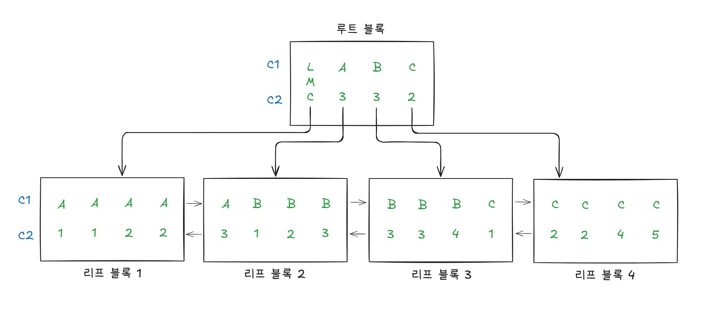

# 3.2 부분범위 처리 활용
## 3.2.3 OLTP 환경에서 부분범위 처리에 의한 성능개선 원리

## 배치(Batch) I/O
- 인덱스 ROWID를 이용한 테이블 랜덤 액세스는 고비용 구조다.
  - 인덱스를 이용해 대량 데이터를 조회하면, 디스크 I/O 발생량도 함께 증가하므로 성능이 급격히 나빠진다.
  - 부분범위 처리 원리를 활용해 상위 N개 집합을 빠르게 출력하도록 구현할 수 있다면, 인덱스로 액세스할 전체 대상 레코드가 아무리 많아도 빠른 응답속도를 낼 수 있다.
    - 이 경우 인덱스를 이용해 소트 연산을 생략할 수 있어야 하며 이와 관련해서 꼭 기억해야 할 내용이 있다.

- 오라클이 12c 이후로 제공하는 기능으로, 읽는 블록마다 건건이 I/O Call을 발생시키는 비효율을 개선한다.
- 인덱스를 이용해 테이블을 액세스하다가 버퍼 캐시에서 블록을 찾지 못하면 일반적으로 디스크 블록을 바로 읽게 되는데, 이 기능이 동작하면 테이블 블록에 대한 디스크 I/O Call을 모아뒀다가 읽을 블록이 일정량 쌓이면 그 때 한꺼번에 읽어오게 한다.
- 오라클 11g 에서 NL 조인 Inner 쪽 테이블 액세스에서 이 기능이 작동했으나, 12c 부터는 인덱스 ROWID로 테이블을 액세스하는 어떤 부분에서든 이 기능이 작동할 수 있게 되었다.

### 데이터 정렬 이슈
- 배치 I/O 기능이 작동하는 경우 문제는 인덱스를 이용해서 출력하는 데이터의 **정렬 순서가 매번 다를 수 있다는 점**이다.
  - 테이블 블록을 모두 버퍼 캐시에서 찾을 경우(버퍼캐시 히트율 = 100%) 기존처럼 인덱스 키값 순으로 데이터가 출력되겠지만, 그렇지 않은 경우(버퍼캐시 히트율 < 100%), 즉 실체 배치 I/O가 작동할 때는 데이터 출력 순서가 인덱스 정렬 순서와 다를 수 있다.

### 예시
```sql
create index emp_x01 on emp(deptno, job, empno);
set autotrace traceonly exp;
select * from emp e where deptno = 20 order by job, empno;
```
- 위 쿼리를 실행하고 실헁 계획을 확인해보면 SORT ORDER BY 오퍼레이션은 생략된다.
  - 인덱스를 활용하여 정렬된 데이터를 조회하기 때문이다.

- 12c 버전에서 제공하는 batch_ table_access_by_rowid 힌트를 함께 사용하면 어떻게 될까?
```sql
select /*+ batch_table_access_by_rowid(e) */ * 
from emp e 
where deptno = 20 
order by job, empno;
```
```
SELECT STATEMENT
  SORT ORDER BY
    TABLE ACCESS BY INDEX ROWID BATCHED
      INDEX RANGE SCAN
```
- 이 경우 배치 I/O가 동작할 수 있으므로 테이블 액세스 단계 뒤쪽에 `BATCHED`가 추가됐고, 동시에 SORT ORDER BY 오퍼레이션도 추가되었다.
- 소트 생략 가능한 인덱스를 사용하더라도, 배치 I/O 기능이 작동하면 데이터 정렬 순서를 보장할 수 없기 때문이다.
- 인덱스로 소트 연산을 생략할 수 없거나 SQL에 ORDER BY가 없으면 랜덤 I/O 성능을 향상하기 위해 옵티마이저는 기본적으로 배치 I/O를 선택한다.

```sql
select * from emp e where deptno = 20 order by empno;
```
```
SELECT STATEMENT
  SORT ORDER BY
    TABLE ACCESS BY INDEX ROWID BATCHED
      INDEX RANGE SCAN
```
- 인덱스로 소트 연산을 생략할 수 없는 경우에 배치 I/O로 동작하고 소트 연산을 수행한다.
```sql
select * from emp e where deptno = 20;
```
```
SELECT STATEMENT
  TABLE ACCESS BY INDEX ROWID BATCHED
    INDEX RANGE SCAN
```
- ORDER BY가 없으므로 정렬 순서 보장이 필요 없어 옵티마이저는 배치 I/O를 채택한다.

### 배치 I/O를 비활성화 하는 경우(비권장)
- 시스템 레벨에서 배치 I/O를 비활성화 하는 경우가 있다.
  - _optimizer_batch_table_access_by_rowid 파라미터를 false로 설정한다.
- 비활성화의 이유는 '필요한' ORDER BY를 생략하는 SQL 작성 패턴(관습) 때문이다.
  - 인덱스를 이용하면 결과집합이 자동으로 인덱스 키값 순으로 정렬되므로 ORDER BY를 생략한 채 rownum 조건과 함께 index/index_desc 힌트를 사용하는 패턴을 과거에 많이 활용해왔다.

#### 예시
```sql
-- 상태변경이력_PK : 장비번호 + 변경일시
-- 변경일시 순으로 상위 10개 레코드를 출력하는 쿼리
SELECT /*+ INDEX(H 상태변경이력_PK) */ 장비번호, 변경일시, 상태코드
FROM 상태변경이력 H
WHERE 장비번호 = :eqp_no
AND ROWNUM <= 10;

SELECT 장비번호, 장비명, 상태코드
  , (SELECT /*+ INDEX_DESC(H 상태변경이력_PK) */ 변경일시
     FROM 상태변경이력 H
     WHERE 장비번호 = P.장비번호
     AND ROWNUM <= 1) 최종변경일시 -- 변경일시 역순으로 상위 1개 레코드 조회
FROM 장비 P
WHERE 장비구분코드 = 'A001';
```
- 부분범위 처리 효과를 얻기 위해 rownum 조차 없이 index 힌트만으로 아래와 같이 쿼리를 작성하기도 한다.
```sql
SELECT /*+ INDEX(H 상태변경이력_PK) */ 장비번호, 변경일시, 상태코드
FROM 상태변경이력 H
WHERE 장비번호 = :eqp_no;
```
- 오라클 기능이 개선되며 굳이 이런 패턴을 유지할 이유는 없어졌지만, 그대로 둬도 상관은 없었다. 인덱스 구성을 변경하지 않는 한, 결과집합의 정렬 순서가 보장됐기 때문이다.
- 그러나 오라클 12c로 업그레이드 하면 정렬 순서가 달라질 수 있으므로 이 패턴은 반드시 수정해야 한다.
- `no_batch_table_access_by_rowid` 힌트를 사용해도 되지만, 가능한 ORDER BY를 추가하는 것이 바람직하다.

#### 추가 및 보완 내용
- rownum 조건과 index/index_desc 힌트를 사용하지 않고도 같은 성능을 내는 방법 : `5.3 인덱스를 이용한 소트 연산 생략`에서 설명
- NL 조인 Inner 테이블에서 작동하는 배치 I/O : `4.1.7 NL 조인 확장 메커니즘`에서 설명
  - 참고로 12c에 도입된 일반 배치 I/O와 NL 조인에서 작동하는 기존 배치 I/O는 파라미터, 힌트, 실행계획 표현방식에서 모두 다름

# 3.3 인덱스 스캔 효율화
### 테이블 랜덤 액세스 최소화
- IOT, 클러스터, 파티션은 테이블 랜덤 액세스를 최소화하는 데 매우 효과적인 저장 구조이나, 운영 시스템 환경에서 이를 적용하기 위해 성능 검증을 위한 많은 테스트를 선행해야 하므로 어려움이 따른다.
  - 시스템 개발 단계에서 물리 설계가 매우 중요한 이유다.
- 운영 환경에서 가능한 일반적인 튜닝 기법은 `인덱스 컬럼 추가`다.

### 인덱스 스캔 효율화
- 반면, 인덱스 스캔 효율화는 튜닝 요소가 매우 다양하며, 인덱스 설계 공식을 이루는 주요 원리가 인덱스 스캔 효율화에서 비롯된다.

## 3.3.1 인덱스 탐색
- 인덱스 탐색은 기본적으로 수직적 탐색과 수평적 탐색으로 구성된다.
  - 수직적 탐색은 스캔 시작점을 찾는 과정이다.
- 뒤이어 설명이 될테지만, 앞서 얘기하면 인덱스를 스캔하는 단계에서 처리하는 조건절은 액세스 조건과 필터 조건으로 나누어 볼 수 있다.
  - 인덱스 액세스 조건:  인덱스 스캔 범위를 결정하는 조건절로 인덱스 수직적 탐색을 통해 스캔 시작점을 결정하는 데 영향을 미치고, 인덱스 리프 블록의 수평적 탐색 중단점을 결정하는 데 영향을 미치는 조건절이다.
  - 인덱스 필터 조건: 테이블로 액세스할지 결정하는 조건절이다.

### 예시
#### 조건절 1
```sql
WHERE C1 = 'B'
```
#### 조건절 2
```sql
WHERE C1 = 'B' -- 스캔 시작/끝 지점을 찾는 역할(수직적 탐색)
AND C2 = 3 -- 스캔 시작/끝 지점을 찾는 역할
```
#### 조건절 3
```sql
WHERE C1 = 'B' -- 스캔 시작/끝 지점을 찾는 역할
AND C2 >= 3 -- 스캔 시작점을 찾는 역할
```
#### 조건절 4
```sql
WHERE C1 = 'B' -- 스캔 시작/끝 지점을 찾는 역할
AND C2 <= 3 -- 스캔 끝 지점을 찾는 역할
```
#### 조건절 5
```sql
WHERE C1 = 'B' -- 스캔 시작/끝 지점을 찾는 역할
AND C2 BETWEEN 2 AND 3 -- 스캔 시작/끝 지점을 찾는 역할
```
#### 조건절 6
```sql
WHERE C1 BETWEEN 'A' AND 'C' -- 스캔 시작/끝 지점을 찾는 역할
AND C2 BETWEEN 2 AND 3 -- 스캔량을 줄이는 역할 수행 X, 인덱스 필터 조건
```



참고)
- LMC(Leftmost Child): 루트/브랜치 블록에 존재하는 키 값을 갖지 않는 특별한 레코드, 자식 노드 중 가장 왼쪽 끝에 위치한 블록을 가리킨다.
  - LMC가 가리키는 주소로 찾아간 블록에는 `키 값을 가진 첫 번째 레코드보다 작거나 같은 값`을 갖는 레코드가 저장돼 있다.