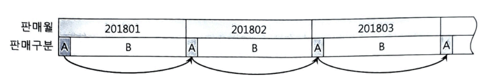
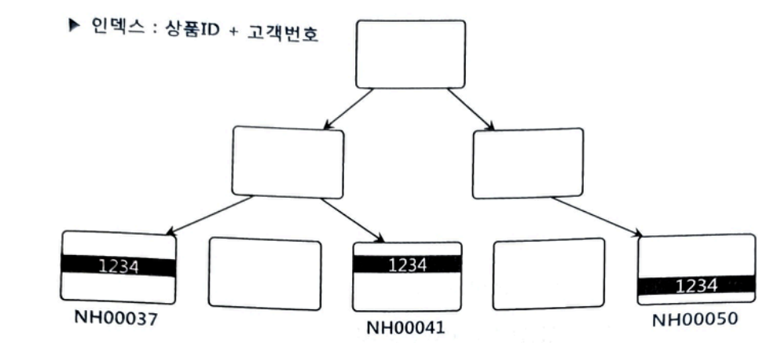
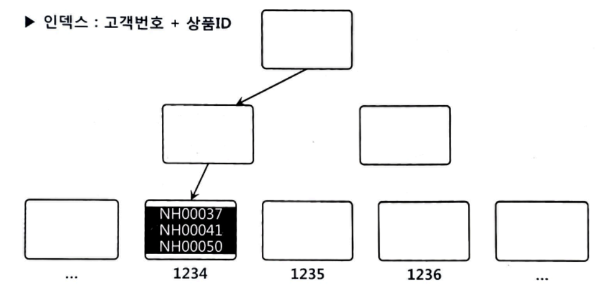
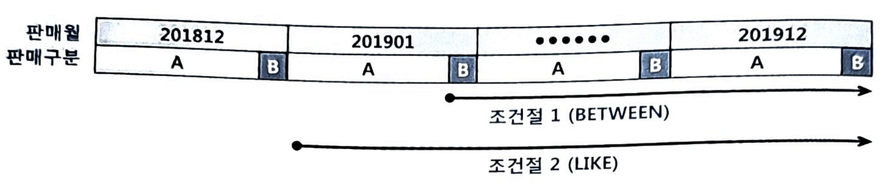
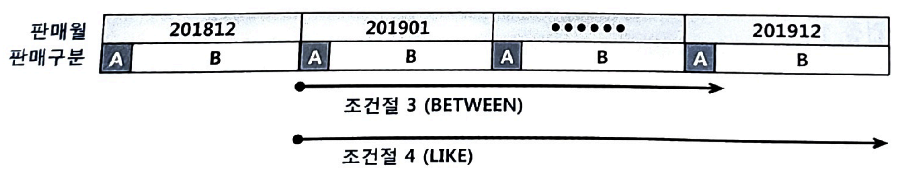

# 3장 인덱스 튜닝 
# 3.3.7 Index Skip Scan 활용 
...이어서

## 판매월(범위 검색(BETWEEN)) 컬럼 선두 Index 사용시 - IDX2

```sql
create index 월별고객별판매집계_IDX2 on 월별고객별판매집계(판매월, 판매구분);
```


- 판매구분 = 'A'인 레코드 
  - 2018년 1월부터 12월까지 각 판매월 앞쪽에 위치하며,
  - 전체에서 차지하는 비중이 8.3%(=10/120)에 불과(서로 멀리 떨어짐)

### IDX2 인덱스를 사용할 때의 트레이스 결과
#### 1. BETWEEN 조건으로

```sql
select /*+ index(t 월별고객별판매집계_IDX2) */ count(*)
from 월별고객별판매집계 t
where 판매구분 = 'A'
and 판매월 between '201801' and '201812';
```


| Rows   | Row Source Operation                                        | 
|--------|-------------------------------------------------------------|
| 1      | SORT AGGREGATE (cr=3090 pr=0 pw=0 time=206430 us)           | 
| 100000 | INDEX RANGE SCAN 월별고객별판매집계_IDX2 (cr=3090 pr=0 pw=0 time= …) | 

- 인덱스를 스캔하면서 3,090개 블록 I/O가 발생
- 테이블을 전혀 방문하지 않았는데도 I/O가 많이 발생한 이유
  - 인덱스 선두 컬럼이 BETWEEN 조건 ➡️ 판매구분이 'B'인 레코드까지 모두 스캔
  
#### 2. BETWEEN 조건을 IN-List로 전환

```sql
select /*+ index(t 월별고객별판매집계_IDX2) */ count(*)
from 월별고객별판매집계 t
where 판매구분 = 'A'
and 판매월 in ('201801', '201802', '201803', '201804', '201805', '201806',
                '201807', '201808', '201809', '201810', '201811', '201812');
```

| Rows   | Row Source Operation**                                     | 
|--------|------------------------------------------------------------|
| 1      | SORT AGGREGATE (cr=314 pr=0 pw=0 time=31527 us)            | 
| 100000 | INLIST ITERATOR (cr=314 pr=0 pw=0 time=900030 us)          | 
| 100000 | INDEX RANGE SCAN 월별고객별판매집계_IDX2 (cr=314 pr=0 pw=0 time= …) | 

- 3,090개이던 블록 I/O 개수가 314개로 감소
- 인덱스 브랜치 블록을 열두 번 반복 탐색했지만, 리프 블록을 스캔할 때의 비효율을 제거함으로써 성능이 열 배 좋음

#### 3. BETWEEN 조건 + Index Skip Scan으로 유도

```sql
select /*+ INDEX_SS(t 월별고객별판매집계_IDX2) */ count(*)
from 월별고객별판매집계 t
where 판매구분 = 'A'
and 판매월 between '201801' and '201812';
```

| Rows   | Row Source Operation                                              |
|--------|-------------------------------------------------------------------|
| 1      | SORT AGGREGATE (cr=300 pr=0 pw=0 time=94282 us)                   |
| 100000 | INDEX SKIP SCAN 월별고객별판매집계_IDX2 (cr=300 pr=0 pw=0 time=500073 us)  |

- 인덱스 선두 컬럼이 BETWEEN 조건인데도 큰 비효율 없이 단 300 블록만 읽음

#### 요약: 네 가지 테스트 결과 

#### [표 3-2]

| 구분        |  블록 I/O |
|-----------|---------|
| IDX1 인덱스  | 281     |
| BETWEEN   | 3,090   |
| IN-List   | 314     |
| Skip Scan | 300     |

- Index Skip Scan이 IN-List보다 오히려 낫고
- 「판매구분 + 판매월」순으로 구성된 IDX1 인덱스를 사용할 때와 비교해서도 큰 차이가 없다.

선두 컬럼이 BETWEEN이어서 나머지 검색 조건을 만족하는 데이터들이 서로 멀리 떨어져 있을 때, **Index Skip Scan**의 위력이 나타난다.

# 3.3.8 IN 조건은 '='인가

IN 조건을 '=' 조건과 동등 한가?

아래 SQL에 대한 인덱스를 
- 「상품ID + 고객번호」로 설계할 때와 
- 「고객번호 + 상품ID」로 설계할 때 

차이가 있는지 물어보면 쉽게 알 수 있다.

흔히 차이가 없다고 생각하지만 IN 조건은 '='이 아니다. 

따라서 인덱스를 어떻게 구성하느냐에 따라 성능도 달라질 수 있다.

```sql
select *
from 고객별가입상품
where 고객번호 = :cust_no
and 상품ID in ('NH00037', 'NH00041', 'NH00050');
```

- 고객별가입상품 테이블에서 고객번호의 평균 카디널리티는 3이라고 가정(즉, 고객별로 평균 세 건의 상품을 가입)

## 인덱스 「상품ID + 고객번호」순으로 생성
- 같은 상품 기준: 고객번호 순으로 정렬된 상태로 하나(또는 연속된 두 개)의 리프 블록에 저장
- 고객번호 기준: 같은 고객번호가 상품ID에 따라 흩어짐

예를 들어, 고객번호가 1234인 레코드가 상품ID에 따라 연속되지 않은 세 개 리프 블록에 저장.



- 즉, 인덱스 「상품ID + 고객번호」: 상품ID 조건절이 IN-List Iterator 방식으로 풀리는 것이 효과적
  - 고객번호 = 1234 조건을 만족하는 레코드가 서로 멀리 떨어져 있기 때문
- 상품ID 조건절이 IN-List Iterator 방식으로 풀린다는 건 SQL이 아래와 같이 IN 조건이 '=' 조건이 되어 실행된다는 것.

```sql
select * from 고객별가입상품
where 고객번호 = :cust_no and 상품ID = 'NH00037'
union all
select * from 고객별가입상품
where 고객번호 = :cust_no and 상품ID = 'NH00041'
union all
select * from 고객별가입상품
where 고객번호 = :cust_no and 상품ID = 'NH00050';
```

상품ID 조건절을 IN-List Iterator 방식으로 풀면 고객번호와 상품ID 둘 다 인덱스 액세스 조건으로 사용된다.

- 인덱스를 수직적으로 세 번 탐색하며, 그 과정에서 아홉 개 블록을 읽는다.

- 지금과 같은 인덱스「상품ID + 고객번호」 구성에서는 상품ID 조건절이 IN-List Iterator 방식으로 풀려야 한다(효과적).
  - 인덱스를 정상적으로 사용하려면 수직적 탐색을 통해 스캔 시작점을 찾아야 한다.
    - (상품ID가 'NH00037'이거나 'NH00041'이거나 'NH00050'인 어느 한 지점을 바로 찾을 수 없음)
  
- 상품ID가 인덱스 선두 컬럼인 상황에서 IN-List Iterator 방식으로 풀지 않으면?
  - 상품ID는 필터 조건 ➡️ 테이블 전체 또는 인덱스 전체를 스캔하면서 필터링해야 함.

## 인덱스 「고객번호 + 상품ID」순 생성
- 같은 고객 기준: 상품ID 순 정렬된 상태로 같은 리프 블록에 저장


- 여기서도 상품ID 조건절을 IN-List Iterator 방식으로 풀면, 
  - 인덱스를 수직적으로 세 번 탐색하는 과정에 아홉 개 블록을 읽는다.
- 상품ID 조건절을 IN-List Iterator 방식으로 풀지 않으면
  - 상품ID 조건절은 필터로 처리 ➡️ 고객번호만 액세스 조건이므로 고객번호 = 1234인 레코드를 모두 스캔
    - 같은 고객은 한 블록(또는 연속된 두 블록)에 모여 있으므로 블록 I/O는 수직적 탐색 과정을 포함해 총 세 개(또는 네 개)만 발생

IN 조건은 '='이 아니다.

IN 조건이 '='이 되려면 IN-List Iterator 방식으로 풀려야만 한다.
그렇지 않으면 IN 조건은 필터 조건이다.

> **IN 조건을 '=' 조건으로 만들기 위해, 즉 액세스 조건으로 만들기 위해 IN-List Iterator 방식으로 푸는 것이 항상 효과적인가?**
> 
> 방금 사례에서 상품ID가 액세스 조건으로서 의미 있는 역할을 하려면, 고객별 상품 데이터가 아주 많아야 한다.
> 
> 그렇지 않은 상황에서는 상품ID가 필터 방식으로 처리되는 게 오히려 낫다.


## 더 쉬운 예

- 상품 테이블 인덱스 구성
  * 상품_PK : 상품ID
  * 상품_X01 : 상품ID + 상품구분코드

- 쿼리문: 조회한 상품(상품ID = :prod_id)의 상품구분코드가 'GX' 또는 'KR'인 데이터 출력
    ```sql
    select * from 상품
    where 상품ID = :prod_id
    and 상품구분코드 in ('GX', 'KR');
    ```
   
- 실행계획(하단 Predicate information) 확인
  ```sql
  ---------------------
  Execution Plan
  ---------------------
  SELECT STATEMENT Optimizer=ALL_ROWS (Cost=2 Card=1 Bytes=38)
    TABLE ACCESS (BY INDEX ROWID) OF '상품' (TABLE) (Cost=2 Card=1 Bytes=38)
      INDEX (RANGE SCAN) OF '상품_X01' (INDEX) (Cost=1 Card=1)
  ---------------------
  Predicate information (identified by operation id):
  ---------------------
    2 - access("상품ID" = :PROD_ID)
    2 - filter("상품구분코드"='GX' OR "상품구분코드"='KR')
  ```
  - 상품구분코드 조건은 X01 인덱스에 대한 필터 조건으로 사용되고 있다.

이 상황에서 

- X01 인덱스 스캔을 IN-List Iterator 방식으로 유도하거나
- X01 인덱스를 상품구분코드 + 상품ID로 변경하면 

성능 향상에 도움이 될까?

그렇지 않다. 상품ID가 Unique하기 때문이다.

## NUM_INDEX_KEYS 힌트 활용

IN-List를 액세스 조건 또는 필터 조건으로 유도하는 방법을 살펴보자.

### 인덱스가 「고객번호 + 상품ID」순으로 구성된 상황

고객번호만 인덱스 액세스 조건으로 사용하려면 아래와 같이 힌트를 사용하면 된다.
```sql
select /*+ num_index_keys(a 고객별가입상품_X1 1) */ *
from 고객별가입상품 a
where 고객번호 = :cust_no
and 상품ID in ('NH00037', 'NH00041', 'NH00050');
```
- `num_index_keys` 힌트의 세 번째 인자 '1': 인덱스 첫 번째 컬럼까지만 액세스 조건으로 사용하라는 의미

```sql
---------------------
**Execution Plan**
---------------------
SELECT STATEMENT Optimizer=ALL_ROWS
  TABLE ACCESS (BY INDEX ROWID BATCHED) OF '고객별가입상품' (TABLE)
   INDEX (RANGE SCAN) OF '고객별가입상품_X1' (INDEX)
---------------------
Predicate information (identified by operation id):
---------------------
  2 - access("고객번호"=TO_NUMBER(:CUST_NO))
  2 - filter("상품ID"='NH00037' OR "상품ID"='NH00041' OR "상품ID"='NH00050')
```

> 힌트를 사용하지 않고 아래와 같이 인덱스 컬럼을 가공하는 방법도 있다.
> 
> ```sql
> select *
> from 고객별가입상품
> where 고객번호 = :cust_no
> and RTRIM(상품ID) in ('NH00037', 'NH00041', 'NH00050');
> 
> select *
> from 고객별가입상품
> where 고객번호 = :cust_no
> and 상품ID || '' in ('NH00037', 'NH00041', 'NH00050');
> ```

상품ID까지 인덱스 액세스 조건으로 사용하려면, 아래와 같이 힌트를 사용하면 된다.
```sql
select /*+ num_index_keys(a 고객별가입상품_X1 2) */ *
from 고객별가입상품 a
where 고객번호 = :cust_no
and 상품ID in ('NH00037', 'NH00041', 'NH00050');
```
실행계획을 보면 상품ID가 IN-List Iterator 방식으로 풀리면서 인덱스 액세스 조건으로 사용되었다.
```sql
---------------------
Execution Plan
---------------------
SELECT STATEMENT Optimizer=ALL_ROWS
  INLIST ITERATOR
    TABLE ACCESS (BY INDEX ROWID BATCHED) OF '고객별가입상품' (TABLE)
      INDEX (RANGE SCAN) OF '고객별가입상품_X1' (INDEX)
---------------------
Predicate information (identified by operation id):
---------------------
  3 - access("고객번호"=TO_NUMBER(:CUST_NO)) AND ("상품ID"='NH00037' OR "상품ID"='NH00041' OR "상품ID"='NH00050')
```

# 3.3.9 BETWEEN과 LIKE 스캔 범위 비교
- 상황
  - 월별로 집계된 테이블
  - 2019년 1월부터 12월 데이터를 조회하고자 한다.

흔히 아래와 같이 LIKE 연산자를 사용한다.

```sql
select * from 월별고객별판매집계
where 판매월 like '2019%';
```

아래 BETWEEN이 더 정확한 표현식인데도 개발자들이 LIKE를 더 선호하는 이유는 코딩하는 것이 더 편리하기 때문이다.

```sql
select * from 월별고객별판매집계
where 판매월 between '201901' and '201912';
```

LIKE와 BETWEEN은 둘 다 범위 검색 조건으로, 앞에서 설명한 범위 검색 조건을 사용할 때의 비효율 원리가 똑같이 적용된다.

하지만 데이터 분포와 조건절 값에 따라 인덱스 스캔량이 서로 다를 수 있다.

결론부터 말하면, LIKE보다 BETWEEN을 사용하는 게 낫다.

상황에 따라 큰 차이가 아닐 수 있지만, BETWEEN을 사용하면 손해는 안 본다.

## 예: 인덱스를 「판매월 + 판매구분」순 구성
### 상황 1
  - 판매구분: 'A'와 'B' 두 개 값이 존재
  - 각각 90%와 10%의 비중을 차지

아래 두 조건절에 대해 인덱스 스캔량을 비교해 보자.

#### < 조건절 1 >

```sql
where 판매월 between '201901' and '201912'
and 판매구분 = 'B'
```

#### < 조건절 2 >

```sql
where 판매월 like '2019%'
and 판매구분 = 'B'
```



- 조건절 1: between
  - 판매월 = '201901'이고 판매구분 = 'B'인 첫 번째 레코드에서 스캔 시작
- 조건절 2: like
  - 판매월 = '201901'인 첫 번째 레코드에서 스캔 시작
    - 혹시라도 '201900'이 저장돼 있다면 그 값도 읽어야 하므로 판매구분 = 'B'인 지점으로 바로 내려갈 수 없기 때문

### 상황 2
  - 판매구분: 'A'와 'B' 두 개 값이 존재
  - 판매구분 'A'와 'B' 두 값이 각각 10%와 90% 비중을 차지한다고 가정

아래 두 조건절에 대해 인덱스 스캔량을 비교해 보자.

#### < 조건절 3 >

```sql
where 판매월 between '201901' and '201912'
and 판매구분 = 'A'
```

#### < 조건절 4 >

```sql
where 판매월 like '2019%'
and 판매구분 = 'A'
```



- 조건절 3: between
  - 판매월 = '201912'이고 판매구분 = 'B'인 첫 번째 레코드를 만나는 순간 스캔을 멈춘다.
- 조건절 4: like
  - 판매월 = '201912'인 레코드를 모두 스캔 후 멈춘다.
    - 혹시라도 '201913'이 저장돼 있다면 그 값도 읽어야 하므로 중간에 멈출 수가 없다.

**정리:**

* 3.3.7. 선두 컬럼의 분포가 한쪽으로 치우쳐 있을 때, Index Skip Scan이 IN-List보다 유리할 수 있다.
* 3.3.8. IN 조건은 '='이 아니다. IN-List Iterator로 풀릴 때만 '='처럼 동작한다.
* 3.3.9. BETWEEN은 명확한 범위 검색으로 LIKE보다 효율적이다.
