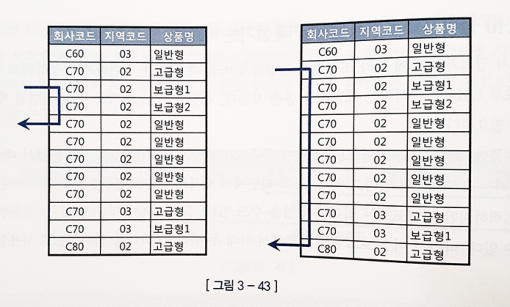
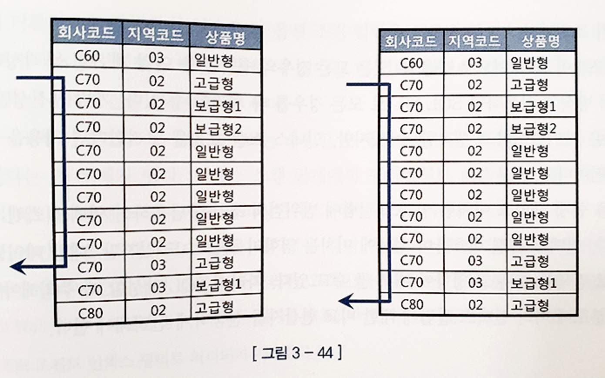

## 3.3.10 범위검색 조건을 남용할 때 생기는 비효율

#### 조건절이 다양하게 바뀌는 경우 LIKE 로 구현하는 경우가 종종 있는데, 해당 컬럼이 인덱스 구성 컬럼일 때는 주의가 필요하다.

-  회사코드, 지역코드, 상품명 등을 입력함으로써 ‘가입상품’ 테이블에서 데이터를 조회하는 경우
    - 회사코드(필수)
    - 지역코드(optional)
    - 상품명(일부만 입력 가능)

```sql
<쿼리 1> 회사코드, 지역코드, 상품명을 모두 입력할 때

SELECT 고객ID, 상품명, 지역코드, ...
FROM 가입상품
WHERE 회사코드 = :com
  AND 지역코드 = :reg
  AND 상품명 LIKE :prod || '%'
  

<쿼리 2> 회사코드, 지역코드, 상품명을 모두 입력할 때

SELECT 고객ID, 상품명, 지역코드, ...
FROM 가입상품
WHERE 회사코드 = :com
  AND 상품명 LIKE :prod || '%'

```

- 인덱스를 `회사코드 + 지역코드 + 상품명` 순으로 구성



좌측에는 사용자가 회사코드, 지역코드, 상품명에 각각 `'C70'`, `'02'`, `'보급'`을 입력하고 조회했을 때의 인덱스 스캔 범위를 표시했고,  
우측은 지역코드를 입력하지 않고 조회했을 때의 스캔 범위를 표시했다.

지역코드`(인덱스 중간 컬럼)` 에 대한 조건이 없을 때(우측)는 넓은 범위를 스캔하지만, 이 조건이 있을 때(좌측)는 세 컬럼 모두 액세스 조건이므로 적은 범위만 스캔하고 빠르게 결과를 출력할 수 있다.

- 두 상황을 하나의 SQL로 처리기 위해 지역코드 컬럼 조건절에 LIKE 연산자를 사용한 경우의 조회성능

```sql
select 고객ID, 상품명, 지역코드, ...
from 가입상품
where 회사코드 = :com
    and 지역코드 like :reg || '%'
    and 상품명 like :prod || '%'
```




지역 코드를 입력 안한경우(우측)는 위와 동일하지만, 지역코드를 입력한 경우(좌측)는 위의 좌측에 비해 인덱스 스캔 범위가 늘어난 것을 볼 수 있다.

이는 앞서 액세스 조건이었던 상품명이 필터 조건으로 바뀌면서 생긴 변화다.

#### 모든 조건절을 BETWEEN으로 개발하는 경우

```sql
SELECT 거래일자, 종목코드, 투자자유형코드,
       주문매체코드, 체결건수, 체결수량, 거래대금
FROM   일별종목거래
WHERE  거래일자 BETWEEN :시작일자 AND :종료일자        -- 필수 조건
AND    종목코드 BETWEEN :종목1 AND :종목2              -- 옵션 조건
AND    투자자유형코드 BETWEEN :투자자유형1 AND :투자자유형2  -- 옵션 조건
AND    주문매체구분코드 BETWEEN :주문매체구분1 AND :주문매체구분2  -- 옵션 조건
```

예를들어 종목코드에 최대 6자리까지 가능하다고 하래, 사용자가 종목 코드를 입력하면 양쪽 변수 `:종목1, :종목2`에 같은 값을 입력한다.
종목코드를 입력하지 않으면 왼쪽 변수에는 `'______'`, 오른쪽에는 `'ZZZZZZ'` 를 입력한다. 이렇게 입력하면 모든 종목 코드가 조회된다.
옵션 조건이 세개이므로 나올 수 있는 모든 경우의 수 만큼 sql을 작성하는 수고로움은 덜지만, 인덱스 스캔 효율을 고려한다면 사용을 자제해야 한다.

> 코딩을 쉽게 하려고 이처럼 인덱스 컬럼에 범위검색 조건을 남용하면 인덱스 스캔 비효율이 생긴다. <br> 대량 테이블을 넓은 범위로 검색할 때는 인덱스 스캔 비효율이 성능에 큰 영향을 미칠 수 있다.<br> 따라서 SQL 작성할 때 주의해야 하며, 데이터 분포에 따라 인덱스 컬럼에 대한 비교 연산자를 신중하게 선택해야 한다.


## 3.3.11 다양한 옵션 조건 처리 방식의 장단점 비교
### OR 조건 활용

```sql
SELECT * 
FROM 거래
WHERE (:cust_id IS NULL OR 고객ID = :cust_id)
  AND 거래일자 BETWEEN :dt1 AND :dt2;

Execution Plan
------------------------------------------------------------
0  SELECT STATEMENT  Optimizer=ALL_ROWS
1   TABLE ACCESS (FULL) OF '거래' (TABLE) /* 인덱스 활용x, 테이블 풀스캔 */
```

문제점은 옵션 조건 컬럼을 선두에 두고 `고객ID + 거래일자` 순으로 인덱스를 구성해도 이를 사용할 수 없다는 데 있다.(옵티마이저에 의한 OR Expansion 쿼리 변환이 기본적으로 작동하지 않으므로)

`거래일자 + 고객ID` 순으로 구성한 인덱스는 사용할 수 있지만, 고객 ID를 필터조건으로 사용한다는 데 문제가 있다.(인덱스 스캔 단계에서 필터링해도 비효율적인데, 테이블 액세스 단계에서 필터링한다.)
- 거래일자 BETWEEN 조건을 찾기 위해 테이블 백만건 스캔
- 백만건 만큼 테이블 랜덤 액세스
- 고객 ID 필터링
  그렇다면 OR 옵션 조건으로 처리한 고객ID는 인덱스에 포함할 필요가 없다. (인덱스 필터로 사용되지 않으므로. 18c 버전에 대한 내용은 아래 명시)
```sql
------------------------------------------------------------
0  SELECT STATEMENT  Optimizer=ALL_ROWS
1   FILTER
2    TABLE ACCESS (BY INDEX ROWID) OF '거래' (TABLE)
3     INDEX (RANGE SCAN) OF '거래_IDX3' (INDEX)
------------------------------------------------------------

Predicate Information (identified by operation id):
------------------------------------------------------------
1 - filter(TO_DATE(:DT1) <= TO_DATE(:DT2))
2 - filter(:CUST_ID IS NULL OR "고객ID" = TO_NUMBER(:CUST_ID))
3 - access("거래일자" >= :DT1 AND "거래일자" <= :DT2)
------------------------------------------------------------
```


인덱스에 포함되지 않은 컬럼에 대한 옵션 조건은 어차피 테이블에서 필터링할 수밖에 없으므로 OR 조건을 사용해도 무방하다.

> OR 조건을 활용한 옵션 조건 처리 <br>
> - 인덱스 액세스 조건으로 사용 불가
> - 인덱스 필터 조건으로도 사용 불가
> - 테이블 필터 조건으로만 사용 가능
> - 단, 인덱스 구성 컬럼 중 하나 이상이 Not Null 컬럼이면 18c부터 인덱스 필터 조건으로 사용 가능

위와 같은 특성을 고려하면 OR 조건을 이용한 옵션 조건 처리는 가급적 사용하지 말아야 한다.
이 방식의 유일한 장점은 옵션 조건 컬럼이 NULL 허용 컬럼이어도 결과집합을 보장한다는 것 뿐이다
(이어서 설명할 방식은 UNIION ALL을 제외하면 NULL 허용 컬럼에 사용할 수 없다. 결과집합을 보장하지 않기 때문이다.)

- OR-Expansion을 통해 인덱스 사용이 가능한 경우
```sql
SELECT * 
FROM 거래
WHERE 고객ID = :cust_id
--각 OR절이 서로 독립적으로 인덱스를 사용할 수 있음
  AND ( (:dt_type = 'A' AND 거래일자 BETWEEN :dt1 AND :dt2)
     OR (:dt_type = 'B' AND 결제일자 BETWEEN :dt1 AND :dt2) );

Execution Plan
------------------------------------------------------------
0  SELECT STATEMENT  Optimizer=ALL_ROWS
1   CONCATENATION -- 병합
2    FILTER
3     TABLE ACCESS (BY LOCAL INDEX ROWID) OF '거래' (TABLE)
4      INDEX (RANGE SCAN) OF '거래_IDX1' (INDEX)   -- 고객ID + 거래일자
5    FILTER
6     TABLE ACCESS (BY LOCAL INDEX ROWID) OF '거래' (TABLE)
7      INDEX (RANGE SCAN) OF '거래_IDX2' (INDEX)   -- 고객ID + 결제일자

```

### LIKE/BETWEEN 조건 활용

앞에서 설명한 것처럼 **LIKE**와 **BETWEEN**은 옵션 조건 처리를 위해 자주 사용하는 방식 중 하나다.  
아래와 같이 `변별력이 좋은 필수 조건이 있는 상황(당일 등록 상품 조회 - 소수)`에서는  
이 패턴을 사용하는 것이 오히려 나쁘지 않다.

- 필수 조건의 변별력이 좋은 경우
```sql
-- 인덱스: 등록일시 + 상품분류코드
SELECT * FROM 상품
WHERE 등록일시 >= TRUNC(SYSDATE)       -- 필수 조건 (당일 등록 상품)
AND 상품분류코드 LIKE :prd_cls_cd || '%';  -- 옵션 조건
```

필수 조건 컬럼을 인덱스 선두에 두고 액세스 조건으로 사용하면 `LIKE/BETWEEN`이 인덱스 필터 조건이어도 충분히 좋은 성능을 낼 수 있기 때문이다.

필수 조건이 아래와 같이 `'='` 이면 옵션 조건인 상품분류코드까지도 인덱스 액세스 조건이므로 최적의 성능을 낼 수 있다.

```sql
-- 인덱스: 상품명 + 상품분류코드
SELECT * FROM 상품
WHERE 상품명 = :prd_nm                 -- 필수 조건
AND 상품분류코드 LIKE :prd_cls_cd || '%';  -- 옵션 조건
```

- 필수 조건의 변별력이 좋지 않은 경우

```sql
-- 인덱스: 상품대분류코드 + 상품코드
SELECT * FROM 상품
WHERE 상품대분류코드 = :prd_lcls_cd        -- 필수 조건
AND 상품코드 LIKE :prd_cd || '%';         -- 옵션 조건
```

상품 대분류 코드만으로 조회하는 경우에는 `Table Full Scan` 이 유리하다. 하지만 옵티마이저는 상품코드까지 입력할 때를 기준으로 `Index Range Scan` 을 선택한다.
상품코드까지 입력하면 괜찮겠지만, 그렇지 않을 때 성능에 문제가 생긴다.

> LIKE / BETWEEN 조건을 적용하기 전 확인해야 할 사항  (BETWEEN 조건은 1번~2번 케이스에 해당)
> 1. 인덱스 선두 컬럼
> 2. NULL 허용 컬럼
> 3. 숫자형 컬럼
> 4. 가변 길이 컬럼
#### 1. 인덱스 선두 컬럼에 대한 옵션 조건을 LIKE/BETWEEN 연산자로 처리하는 것은 금물이다.

```sql
-- 인덱스: 고객ID + 거래일자
SELECT * FROM 거래 
WHERE 고객ID LIKE :cust_id || '%' /*인덱스 선두 컬럼을 LIKE로 처리*/
AND 거래일자 BETWEEN :dt1 AND :dt2;
```

사용자가 고객ID 값을 입력하면,  거래일자와 함께 인덱스 스캔이 수행되어 비교적 효율적으로 작동한다.  
하지만 고객ID를 입력하지 않으면  인덱스는 **모든 거래 데이터를 스캔**하면서 거래일자 조건만으로 필터링하게 되어 불필요한 범위 스캔이 발생한다.

위와 같이 옵션 처리에 LIKE/BETWEEN 을 사용했다면 인덱스를 거래일자+고객ID순으로 구성해야 한다.
(거래일자가 선두에 있으면 탐색시작점을 알 수 있다. 하지만 고객ID값을 입력할 때 생기는 비효율은 감수해야 한다.)

#### 2. NULL 허용 컬럼에 대한 옵션 조건을 LIKE/BETWEEN 연산자로 처리하는 것도 금물이다.

NULL이 허용된 컬럼에 대해 LIKE / BETWEEN을 적용하면 성능을 떠나 결과 집합의 오류가 생길 수 있다.
위 SQL에서 :cust_id 변수에 NULL을 입력하면 조건절은 아래와 같은 형태가 된다.
```sql
SELECT * FROM 거래
WHERE 고객ID LIKE '%'
AND 거래일자 BETWEEN :dt1 AND :dt2;
```

거래일자 조건에 해당하는 모든 거래를 선택해야 하는 상황인데, 고객ID가 NULL 허용 컬럼이고 실제 NULL 값이 입력되어 있다면 그 데이터는 결과집합에서 누락된다. (NULL값이 있는 행이 결과에서 누락)

```sql
SELECT * FROM dual WHERE NULL LIKE :var || '%';

-- 결과: 선택된 레코드가 없습니다
```

NULL은 어떤 문자열 비교에도 참이 될 수 없기 때문이다.

BETWEEN 조건을 사용할 때도 컬럼 값이 NULL인 데이터는 결과집합에서 누락된다.

#### 3. 숫자형이면서 인덱스 액세스 조건으로도 사용 가능한 컬럼에 대한 옵션 조건 처리는 LIKE를 사용해선 안된다.

```sql
-- 인덱스: 거래일자 + 고객ID
SELECT * FROM 거래
WHERE 거래일자 = :trd_dt
--:cust_id에 값을 입력하면 두 컬럼 모두 인덱스 액세스 조건으로 사용된다
AND 고객ID LIKE :cust_id || '%'; 
```

그런데 만약 고객ID가 숫자형 컬럼이면, 아래와 같이 자동 형변환이 일어나므로 고객ID가 필터 조건으로 사용된다.
하루치 거래를 모두 스캔하면서 고객ID 조건을 필터링한다는 뜻이다.

```sql
SELECT * FROM 거래
WHERE 거래일자 = :trd_dt
AND TO_CHAR(고객ID) LIKE :cust_id || '%'; 
```

이 경우, `고객ID + 거래일자` 순으로 구성한 인덱스는 아예 사용할 수 없다.

#### 4. LIKE를 옵션 조건에 사용할 때는 컬럼 값 길이가 고정적이어야 한다.

예를 들어 고객명 컬럼에는 '김훈', '김훈남' 등 길이가 다른 값이 입력될 수 있다.
그런데 고객명에 대한 옵션 조건을 LIKE 패턴으로 처리하면 `김훈` 고객을 찾기 위해 `:cust_nm` 변수에 `김훈` 을 입력했을 때 `김훈남` 고객도 같이 조회된다.

```sql
WHERE 고객명 LIKE :cust_nm || '%' -- :cust_nm = '김훈'
```

따라서 컬럼 값 길이가 가변적일 때는 변수 값 길이가 같은 레코드만 조회되도록 아래와 같은 조건절을 추가해야 한다.

```sql
WHERE 고객명 LIKE :cust_nm || '%'
AND length(고객명) = length(nvl(:cust_nm), 고객명)
```

아래와 같이 하는 방법도 있다

```sql
WHERE 고객명 LIKE :cust_nm -- 고객명을 입력하지 않을 때 :cust_nm 에 % 입력
```

'%' 없는 LIKE 조건은 '=' 조건처럼 :cust_nm 에 입력한 값과 정확히 일치하는 고객명만 출력한다.
단, 사용자가 고객명을 입력하지 않으면 :cust_nm 변수에 '%'를 입력해야 모든 고객명을 출력한다.
