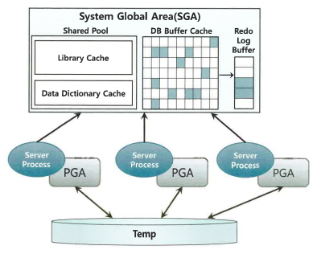
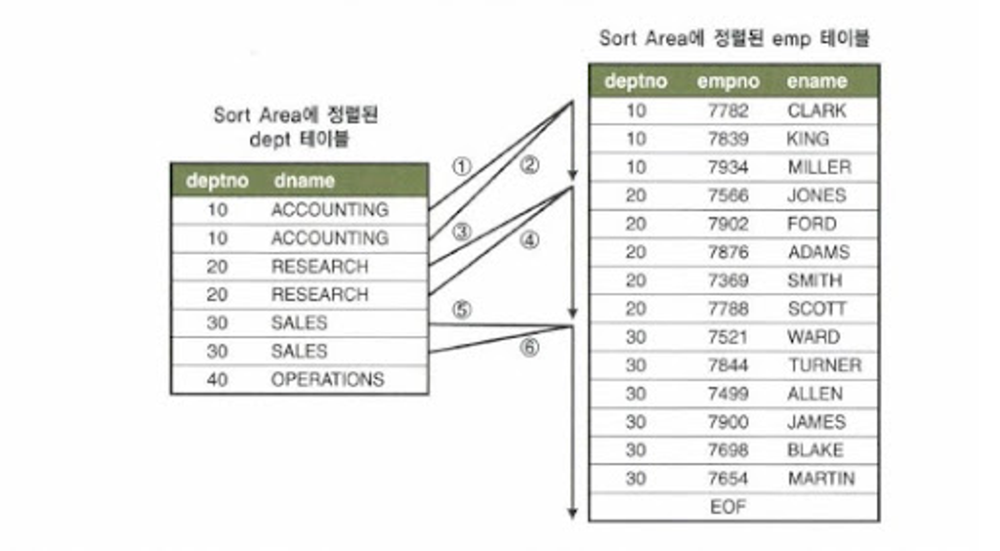

# 4.2 소트 머지 조인
- 조인 컬럼에 인덱스가 없거나 대량 데이터 조인이어서 인덱스가 효과적이지 않을 때, 옵티마이저는 NL 조인 대신 소트 머지 조인이나 해시 조인을 선택한다.
- 해시 조인의 등장으로 인해 소트 머지 조인의 효용이 전에 비해 떨어졌으나, 해시 조인을 사용할 수 없는 상황에서 대량 데이터를 조인하는 경우 여전히 유용하게 쓰일 수 있다.

## 4.2.1 SGA vs.PGA

### SGA(System Global Area 또는 Shared Global Area)
- 공유 메모리 영역인 SGA에 캐시된 데이터는 여러 프로세스가 공유하게 된다.
- 그러나 여러 프로세스의 동시 액세스는 불가하므로, 이를 방지하기 위해 프로세스 사이에 동시에 발생하는 액세스를 직렬화 하기 위한 Lock 메커니즘으로서 래치(Latch)가 존재한다.
- SGA의 가장 핵심적 구성요소인 DB 버퍼캐시에는 데이터 블록과 인덱스 블록이 캐싱되는데, 여기서 블록을 읽기 위해서는 버퍼 Lock도 얻어야 한다. ([1.3.8 캐시 탐색 메커니즘](../1장/%5B01장%5D_SQL%20처리%20과정과%20IO_57-66_강혜주.md) 참고)

### PGA(Process/Program/Private Global Area)
- 오라클 서버 프로세스는 SGA 에 공유된 데이터를 읽고 쓰면서, 동시에 자신만의 고유 메모리 영역을 갖는다.
- 각 오라클 서버 프로세스에 할당된 메모리 영역을 PGA 라고 부르며, 프로세스에 종속적인 고유 데이터를 저장하는 용도로 사용한다.
- 할당받은 PGA 공간이 작아 데이터를 모두 저장할 수 없을 때는 Temp 테이블스페이스를 이용한다.
- PGA는 다른 프로세스와 공유하지 않는 독립적인 메모리 공간이므로 래치 메커니즘이 불필요하다.
  - 즉 같은 양의 데이터를 읽더라도 SGA 버퍼캐시에서 읽을 때보다 훨씬 빠르다.

## 4.2.2 기본 메커니즘
- 소트 머지 조인(Sort Merge Join)은 이름과 같이 아래의 두 단계를 진행하여 조인을 수행한다.

1. 소트 단계 : 양쪽 집합을 조인 컬럼 기준으로 정렬한다.
2. 머지 단계 : 정렬한 양쪽 집합을 서로 머지(Merge)한다.

### 소트 머지 조인 과정
- 소트 머지 조인은 use_merge 힌트로 유도한다.
- 아래 SQL 에 사용한 힌트는 사원 테이블 기준으로(ordered) 고객 테이블과 조인할 때 소트 머지 조인 방식을 사용하라(use_merge)고 지시하고 있다.

```sql
SELECT /*+ ordered use_merge(c) */
       e.사원번호, e.사원명, e.입사일자,
       c.고객번호, c.고객명, c.전화번호, c.최종주문금액
FROM   사원 e, 고객 c
WHERE  c.관리사원번호 = e.사원번호
AND    e.입사일자 >= '19960101'
AND    e.부서코드 = 'Z123'
AND    c.최종주문금액 >= 20000;
```
- 수행 과정을 순차적으로 살펴보자

1. 조건에 해당하는 사원 데이터를 읽어 조인컬럼인 사원번호 순으로 정렬한다. 
  - 정렬한 결과 집합은 PGA 영역에 할당된 Sort Area에 저장한다.
  - 혹 정렬한 결과집합이 PGA에 담을 수 없을 정도로 크면 Temp 테이블스페이스에 저장한다.
```sql
select 사원번호, 사원명, 입사일자
from 사원
where 입사일자 >= '19960101'
and 부서코드 = 'Z123'
order by 사원번호
```

2. 조건에 해당하는 고객 데이터를 읽어 조인컬럼인 관리사원번호 순으로 정렬한다.
  - 정렬한 결과 집합은 PGA 영역에 할당된 Sort Area에 저장한다.
  - 혹 정렬한 결과집합이 PGA에 담을 수 없을 정도로 크면 Temp 테이블스페이스에 저장한다.
```sql
select 고객번호, 고객명, 전화번호, 최종주문금액, 관리사원번호
from 고객
where 최종주문금액 >= 20000
order by 관리사원번호
```

3. PGA(또는 Temp 테이블스페이스)에 저장한 사원 데이터를 스캔하면서 PGA(또는 Temp 테이블스페이스)에 저장한 고객 데이터와 조인한다.
  - 조인하는 과정을 PL/SQL 코드로 표현하면 아래와 같다.
```sql
begin
  for outer in (select * from PGA에_정렬된_사원)
  loop -- outer 루프
    for inner in (select * from PGA에_정렬된_고객 where 관리사원번호 = outer.사원번호)
    loop -- inner 루프
      dbms_output.put_line( ... );
    end loop;
  end loop;
end;
```

- 1번과 2번이 소트 단계, 3번이 머지 단계에 해당한다.
- 실제 조인 오퍼레이션을 수행하는 3 머지 단계는 NL 조인과 다르지 않음을 위 Pseudo 코드를 통해 알 수 있다.
- 특히나 주목할 점은 사원 데이터를 기준으로 고객 데이터를 매번 Full Scan 하지 않아도 된다는 사실이다.
  - 고객 데이터가 정렬되어 있어 조인 대상 레코드가 시작되는 지점을 쉽게 찾을 수 있고, 조인에 실패하는 레코드를 만나는 순간 바로 멈출 수 있다.
  - Sort Area에 저장한 데이터 자체가 인덱스 역할을 하므로 소트 머지 조인은 조인 컬럼에 인덱스가 없어도 사용할 수 있는 조인 방식이 된다.
  - 또 조인 컬럼에 인덱스가 있더라도 NL 조인은 대량 데이터 조인에서 불리하므로 소트 머지 조인을 사용할 수 있다.



## 4.2.3 소트 머지 조인이 빠른 이유

- NL 조인은 모든 DBMS가 공통으로 제공하는 가장 전통적인 조인 방식이다.
- NL 조인의 치명적인 단점은 대량 데이터 조인시 성능이 매우 느리다는  점이다.
- 이러한 이유로 소트 머지 조인과 해시 조인이 개발되었다.

- 소트 머지 조인은 Sort Area에 미리 정렬해 둔 자료구조를 이용한다는 점만 다를 뿐 조인 프로세싱 자체는 NL 조인과 같다. 그렇다면 성능 차이는 어디서 나는 걸까?

### 성능 차이 이유
- NL 조인은 간단히 말하면 `인덱스를 이용한 조인 방식`이다.
  - 조인 과정에서 액세스하는 모든 블록을 랜덤 액세스 방식으로 '건건이' DB 버퍼캐시를 경유해서 읽는다.
  - 즉, 인덱스든 테이블이든, 읽는 모든 블록에서 래치 획득 및 캐시버퍼 체인 스캔 과정을 거치게 된다.
  - 버퍼 캐시에서 찾지 못한 블록은 또 '건건이' 디스크를 통해 읽어 들인다.
  - 인덱스를 이용하기 때문에 인덱스 손익분기점 한계를 그대로 갖게 된다.
  - 이러한 이유로 NL 조인이 대량 데이터 조인에서 불리하게 된다.

- 소트 머지 조인은 양쪽 테이블로부터 조인 대상 집합(조인 조건 외 필터 조건을 만족하는 집합)을 '일괄적으로' 읽어 PGA(또는 Temp 테이블스페이스)에 저장한 후 조인한다.
  - PGA는 프로세스만을 위한 독립적인 메모리 공간이므로 데이터를 읽을 때 래치 획득 과정이 없으므로, 이 점에서 소트 머지 조인이 대량 데이터 조인에 유리하게 된다.
  - 조인 전에 양쪽 집합에 대한 소트 연산을 추가로 수행하는 점에서 NL 조인보다 더 느려지지 않을까 싶지만, 오히려 소트 머지 조인은 이 정렬이 대량 데이터 조인에 유리해지는 핵심 요인이 된다. (사족: 랜덤 액세스에서 시퀀셜 액세스로 변환되는 점에서 대량 데이터 조인에 유리하게 된다.)
  - 소트 머지 조인도 최초에 양쪽 테이블로부터 조인 대상 집합을 읽을 때는 DB 버퍼 캐시를 경유하며, 이 때 인덱스를 이용하기도 한다.
    - 이 과정에서 생기는 버퍼캐시 탐색 비용과 랜덤 액세스 부하는 소트 머지 조인에도 존재한다.


### Temp 테이블스페이스 좀 더 알아보기
- 공유 임시 저장소이므로 여러 세션이 동시에 쓰지만, 내부적으로 세션별 Temp 세그먼트를 따로 할당하게 된다.
- 동시성에서는 큰 문제가 없다고 한다. 다만, 디스크 I/O 비용은 존재한다.