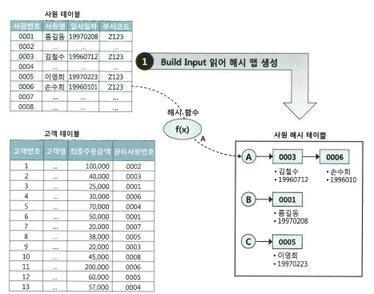
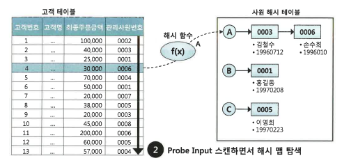
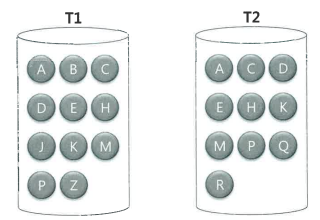
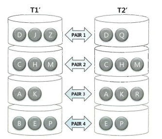

# 조인 튜닝

---
## 4.3 해시조인

NL조인은 인덱스를 이용한 조인방식이므로 인덱스 구성에 따른 성능차이가 심하다<br>
하지만 해시조인은 조인과정에 인덱스를 사용하지 않아 대량 데이터를 조인할 때 NL조인보다 훨씬 빠르고 일정한 성능을 보인다.

---
### 4.3.1 기본 매커니즘

해시조인은 두 단계로 진행된다.

1. Build 단계
    - 작은 쪽 테이블(Build Input)을 읽어 해시 테이블을 생성
2. Probe 단계
    - 큰 쪽 테이블(Probe Input)을 읽어 해시 테이블을 탐색 하면서 조인한다.
    - 
```sql
select /*+ ordered use_hash(c)*/
e.사원번호,e.사원명,e.입사일자,
c.고객번호, c.고객명, c.전화번호, c.최종주문금액
from 사원 e, 고객 c
where c.관리사원번호 = e.사원번호
and e.입사일자 >= '19960101'
and e.부서코드 >= 'Z123'
and e.최종주문금액 >= 20000
```


1. Build 단계
   - 아래 조건에 해당하는 사원 데이터를 읽어 해시테이블을 생성한다. 이때 조인컬럼인 사원번호를 해시 테이블 키값으로 사용한다.
   > 사원번호를 해시함수에 입력 -> 해시함수에서 반환된 값으로 해시 체인을 찾는다 -> 해시체인에 데이터를 연결
   - 해시테이블은 PGA영역에 할당된 Hash Area에 저장한다 (너무 커서 PGA에 담을 수 없다면 Temp 테이블 스페이스에 저장한다.)
   
2. Probe 단계 
   - 아래 조건에 해당하는 고객 데이터를 하나씩 읽어서 해시 테이블을 탐색한다.
   > 관리사원번호를 해시 함수에 입력 -> 반환된 값으로 해시 체인을 찾는다. -> 해시체인을 스캔해서 값이 같은 사원번호를 찾는다.
   - 이때 찾으면 조인에 성공한 것, 아니면 실패한 것이다. 

- Build 단계에서 사용한 해시 함수를 Probe 단계에서 공통으로 사용하므로 같은 사원번호를 입력하면 같은 해시값을 반환한다.<br>
-> 해시함수가 반환한 값에 해당하는 해시 체인만 스캔하면 된다.

**Probe 단계에서 조인과정을 PL/SQL로 표현**
```sql
begin
for outer in (
        select 고객번호, 고객명, 전화번호, 최종주문금액, 관리사원번호
        from 고객 
        where 최종주문금액 >= 20000
    )
    loop  -- outer 루프
        for inner in (
            select 사원번호, 사원명, 입사일자 
            from PGA에_생성한_사원_해시맵
            where 사원번호 = outer.관리사원번호
        )
        loop  -- inner 루프
            dbms_output.put_line(...);
end loop;
end loop;
end;
```

**Probe 단계에서 조인과정을 그림으로 표현**



---
# 4.3.2 해시 조인이 빠른 이유

해시테이블을 PGA 영역에 할당하기 때문이다.

NL조인은 outer테이블 레코드 마다 inner테이블 레코드를 읽기 위해 래치 획득과 캐시버퍼 체인 스캔을 반복하지만
해시조인은 래치 획득 과정없이 PGA를 통해 빠르게 데이터를 탐색하고 조인한다.

**해시 테이블에 담기는 정보**
>해시 테이블에 조인 키값만 저장된다고 오해 할 수있다. 예를 들어 사원 테이블에 `사원번호`를 말한다.<br>
> 이때 만약 해시테이블을 실제로 조인 키값만으로 생성하게되면 앞서 말한 해시조인의 장점이 사라지게 된다.<br>
> 조인에 성공한 사원번호에 대한 나머지 정보를 읽으려면 ROWID로 다시 테이블 블록을 액세스 해야하기 때문<br>
> 그래서 해시테이블에는 조인 키값뿐만 아니라 SQL에 사용한 모든 컬럼을 저장한다.<br>

해시조인과 소트 머지 조인 둘다 오퍼레이션을 PGA에서 처리한다.

그런데 대량 데이터를 조인할 때 일반적으로 해시 조인이 더 빠르다 이유가 뭘까?   

성능차이는 조인 오퍼레이션 시작전 준비 작업에서 발생한다.

- 소트 머지 조인
   - 사전 준비시 '양쪽' 집합을 모두 정렬해서 PGA에 담는다 
   - PGA는 크리 큰 공간이 아니므로 두 집합중 하나가 중대형 이상이면 Temp테이블 스페이스, 즉 디스크에 쓰는 작업을 반드시 수반한다.
- 해시 조인
  - 두 집합중 어느 '한쪽'을 읽어서 해시맵을 생성한다. 둘중 작은 집합을 Build Input으로 선택하므로 두 집합이 모두 큰 경우가 아니면 Temp테이블 스페이스, 즉 디스크에 쓰는 작업은 전혀 일어나지 않는다.
  
정리
해시 조인은 NL조인처럼 조인 과정에서 랜덤액세스 부하가 없고 소트머지조인처럼 양쪽 집합을 미리 정렬하는 부하도없다.
해시 테이블을 생선하는 비용이 있지만 둘중 작은 집합을 Build Input으로 선택하므로 부담이 적다.
그렇다고 Build Input이 HashAear 크기를 초과하면 다른 조인 메소드를 선택하라는 뜻이 아니다.
설령 Temp 테이블 스페이스를 쓰더라도 대량 데이터 조회시 일반적으로 해시조인이 가장 빠르다.

**해시 조인 요약**

🔹 **NL 조인과 달리 조인 과정에서 **랜덤 액세스** 부하가 발생하지 않는다.

🔹 **소트 머지 조인과 달리 조인을 위해 **양쪽 집합을 미리 정렬** 할 필요가 없다.

🔹 조인을 위해 **해시 테이블** 을 생성하는 비용이 있지만 **둘 중 작은 집합** 을 **Build Input** 으로 선택하므로 해시 테이블 생성 비용의 부담이 상대적으로 적다.

🔹 Build Input이 **Hash Area 크기를 초과한다고 해서** 반드시 다른 조인 방식을 선택해야 하는 것은 아니다.

🔹 설령 **Temp 테이블 스페이스**를 사용하더라도, **대량 데이터 조회 시 해시 조인이 일반적으로 가장 빠르다.**

✅ **요약**
> 해시 조인은 랜덤 액세스나 정렬 부하가 없고,  
> 대용량 데이터 조인 시 효율이 매우 뛰어난 방식이다.

# 4.3.3 대용량 Build Input 처리


두 테이블 모두 대용량 테이블이라 인메모리에서 조인이 불가능 할때 DBMS는 어떻게 처리할까?

두 단계로 나눠서 진행된다. `분할 정복 방식`이다.

1. 파티션 단계
   - 조인 하는 양쪽 집합의 조인 컬럼에 해시 함수를 적용하고, 반환된 해시 값에 따라 동적으로 파티셔닝한다.
   - 독립적으로 처리할 수 있는 여러 개의 작은 서브집합으로 분할하여 짝을 생성하는 단계
   - 이때 양쬭 집핮을 읽어 Temp에 저장해야 하므로 인메모리 해시조인보다 성능이 많이 떨어진다.
   
   
2. 조인 단계
   - 각 파티션 짝에 대해 하나씩 조인을 수행한다. 이때 각각에 대한 Build Input과 Probe Input은 독립적으로 결정
   - 해시 테이블을 생성하고 나면 반대 쪽 파티션 로우를 하나씩 읽으면서 해시 테이블을 탐색 한다.

