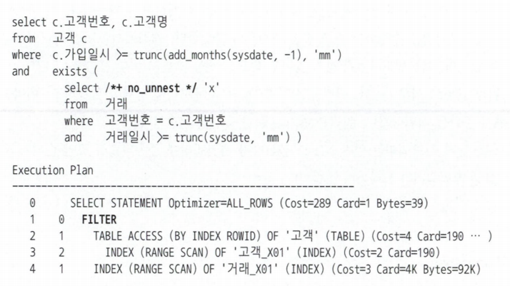
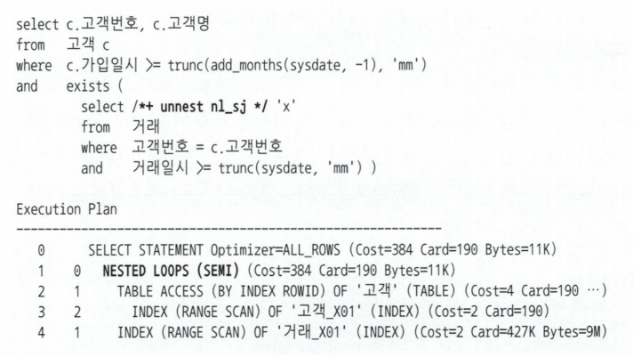
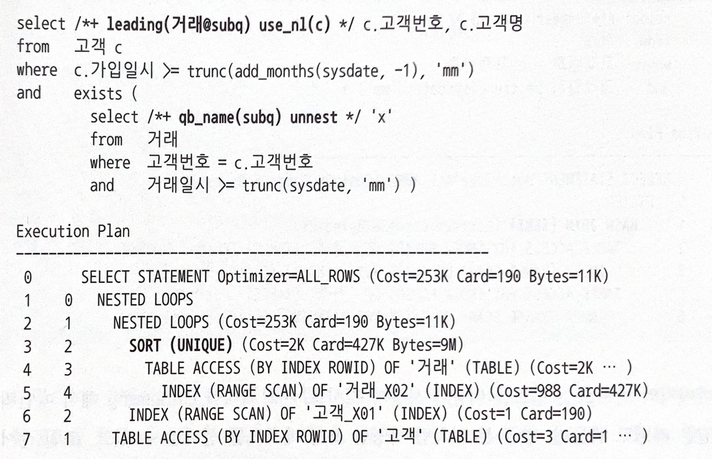
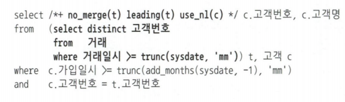
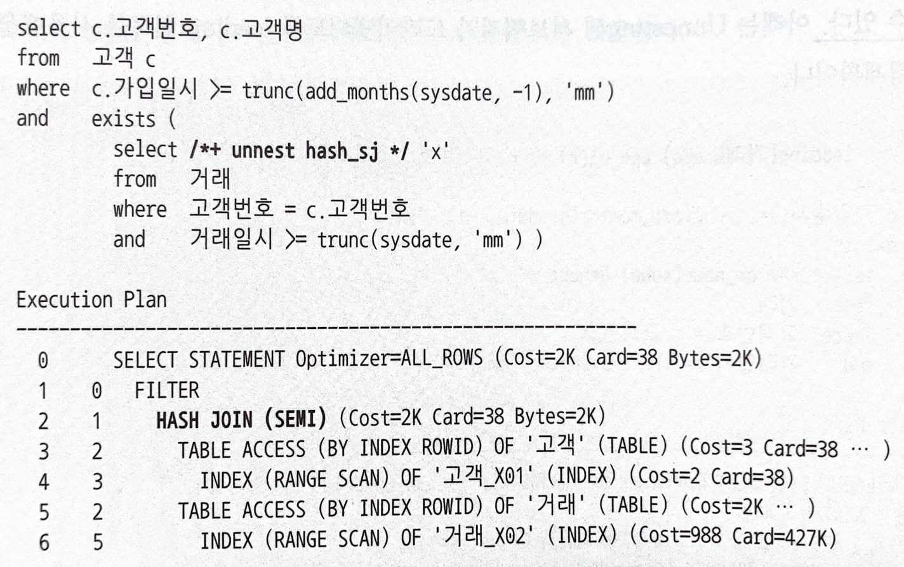

# 4.4 서브쿼리 조인
- 실무에서는 복잡한 서브쿼리와 조인하는 경우가 많다.
  - 그러므로, 옵티마이저가 서브쿼리 조인을 어떻게 처리하는지를 이해라고, 원하는 방식으로 실행계획을 제어할 수 있어야 한다.
- 옵티마이저는 서브쿼리에 대해 다양한 형태로 쿼리 변환을 시도한다.
  - 즉, 서브쿼리 조인을 이해하기 위해서는 이 쿼리 변환을 알아야 한다.

## 4.4.1 서브쿼리 변환이 필요한 이유
최근 옵티마이저는 비용(Cost)을 평가하고 실행계획을 생성하기에 앞서 사용자로부터 전달받은 SQL을 최적화에 유리한 형태로 변환하는 작업, 즉 **쿼리 변환** 부터 진행한다.
- 이는 사용자가 애초에 최적화에 가장 유리한 형태로 SQL을 작성했으면 좋았을 일이나, 그렇지 않기에 옵티마이저가 대신 처리하는 추세이다. 이로 인해 옵티마이저의 엔진은 더 무거워지고 최적화에 소요되는 시간도 증가하고 있다.

#### 쿼리 변환(Query Transformation)
- 옵티마이저가 SQL을 분석해 의미적으로 동일(즉, 같은 결과 집합을 생성)하면서도 더 나은 성능이 기대되는 형태로 재작성하는 것을 말한다.
  - 이미 많은 쿼리 변환이 개발되었으며 SQL 성능과 관련해 새로 개발되는 핵심 기능들도 대부분 쿼리 변환 영역이다.

#### 서브쿼리(Subquery)
- 하나의 SQL문 안에 괄호로 묶은 별도의 쿼리 블록(Query Block)을 말한다.
  - 쿼리에 내장된 또 다른 쿼리다.
  - 서브쿼리를 DBMS 마다 조금씩 다르게 분류할 수 있다.
- 오라클은 아래와 같이 분류한다.
```sql
SELECT c.고객번호, c.고객명, t.평균거래, t.최소거래, t.최대거래
     , (SELECT 고객분류명 FROM 고객분류 WHERE 고객분류코드 = c.고객분류코드) -- 스칼라 서브쿼리
  FROM 고객 c
     , (SELECT 고객번호, AVG(거래금액) 평균거래
             , MIN(거래금액) 최소금액, MAX(거래금액) 최대거래
          FROM 거래
         WHERE 거래일시 >= TRUNC(SYSDATE, ‘MM’)
         GROUP BY 고객번호) t -- 인라인 뷰
 WHERE c.가입일시 >= TRUNC(ADD_MONTHS(SYSDATE, -1), ‘mm’)
   AND t.고객번호 = c.고객번호
   AND exists (SELECT ‘X’
                 FROM 고객변경이력 h
                WHERE h.고객번호 = c.고객번호
                  AND h.변경사유코드 = ‘ZCH’
                  AND c.최종변경일시 BETWEEN h.시작일시 AND h.종료일시) -- 중첩된 서브쿼리
```

#### 1. 인라인 뷰(Inline View)
- FROM 절에 사용한 서브쿼리를 말한다.

#### 2. 중첩된 서브쿼리(Nested Subquery)
- 결과집합을 한정하기 위해 WHERE 절에 사용하는 서브쿼리를 말한다.
- 특히 서브쿼리가 메인쿼리 컬럼을 참조하는 형태를 '상관관계 있는(Correlated) 서브쿼리' 라고 부른다.

#### 3. 스칼라 서브쿼리(Scalar Subquery)
- 한 레코드 당 정확히 하나의 값을 반환하는 서브쿼리다.
- 주로 SELECT-LIST에서 사용하지만 몇 가지 예외사항을 제외하면 컬럼이 올 수 있는 대부분 위치에 사용할 수 있다.

---
이러한 서브쿼리를 참조하는 메인 쿼리도 하나의 쿼리 블록이며, 옵티마이저는 쿼리 블록 단위로 최적화를 수행하게 된다.

#### 예제1
- 아래 쿼리를 수행하면 쿼리 블록 1, 2를 각각 최적화한다.

```sql
-- 원본 쿼리
SELECT c.고객번호, c.고객명
  FROM 고객 c
 WHERE c.가입일시 >= TRUNC(add_months(sysdate, -1), 'mm')
   AND EXISTS (SELECT /*+ no_unnest */
                 FROM 거래
                WHERE 고객번호 = c.고객번호
                  AND 거래일시 >= TRUNC(SYSDATE, 'mm'))

-- 쿼리 블록 1 (메인 쿼리)
SELECT c.고객번호, c.고객명
FROM 고객 c
WHERE c.가입일시 >= TRUNC(add_months(sysdate, -1), 'mm')

-- 쿼리 블록 2 (EXISTS 서브 쿼리)
select 'x'
from 거래
where 고객번호 = :cust_no
    and 거래일시 >= TRUNC(SYSDATE, 'mm'))
```
#### 예제2
- 아래도 그대로 수행하면 쿼리 블록 1, 2를 각각 최적화한다.
```sql
select c.고객번호, c.고객명, t.평균거래, t.최소거래, t.최대거래
from 고객 c, (
    **select  고객번호, 
                    avg(거래금액) 평균거래, 
                    min(거래금액) 최소거래, 
                    max(거래금액) 최대거래
    from 거래
    where 거래일시 >= turnc(sysdate, 'mm')
    group by 고객번호**
) t
where c.가입일시>= turnc(add_months(sysdate, -1), 'mm')
    and t.고객번호= c.고객번호

-- 쿼리 블록 1 (메인 쿼리)
select c.고객번호, c.고객명, t.평균거래, t.최소거래, t.최대거래
from 고객 c, SYS_VW_TEMP t
where c.가입일시>= turnc(add_months(sysdate, -1), 'mm')
    and t.고객번호= c.고객번호

-- 쿼리 블록 2 (인라인 뷰)
select 고객번호, avg(거래금액) 평균거래, min(거래금액) 최소거래, max(거래금액) 최대거래
from 거래
where 거래일시 >= turnc(sysdate, 'mm')
group by 고객번호
```

- 그러나 이렇게 서브쿼리 별로 최적화 된 쿼리가 전체적으로도 최적화됐다고 볼 수는 없다.
- 즉, 옵티마이저가 나무가 아닌 숲 전체를 바라보는 관점에서 쿼리를 이해하기 위해서는 먼저 서브쿼리를 풀어 낼 필요가 있다.

## 4.4.2 서브쿼리와 조인
- 메인쿼리와 서브쿼리 간에는 부모와 자식이라는 종속적이고 계층적인 관계가 존재한다.
  - 서브쿼리는 메인쿼리에 종속되므로 단독으로 실행할 수 없다.
  - 메인쿼리 건수만큼 값을 받아 반복적으로 필터링하는 방식으로 실행하게 된다.

### 필터 오퍼레이션
- 서브쿼리를 필터 방식으로 처리할 때의 실행계획


- no_unnest 힌트를 사용하여, 필터 방식으로 처리하도록 유도했다.
- no_unnest 는 서브쿼리를 풀어내지 말고 그대로 수행하라고 옵티마이저에게 지시하는 힌트다.

#### NL 조인과 공통점
- **필터(Filter) 오퍼레이션**은 기본적으로 NL 조인과 처리 루틴이 같다.
  - 위 실행 계획의 `FILTER`를 `NESTED LOOPS` 로 치환하고 처리 루틴을 해석할 수 있다.
  - NL 조인과 같이 **부분 범위 처리**가 가능하다.

#### NL 조인과 차이점
- 필터는 메인 쿼리의 한 로우가 서브 쿼리의 한 로우와 조인에 성공하는 순간 진행을 멈추고, 메인 쿼리의 다음 로우를 계속 처리한다.
  - 조건에 해당하는 특정 고객의 조건에 해당되는 거래가 하나 조회되면 진행이 멈추고 다음 고객으로 넘어가는 식
  - 메인쿼리 결과집합(고객)이 서브쿼리 M쪽 집합(거래) 수준으로 확장되는 현상(고객번호 중복)을 막기 위해서이다.

- 필터 오퍼레이션은 **캐싱** 기능을 갖는다.
  - 필터 처리한 결과, 즉 서브쿼리 입력 값에 따른 반환 값(true 또는 false)을 캐싱하는 기능이다.
  - 캐싱 기능이 있기 때문에 서브쿼리를 수행하기 전에는 항상 캐시부터 확인한다.
    - 캐시에서 true/false 여부를 확인할 수 있다면 서브쿼리를 수행하지 않아도 되기 때문에 성능이 올라간다.
  - 캐싱은 **쿼리 단위**로 이루어진다.
    - 쿼리를 시작할 때 PGA 메모리에 공간을 할당하고, 쿼리를 수행하면서 공간을 채워나가며, 쿼리를 마치는 순간 공간을 반환한다.

- 필터 서브쿼리는 일반 NL 조인과 달리 메인 쿼리에 종속되므로 조인 순서가 고정된다.
  - 항상 메인쿼리가 드라이빙 집합(outer)이다.

### 서브쿼리 Unnesting
- 서브쿼리를 Unnesting 할 때의 실행계획

- 보편적으로 옵티마이저는 Unnesting을 선택하나, 명시적으로 unnest 힌트를 사용했다.

#### 의미
- `nest`의 사전적 의미: 상자 등을 차곡차곡 포개넣다.
- 즉, 중첩을 의미하며, 이 반의어인 unnest 는 중첩된 상태를 풀어내라 라는 뜻을 갖는다.
- 서브쿼리 Unnesting은 메인과 서브쿼리 간 계층 구조를 풀어 서로 `같은 레벨(flat 한 구조)`로 만들어 주는 것을 의미한다.
- 서브쿼리 Flattening 이라고도 부른다.

#### 활용
- Unnesting을 하지 않는다면, 필터 방식으로 처리될 것이다.
- 그러나 Unnesting을 하고 나면 일반 조인문처럼 다양한 최적화 기법을 사용할 수 있다.
  - 앞 선 예시에서는 unnest와 nl_sj 힌트를 사용하여 NL 세미조인 방식으로 실행된다.

#### NL 세미 조인
- 기본적으로 NL 조인과 같은 프로세스다.
  - 조인에 성공하는 순간 진행을 멈추고 메인 쿼리의 다음 로우를 계속 처리한다는 점에서 차이가 있다.
    - 위는 앞서 설명했던 필터 오퍼레이션의 기능 중 하나이기도 하다.
- 오라클 10g 부터는 NL 세미조인이 캐싱 기능도 갖게 되었기에 필터 오퍼레이션과 큰 차이가 없다.

---
- 다만 Unnesting 된 서브쿼리는 NL 세미 조인 외에도 다양한 방식을 통해 실행될 수 있다.
- 필터 방식은 항상 메인 쿼리가 드라이빙 집합이지만 Unnesting 된 서브쿼리는 메인 쿼리 집합보다 먼저 처리될 수 있다.

#### leading 힌트 사용 예
- Unnesting 된 서브쿼리가 드라이빙 하도록 leading 힌트 사용

- 서브쿼리를 그대로 풀어 조인하면 메인쿼리 결과집합(고객)이 서브쿼리 M쪽 집합(거래) 수준으로 확장될 수 있기에, 서브쿼리 집합에 대한 Sort Unique 오퍼레이션부터 수행하였다.
  - 서브쿼리 집합에서 고객번호의 중복을 제거하기 위해 아래처럼 쿼리를 변환했다고 볼 수 있다.


- 사족) 여기서 NL 조인에서 batch I/O 가 발생한 것을 추론할 수 있다.

#### 해시 세미 조인 방식 힌트 사용 예
- 서브쿼리를 Unnesting 하고 해시 세미 조인 방식으로 실행 유도


---

- 옵티마이저의 선택 또는 힌트를 이용한 사용자의 지시를 통해 서브쿼리를 Unnesting 하여 메인쿼리와 같은 레벨로 만들어 다양한 조인 메소드를 활용하고, 조인 순서를 정의할 수 있다.
  - 옵티마이저의 경우 많은 조인 테크닉을 가지기 때문에 조인 형태로 변환했을 때, 필터 오퍼레이션보다 더 좋은 실행경로를 찾을 가능성이 높아진다.

### 일부 이미지 참조 블로그
- https://j-d-i.tistory.com/370
