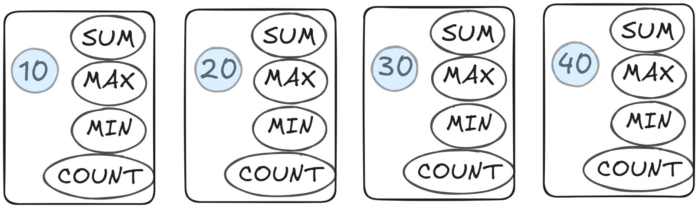
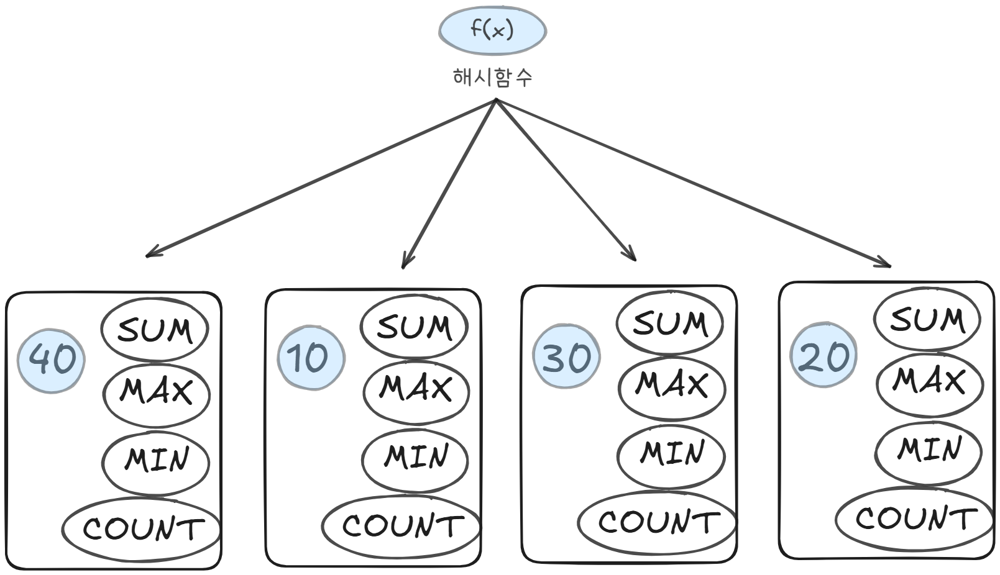

# 소트 튜닝

---
### (3) Sort Group By

소팅 알고리즘을 사용해 그룹별 집계를 수행하는것

```sql
SELECT DEPTNO,SUM(SAL),MAX(SAL),MIN(SAL),AVG(SAL)
FROM EMP
GROUP BY DEPTNO
ORDER BY DEPTNO;

| Id | Operation          | Name | Rows  | Bytes  | Cost (%CPU)  | Time     |
-----------------------------------------------------------------------------
| 0  | SELECT STATEMENT   |      | 11    | 165    | 4 (25)       | 00:00:01 |
| 1  |  SORT GROUP BY     |      | 11    | 165    | 4 (25)       | 00:00:01 |
| 2  |   TABLE ACCESS FULL| EMP  | 14    | 210    | 3 (0)        | 00:00:01 |
```
수천 명의 사원이 근무하는 회사에서 부서가 4개뿐이며 부서코드는 각각 10,20,30,40이라고 가정

10부터 40까지 적은 메모지 네 개만 준비하면 된다


1. 각 사원의 급여 정보를 읽으면서 부서번호에 해당하는 메모지를 찾는다
2. 메모지를 찾고 `SUM`, `MAX`, `MIN`, `COUNT` 값을 갱신한다 (Sort Aggregate방식과 동일)

위는 쉽게 설명하기 위해 부서 개수를 미리 안다고 전제 한것

부서 개수를 미리 알 수 없다면, 급여 대장을 읽다가 새로운 부서가 나타날때 마다 메모지를 정렬순서에 맞춰 끼워넣는 방식을 사용해야 한다.

DBMS가 Sort Group By를 처리 할때 위와 같은 방식으로 사용하며 이 방식을 사용하면 사원이 수억명이라도 단 네장의 메모지만 있으면 된다
-> 부서가 많지 않다면 Sort Area가 클 필요가 전혀 없다.(집계할 대상 레코드가 많아도 Temp 테이블스페이스를 쓰지 않는다.)


**오라클 10gR2 버전에 도입된 Hash Group By**

해싱 알고리즘을 사용한다.

```sql
SELECT DEPTNO,SUM(SAL),MAX(SAL),MIN(SAL),AVG(SAL)
FROM EMP
GROUP BY DEPTNO

| Id | Operation          | Name | Rows  | Bytes  | Cost (%CPU)  | Time     |
-----------------------------------------------------------------------------
| 0  | SELECT STATEMENT   |      | 11    | 165    | 4 (25)       | 00:00:01 |
| 1  |  HASH GROUP BY     |      | 11    | 165    | 4 (25)       | 00:00:01 |
| 2  |   TABLE ACCESS FULL| EMP  | 14    | 210    | 3 (0)        | 00:00:01 |
```

읽는 레코드마다 Group By 컬럼의 해시 값으로 해시 버킷을 찾아 그룹별로 집계항목을 갱신하는 방식

---

**그룹핑 결과의 정렬 순서**

10gR2에서 Hash Group By가 도입 되면서 정렬 순서를 보장하지 않는다 <- X 아님 그전부터 보장하지 않는다(공식 문서 오피셜)

???: 문서상으로 공표한것일뿐 Sort Group By는 정렬 되는데? <br>
라고 믿는 사람들이 많음 

9i에서 실행한 결과 제대로 정렬이 되지 않음
```sql
SELECT DEPTNO, JOB, SUM(SAL),MAX(SAL),MIN(SAL),AVG(SAL)
FROM EMP
GROUP BY DEPTNO, JOB

Excuteion Plan
------------------------------------------------------
대충 SORT GROUP BY로 실행한다는 내용
```

- SORT GROUP BY의 의미는 소팅 알고리즘을 사용해서 값을 집계 한다는 뜻이며 결과의 정렬을 의미 하지 않는다
- 물론 Order By를 명시하면 정렬 순서가 보장된다

그래서 실행계획에 표시된 SORT GROUP BY만 보고 정렬 여부를 판단해서는 안 된다

>**Order By 유무에 따라 정렬순서는 왜 바뀔까?** 
>- 소팅 알고리즘을 사용해 그룹핑한 결과 집합은 논리적인 정렬 순서를 갖는 연결 리스트 구조
>- Order By를 명시하면 오라클은 논리적 정렬 순서를 따라서 값을 읽음
>- Order By가 없으면 정렬된 순서로 출력할 의무가 없기 때문에 논리적 순서를 무시하고 물리적으로 저장된 순서에 따라 값을 읽음


