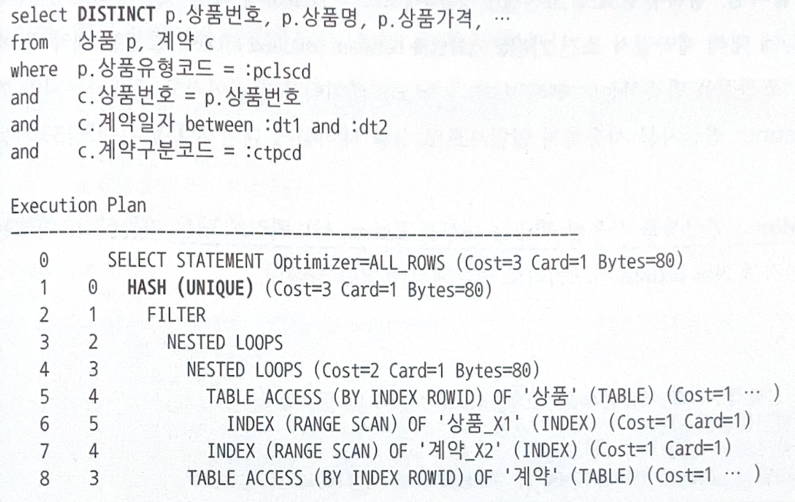
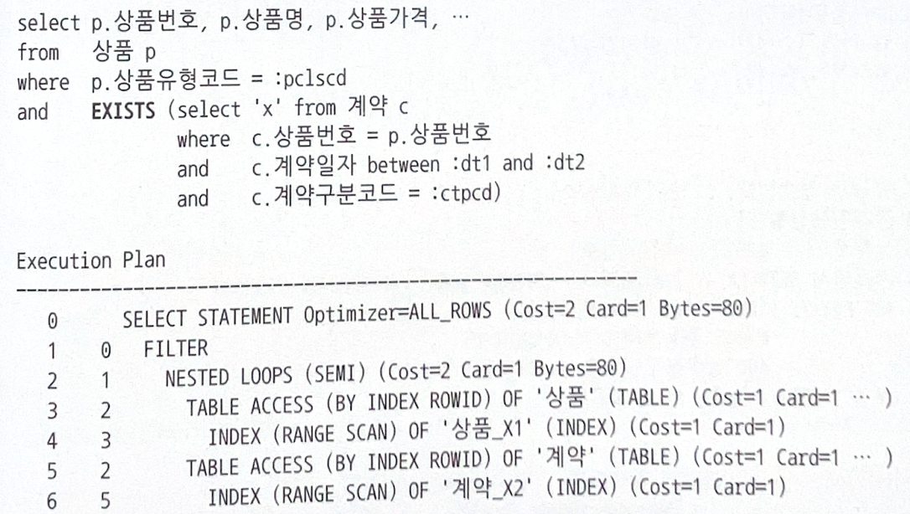
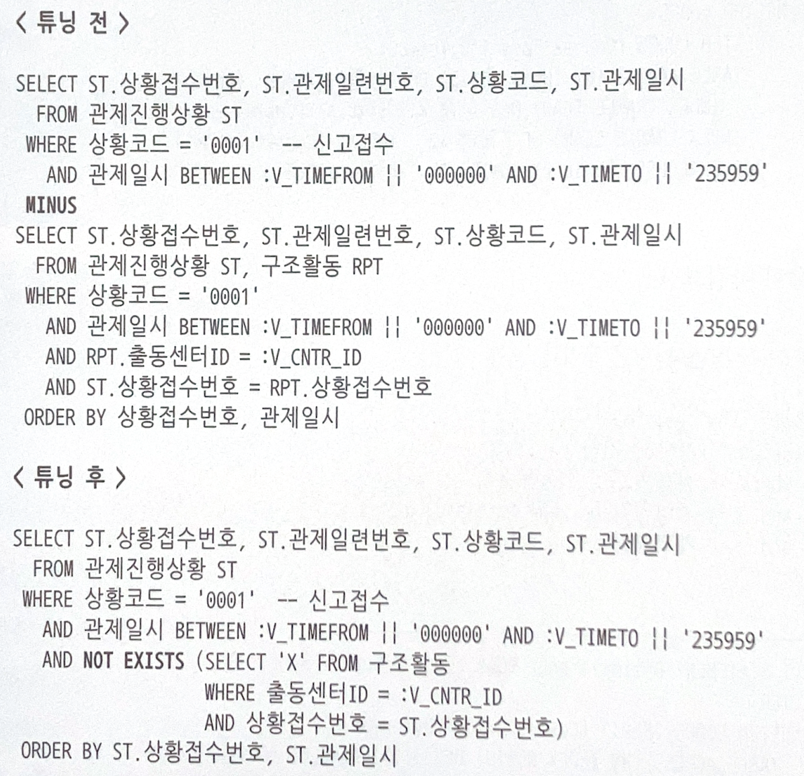
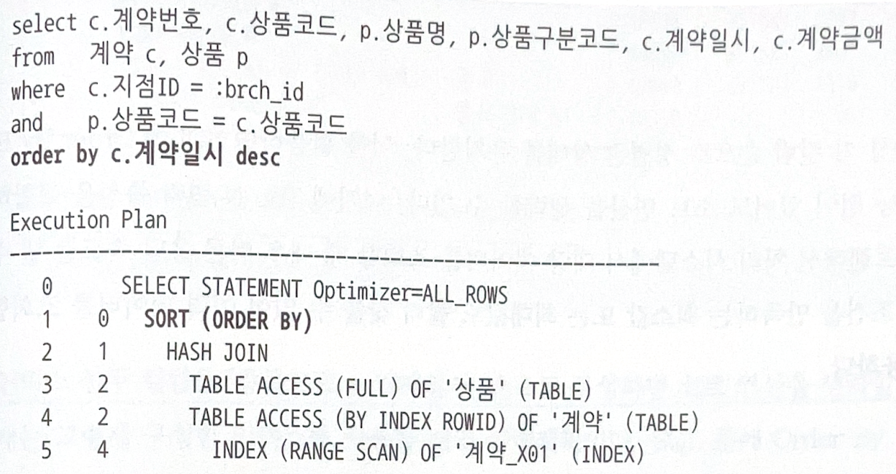
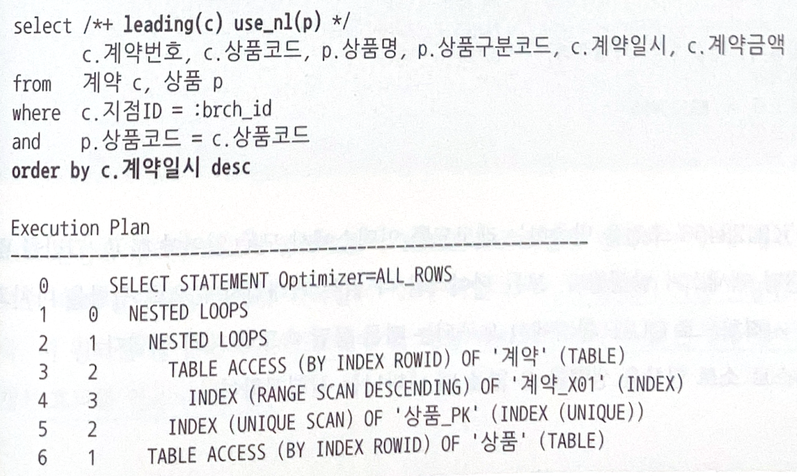

## 5.2.2 Exists 활용
- 중복 레코드를 제거할 목적으로 Distinct 연산자를 활용하는 경우
  - 이를 사용하기 위해서 조건에 해당하는 데이터를 모두 읽어 중복을 제거하게 된다.
  - 부분범위 처리는 당연히 불가능하고, 모든 데이터를 읽는 과정에 많은 I/O가 발생한다.

### 예시
- 상품, 계약 테이블
- `계약_X2 인덱스` 구성: 상품번호 + 계약일자

- 위 쿼리는 상품유형코드 조건절에 해당하는 상품에 대해 계약일자 조건 기간에 발생한 계약 데이터를 모두 읽는 비효율 존재
- 상품 수는 적고 상품별 계약 건수가 많을수록 비효율이 큰 패턴

- Exists 서브쿼리는 데이터 존재 여부만 확인하기 때문에 조건절을 만족하는 데이터를 모두 읽지 않는다.
- 위 쿼리는 `상품유형코드 조건절에 해당하는 상품`에 대해 `계약일자 조건 기간에 발생한 계약 중 계약구분코드 조건절을 만족하는 데이터`가 한 건이라도 존재하는지만 확인한다.
- Distinct 연산자를 사용하지 않았으므로 상품 테이블에 대한 부분범위 처리도 가능하다.

- Distinct, Minus 연산자를 사용한 쿼리는 대부분 Exists 서브쿼리로 변환 가능하다.
- 위 쿼리는 Minus 연산자를 Not Exists 서브쿼리로 변환해서 튜닝한 사례다.

---
## 5.2.3 조인 방식 변경
- 인덱스를 이용해 소트 연산을 생략하는 방법은 조인 방식도 잘 선택해주어야 한다.

- 위 실행조건을 살펴보면, 계약_X01 인덱스가 `지점ID + 계약일시` 순이면 소트 연산을 생략할 수 있지만 해시 조인이기 때문에 Sort Order By가 나타난다.
- 아래와 같이 계약 테이블 기준으로 상품 테이블과 NL 조인하도록 조인 방식을 변경하면, 소트 연산을 생략할 수 있다.
  - 이 때, 지점ID 조건을 만족하는 데이터가 많고 부분범위 처리 가능한 상황에서 큰 성능 개선 효과를 얻을 수 있다.

- 소트 머지 조인의 경우 정렬 기준이 조인 키 컬럼이면 Sort Order By 연산을 생략할 수 있다.
