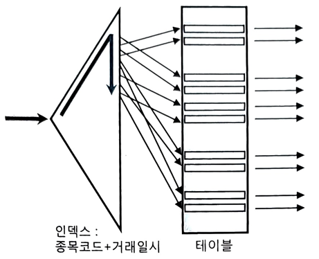

# 5.3. 인덱스를 이용한 소트 연산 생략

- 인덱스는 항상 키 컬럼 순으로 정렬된 상태를 유지 
  - 이를 활용하면 
    - SQL에 `ORDER BY` 또는 `GROUP BY` 절이 있어도 소트 연산을 생략 가능
    - 추가로 Top N 쿼리 특성을 결합 시, 온라인 트랜잭션 처리 시스템에서 대량 데이터를 조회할 때 응답속도 빠름
    - 특정 조건을 만족하는 최소값 또는 최대값도 빨리 찾을 수 있어 이력 데이터를 조회에 유용

# 5.3.1 Sort Order By 생략

아래 쿼리에서 인덱스를 종목코드만으로 구성하면 소트 연산을 생략할 수 없다.

```sql
select 거래일시, 체결건수, 체결수량, 거래대금
from 종목거래
where 종목코드 = 'KR123456'
order by 거래일시
```

- `종목코드 = 'KR123456'` 조건을 만족하는 레코드를 인덱스에서 모두 읽어야 함
  - ➡️ 그만큼 많은 테이블 랜덤 액세스가 발생
- 모든 데이터를 다 읽어 거래일시 순으로 정렬을 마치고서야 출력을 시작
  - 속도 느릴 수 있음

### 실행계획 - `종목코드`로만 인덱스 구성

| Id   | Operation                   | Name    | Rows  | Bytes   | Cost (%CPU)  |
|------|-----------------------------|---------|-------|---------|--------------|
| 0    | SELECT STATEMENT            |         | 40000 | 3515K   | 2041 (1)     |
| 1    | SORT ORDER BY               |         | 40000 | 3515K   | 2041 (1)     |
| 2    | TABLE ACCESS BY INDEX ROWID | 종목      | 40000 | 3515K   | 1210 (1)     |
| 3    | INDEX RANGE SCAN            | 종목거래_N1 | 40000 |         | 96 (2)       |

**Predicate Information (identified by operation id):**
2 - access("종목코드" = 'KR123456')

- 결과: 인덱스로 소트 연산을 생략 불가


### 실행계획 - `종목코드 + 거래일시` 순 인덱스 선두컬럼 구성

| Id | Operation                   | Name    | Rows  | Bytes | Cost (%CPU) |
| -- | --------------------------- | ------- | ----- | ----- | ----------- |
| 0  | SELECT STATEMENT            |         | 40000 | 3515K | 1372 (1)    |
| 1  | TABLE ACCESS BY INDEX ROWID | 종목      | 40000 | 3515K | 1372 (1)    |
| 2  | INDEX RANGE SCAN            | 종목거래_PK | 40000 |       | 258 (1)     |

**Predicate Information (identified by operation id):**
2 - access("종목코드" = 'KR123456')

- 결과: `SORT ORDER BY` 오퍼레이션 생략 됨
  - 소트 연산을 생략함으로써 `종목코드 = 'KR123456'` 조건을 만족하는 전체 레코드를 읽지 않고도 바로 결과집합 출력 시작 가능
    - 즉, 부분범위 처리 가능한 상태가 됨!

원리를 잘 활용하면, 소트 대상 레코드가 많은 상황에서 극적인 성능 개선 효과를 얻을 수 있다.

### 부분범위 처리를 활용한 튜닝 기법, 아직도 유효한가?

지금까지 부분범위 처리 원리를 많이 강조했다. 

요즘 DB 애플리케이션은 대부분 3-Tier 환경에서 작동하므로 부분범위 처리는 의미 없다고 생각하는 사람들이 있다.

3-Tier 환경에서 부분범위 처리는 정말 의미 없을까?

> 3-Tier(쓰리 티어)? 
> 
> 아키텍처는 현대적인 애플리케이션 구조 중 하나로, 애플리케이션을 **세 개의 계층(Tier)**으로 나누어 구성하는 방식

> 부분범위 처리? 
> 
> 쿼리 수행 결과 중 앞쪽 일부를 우선 전송하고 멈추었다가, 
> 클라이언트가 추가 전송을 요청(그리드 스크롤 또는 ‘다음’ 버튼 클릭을 통한 Fetch Call)할 때마다 남은 데이터를 조금씩 나눠 전송하는 방식
> 
> > (Toad나 Orange가 DB 서버에 접속하듯)클라이언트 프로그램이 DB 서버에 직접 접속하는 2-Tier 환경에서는 이 특징을 활용한 튜닝 기법을 많이 활용했다.

클라이언트와 DB 서버 사이에 WAS, AP 서버 등이 존재하는 3-Tier 아키텍처는 

서버 리소스를 수많은 클라이언트가 공유하는 구조이므로, 
클라이언트가 특정 DB 커넥션을 독점할 수 없다. 

단위 작업을 마치면 DB 커넥션을 바로 커넥션 풀에 반환해야 하므로, 
그 전에 쿼리 조회 결과를 클라이언트에게 ‘모두’ 전송하고 커서(Cursor)를 닫아야만 한다.

> 참고:
> 
> JAVA 기준으로 Statement와 ResultSet 객체,
> 
> 마이크로소프트 ADODB 기준으로 Command와 Recordset 객체가
> 
> 커서 역할을 한다.

따라서 쿼리 결과집합을 조금씩 나눠서 전송하는 방식을 사용할 수 없다.

### 부분범위 처리 활용의 핵심

1. 결과집합 출력을 바로 시작할 수 있는가
2. 앞쪽 일부만 출력하고 멈출 수 있는가

이 두 조건을 보면 3-Tier 환경에서 의미 없다고 생각할 수 있지만, 
부분범위 처리 원리는 3-Tier 환경에서도 여전히 유효하다.
   

비밀은 바로 **Top N 쿼리**에 있다.

## 5.3.2 Top N 쿼리

> Top N 쿼리: 전체 결과집합 중 상위 N개 레코드만 선택하는 쿼리


SQL Server나 Sybase는 Top N 쿼리를 아래와 같이 작성할 수 있다.


```sql
select TOP 10 거래일시, 체결건수, 체결수량, 거래대금
from 종목거래
where 종목코드 = 'KR123456'
and 거래일시 >= '20180304'
order by 거래일시
```

IBM DB2는 아래와 같은 Row Limiting 절을 제공한다.

```sql
select 거래일시, 체결건수, 체결수량, 거래대금
from 종목거래
where 종목코드 = 'KR123456'
and 거래일시 >= '20180304'
order by 거래일시
FETCH FIRST 10 ROWS ONLY;
```

오라클에서는 아래처럼 인라인 뷰로 한 번 감싸야 하는 불편함이 있다.²

> ² 오라클도 12c부터 DB2와 같은 Row Limiting 절을 지원한다.
> 
> 하지만, ‘Top N Stopkey’ 알고리즘이 잘 작동하지 않는 경우가 있어 아직 사용에 있어 유보적이다.(그래서 책은 전통적 방식을 소개한다.)

```sql
select * from (
  select 거래일시, 체결건수, 체결수량, 거래대금
  from 종목거래
  where 종목코드 = 'KR123456'
  and 거래일시 >= '20180304'
  order by 거래일시
)
where rownum <= 10;
```

SQL 형태는 인라인 뷰로 정의한 집합을 모두 읽어 거래일시 순으로 정렬한 중간 집합을 우선 만들고, 거기서 상위 10개 레코드를 취하는 형태다.

소트를 생략할 수 있도록 인덱스를 구성해 주더라도 중간 집합을 만들어야 하므로 부분범위 처리는 불가능해 보이지만,

`종목코드 + 거래일시` 순으로 구성된 인덱스를 이용하면, 옵티마이저는 소트 연산을 생략하며, 



인덱스를 스캔하다가 10개 레코드를 읽는 순간 바로 멈춘다.


### 실행계획

```
SELECT STATEMENT  Optimizer=ALL_ROWS
  COUNT (STOPKEY)
    VIEW
      TABLE ACCESS (BY INDEX ROWID) OF '종목거래' (TABLE)
        INDEX (RANGE SCAN) OF '종목거래_PK' (INDEX (UNIQUE))
```

- `SORT ORDER BY` 오퍼레이션 없음.
- `COUNT (STOPKEY)`: 조건절에 부합하는 레코드가 아무리 많아도, 그중 `ROWNUM`으로 지정한 건수만큼 결과 레코드를 얻으면 바로 멈춘다는 뜻이다.(= **‘Top N Stopkey’ 알고리즘**)

