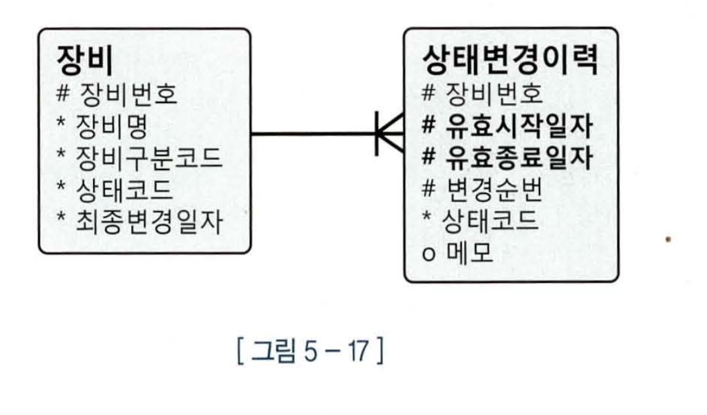
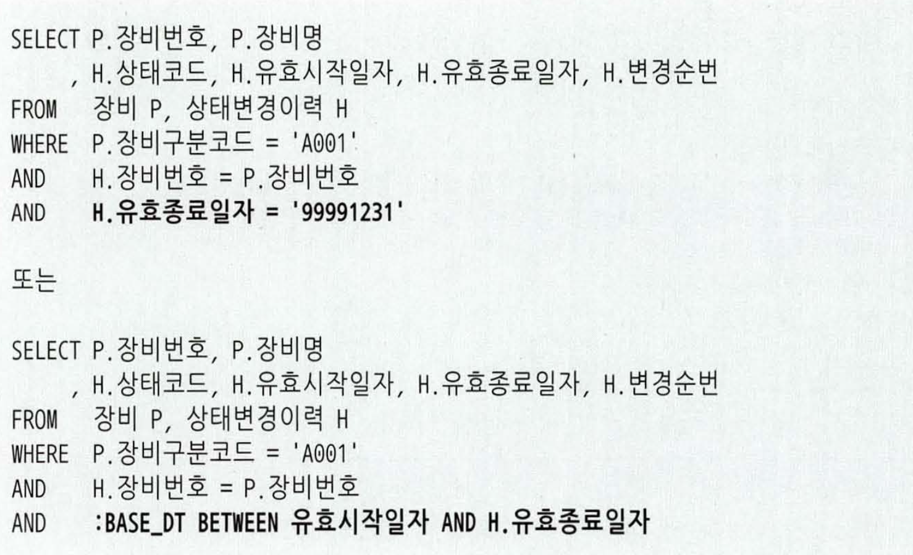
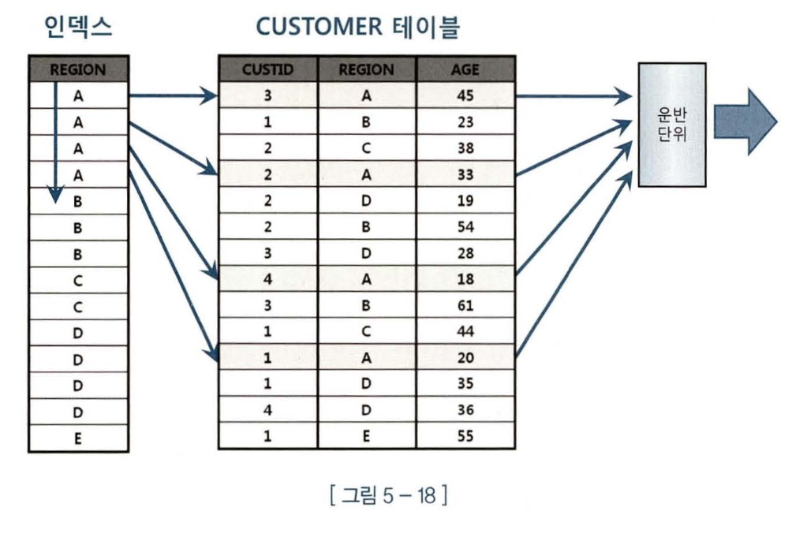

# 소트 튜닝

---

**상황에 따라 달라져야 하는 이력 조회 패턴**

전체 장비의 이력을 조회할 때는 인덱스를 이용한 StopKey 기능 작동 여부가 핵심이 아니다.<br>
인덱스 활용 패턴은 랜덤 I/O발생량 만큼 성능도 비례해서 느려진다 -> 대량 데이터를 조회할때 좋은 솔루션이 아니다<br>

정체 장비의 이력을 조회할 때는 아래와 같이 윈도우 함수를 이용하는 것이 효과적
```sql
SELECT P.장비번호, P.장비명
     , H.변경일자 AS 최종변경일자
     , H.변경순번 AS 최종변경순번
     , H.상태코드 AS 최종상태코드
FROM 장비 P
   , (SELECT 장비번호, 변경일자, 변경순번, 상태코드
           , ROW_NUMBER() OVER (PARTITION BY 장비번호 
                            ORDER BY 변경일자 DESC, 변경순번 DESC) RNUM
      FROM 상태변경이력) H
WHERE H.장비번호 = P.장비번호
  AND H.RNUM = 1;

| Id | Operation            | Name         | A-Rows | Buffers | Reads |
----------------------------------------------------------------------
|  0 | SELECT STATEMENT     |              | 1000   | 2881K   | 36812 |
|  1 |  HASH JOIN           |              | 1000   | 2881K   | 36812 |
|  2 |   TABLE ACCESS FULL  | 장비          | 1000   | 23      | 6     |
|  3 |   VIEW               |              | 1000   | 2881K   | 36806 |
|  4 |    SORT GROUP BY     |              | 8700   | 2881K   | 36806 |
|  5 |     TABLE ACCESS FULL| 상태변경이력   | 18250K | 2880K   | 36803 |

```
>`ROW_NUMBER()` <br>
>- 결과 집합 내에서 지정한 정렬 순서에 따라 각 행에 고유한 순번을 부여하는 함수
>- 윈도우 함수이므로, GROUP BY처럼 집계해서 줄이는 게 아니라 원본 행 개수를 유지하면서 각 행에 순번을 붙입니다.

Full Scan과 해시조인을 이용하기 때문에 인덱스를 이용하는 방식보다 빠르다.

아래와 같이 KEEP절을 활용할 수도 있다.
```sql
SELECT P.장비번호, P.장비명
     , H.변경일자 AS 최종변경일자
     , H.변경순번 AS 최종변경순번
     , H.상태코드 AS 최종상태코드
FROM 장비 P
   , (SELECT 장비번호, 
         MAX(변경일자)변경일자,
         MAX(변경순번)KEEP(DENSE_RANK LAST ORDER BY 변경일자, 변경순번) 변경순번,
         MAX(상태코드)KEEP(DENSE_RANK LAST ORDER BY 변경일자, 변경순번) 상태코드
      FROM 상태변경이력
      GROUP BY 장비번호) H
WHERE H.장비번호 = P.장비번호
```

>`KEEP()` <br>
>- 집계 함수(MAX, MIN, SUM 등)와 함께 사용되어 특정 순서 기준으로 “마지막” 혹은 “처음” 값을 유지(KEEP) 하도록 해주는 기능
---

**선분 이력 맛보기**

>선분이력은 유효기간(시작일자~종료일자) 을 한 “선분(라인)”처럼 관리하는 이력 구조를 말한다.
> 즉, 각 데이터가 언제부터 언제까지 유효했는가를 기록하는 방식
> 
선분 이력 모델을 채택하면 아래와 같이 간단한 쿼리로 쉽게 이력을 조회 할수 있고, 간단한 만큼 성능에도 이점이 생긴다.


### 5.3.5 Sort Group By 생략

그룹핑 연산에도 인덱스를 활용할 수 있다.
아래 SQL에 region이 선두 컬럼인 인덱스를 이용하면, Sort Group By 연산을 생략할 수 있다.
```sql
select region, avg(age), count(*)
from customer
group by region
    
| Id | Operation                       | 
----------------------------------------
...   SORT GROUP BY NOSORT             |
          TABLE ACCESS BY INDEX ROWID  |
            INDEX FULL SCAN            |
```

위 실행 계획이 어떻게 수행되는지 알아보자 <br>
Array Size가 3일때


1. 인덱스에서 `A`구간을 스캔하면서 테이블 액세스를 하다가 `B`를 만나는 순간 집계한 값을 운반단위에 저장한다.
2. `B`도 동일하게 진행을 하다가 `C`를 만나는 순간 집계한 값을 운반단위에 저장한다.
3. `C`구간을 스캔하다가 `D`를 만나는 순간 운반단위에 저장하고 Array Size가 3이므로 `A,B,C`에 대한 집계결과를 클라이언트에 전송하고 다음 Fetch Call이 올 때까지 기다린다.(다음 Fetch Call이 안올 경우 작업종료)
4. 클라이언트로 부터 다음 Fetch Call이 오면 `D`구간부터 1~3과정을 반복한다.

이처럼 인덱스를 이용해 NoSort방식으로 Group By를 처리하면 부분범위 처리가 가능해 진다.