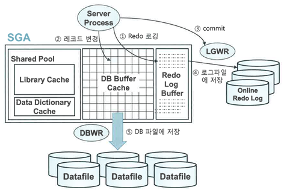
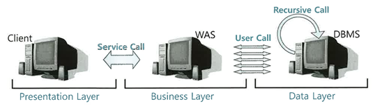

# DML 튜닝

---

### Undo 로깅과 DML 성능
 Redo는 트랜잭션을 재현함으로써 과거를 현재 상태로 되돌리는 데 사용하고, Undo는 트랜잭션을 롤백함으로써 현재를 과거 상태로 되돌리는데 사용한다.
 
 따라서 Redo는 트랜잭션 재현에 필요한 정보를 로깅하며, Undo는 이전 상태로 되돌리는 데 필요한 정보를 로깅한다.
 DML 수행시 Undo를 생성해야 하므로 Undo로깅은 DML성능에 영향을 미친다.
---
### Undo의 용도와 MVCC모델
오라클은 데이터 변경시에 Undo 세그먼트에 기록을 남긴다.
Undo 데이터를 기록한 공간은 해당 트랜잭션이 커밋하는 순간 다른 트랜잭션이 재사용 할 수 있다.
그래서 언젠간 다른 트랜잭션 데이터로 덮어쓰이면서 사라질수 밖에 없다

**Undo에 기록된 데이터의 목적 3가지**
1. Transaction RollBack
   - 트랜잭션에 의한 변경사항을 롤백하고자 할때
2. Transaction Recovery (Instance Recovery 시 rollback 단계) Instance Crash 발생 후 Redo를 이용해 roll forward 단계가 완료되면 최종커밋
   - 시스템이 셧다운된 시점에 아직 커밋되지 않은 트랜잭션들을 모두 롤백 해야 할때
3. Read Consistency
   - 읽기 일관성을 위해 사용한다 (consistent 모드로 데이터를 읽는 오라클에선 동시 트랜잭션이 많을수록 성능저하가 발생하기 때문)

MVCC(Multi-Version Concurrency Control)모델
MVCC모델을 사용하는 오라클은 Current모드, Consistent모드 두가지 모드로 읽는다.

**Current 모드**
- 디스크에서 캐시로 적재된 원본 블록을 현재 상태 그대로 읽는 방식  

**Consistent 모드**
- 쿼리가 시작된 이후에 다른 트랜잭션에 의해 변경된 블록을 만나면 원본 블록으로부터 복사본을 만들고 Undo 데이터를 적용함으로써 쿼리가 시작된 시점으로 되돌려서 읽는 방식

---
### Lock과 DML 성능
   Lock은 DML 성능에 크고 직접적인 영향을 끼친다. 

| Lock 사용 방식                                   | 단점                             |
|--------------------------------------------------|----------------------------------|
| **자주 사용 / 길게 사용 / 높은 Lock 레벨**      | DML 성능 저하                    |
| **적게 사용 / 짧게 사용 / 낮은 Lock 레벨**      | 데이터 품질 저하(정합성 낮아짐) |

`성능`과 `데이터 품질` 모두 중요한데 이 둘은 트레이드 오프 관계여서 어렵다 
두마리 토끼를 다잡으려면 세심한 `동시성 제어`가 필요하다

>`동시성 제어`란
> - 동시에 실행되는 트랜잭션 수를 최대화하면서 데이터 무결성을 유지하기 위해 노력하는것

### 커밋과 DML 성능
DML을 끝내려면 커밋이 완료되어야 하므로 밀접한 관련이 있다. 
특히 DML이 Lock에 의해 블로킹 된 경우, 커밋은 DML성능과 직결된다.(Lock을 푸는 열쇠가 바로 커밋)

**커밋의 매커니즘**

(1) DB 버퍼캐시
   - 사용자를 대신해 일을 처리하는 서버 프로세스는 버퍼캐시를 통해 데이터를 읽고 쓴다.
   - 버퍼 캐시에서 변경된 블록(Dirty 블록)을 모아 주기적으로 데이터 파일에 일괄 기록하는 작업(Batch)을 DBWR 프로세스가 한다.

(2) Redo 로그 버퍼
   - 버퍼캐시에 가한 변경사항을 Redo 로그에도 기록한다. 따라서 휘발성인 버퍼캐시가 유실되더라도 Redo로그를 통해 복구 가능하다
   - Redo 로그도 파일이라 디스크I/O가 느린데 성능 문제를 해결하기 위해 로그버퍼를 사용한다.
   - Redo 로그 파일에 기록하기 전에 로그버퍼에 기록하는 방식이다
   - 로그버퍼는 LGWR프로세스가 Redo 로그 파일에 일괄(Batch) 기록한다.

(3) 트랜잭션 데이터 저장 과정

   
   1. DML 실행시 Redo 로그버퍼에 변경사항 저장
   2. 버퍼블록에서 데이터를 변경한다.(버퍼 캐시에서 찾지 못하면 데이터 파일에서 읽고 진행)
   3. 커밋
   4. LGWR 프로세스가 Redo로그 버퍼 내용을 로그파일에 일괄 저장
   5. DBWR 프로세스가 변경된 버퍼블록들은 데이터 파일에 일괄 저장
   
   **Write Ahead Logging**
   - 오라클은 데이터를 변경하기 전에 항상 로그부터 기록한다. 이는
   서버프로세스가 데이터를 변경(2)하기전에 Redo 로그버퍼에 로그를 먼저 기록(1)하는 이유이면서
   DBWR 프로세스가 dirty블록을 디스크에 기록(5)하기전에 LGWR 프로세스가 Redo 로그파일에 로그를 먼저 기록(4)하는 이유이다

   **Log Force at Commit**
   - 메모리 버퍼캐시가 휘발성이어서 Redo에 로그를 남기는데 Redo 로그 또한 휘발성인 로그버퍼에 기록된다.
   이러면 커밋한 트랜잭션의 영속성을 어떻게 보장할것인가?

   DBWR과 LGWR 프로세스는 주기적으로 깨어나 각각 파일에 기록하는데 LGWR은 서버프로세스가 커밋을 발행했다고 신호를 보낼때도 이 활동을 시작한다
   그래서 적어도 커밋 시점에는 Redo로그버퍼 내용을 로그파일에 기록하는데 이를 Log Force at Commit이라 한다

(4) 커밋 = 저장버튼

   트랜잭션을 문서작업에 비유하면 커밋은 작업 도중 저장 버튼을 누르는 것과 같다
   서버 프로세스가 그때까지 한 작업을 디스크에 기록하라는 명령어인 셈
   서버 프로세스는 LGWR에 신호를 보낸후 작업 완료가 된 이후 부터 다음 작업을 진행할 수 있다
   이는 Sync작업으로 LGWR이 Redo로그를 기록하는 작업은 디스크 I/O기 때문에 커밋은 생각보다 느리다.
   
   결론 : 필요이상으로 트랜잭션을 길게 정의하면서 오랫동안 커밋하지 않거나 커밋을 너무 자주하면 문제가 된다.
   그래서 트랜잭션을 논리적으로 잘 정리해서 불필요한 커밋이 발생하지 않아야 한다.

### 데이터베이스 Call과 성능
SQL 트레이스 리포트에서 Call부분을 보면 아래 세 단계로 나누어 실행된다.
1. ParseCall : SQL파싱과 최적화를 수행하는 단계 (라이브러리 캐시에서 SQL실행계획을 찾으면 생략가능)
2. ExcuteCall : SQL을 실행하는 단계 DML은 이 단계에서 끝나지만 Select문은 Fetch단계를 거친다
3. FetchCall : 데이터를 읽어서 사용자에서 결과 집합을 전송하는 과정으로 select문에만 나타나며, 전송할 데이터가 많으면 여러변 발생한다.

Call이 어디서 발생하는냐에 따라 UserCall과 Recursive Call로 나뉜다.

UserCall: DBMS 외부로 부터 인입 되는 Call (WAS서버에서 발생하는 Call)
RecursiveCall : DBMS 내부에서 발생하는 콜 (PL/SQL 사용자 정의 함수, 프로시저, 트리거에 내장된 SQL 실행시)

UserCall이든 RecursiveCall이든, 데이터베이스 Call이 많으면 성능은 느릴수 밖에 없다.
특히, 네트워크를 경유하는 UserCall이 성능에 끼치는 영향은 매우 크다.