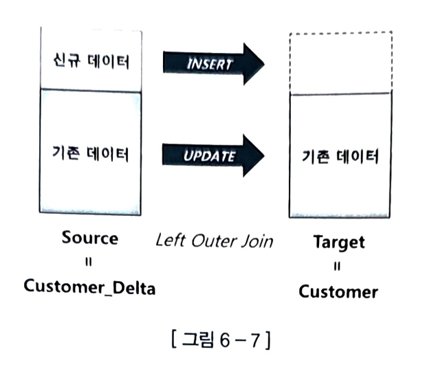
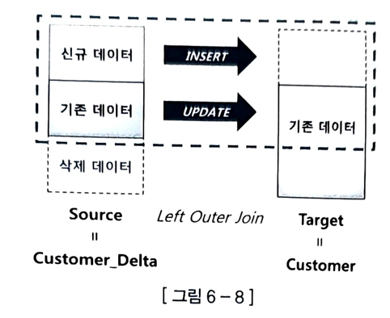

## 키 보존 테이블이란?

> ‘키 보존 테이블(Key-Preserved Table)’이란,
> 
> **조인된 결과 집합을 통해서도 중복 값 없이 Unique 하게 식별이 가능한 테이블**
> 
> - Unique 한 1쪽 집합과 조인되는 테이블이어야 조인된 결과 집합을 통한 식별이 가능

### `EMP_DEPT_VIEW` 뷰에서 ROWID 함께 출력

```sql
SQL) SELECT ROWID, emp_rid, dept_rid, empno, deptno
FROM EMP_DEPT_VIEW;
```

| ROWID              | EMP_RID            | DEPT_RID           | EMPNO | DEPTNO |
| ------------------ | ------------------ | ------------------ | ----- | ------ |
| AAAMt4AAGAAAEWSAAA | AAAMt4AAGAAAEWSAAA | AAAMt5AAGAAAEWaAAB | 7369  | 20     |
| A4ANt4AAGAAAEWSAAB | AAAMt4AAGAAAEWSAAB | AAAMt5AAGAAAEWaAAC | 7499  | 30     |
| A4AMt4AAGAAAEWSAAC | AAAMt4AAGAAAEWSAAC | AAAMt5AAGAAAEWaAAC | 7521  | 30     |
| AAAMt4AAGAAAEWSAAD | AAAMt4AAGAAAEWSAAD | AAAMt5AAGAAAEWaAAB | 7566  | 20     |
| AAAMt4AAGAAAEWSAAE | AAAMt4AAGAAAEWSAAE | AAAMt5AAGAAAEWaAAC | 7654  | 30     |
| AAAWt4AAGAAAEWSAAG | AAANt4AAGAAAEWSAAG | AAAMt5AAGAAAEWaAAA | 7782  | 10     |

14 rows selected.

- `DEPT_RID`에는 중복 값 존재
- `EMP_RID`에는 중복 값이 없으며 뷰의 ROWID와 일치

> **‘키 보존 테이블’이란, 뷰에 ROWID를 제공하는 테이블**을 말한다.

아래와 같이 `DEPT` 테이블로부터 Unique 인덱스를 제거하면 키 보존 테이블이 없기 때문에 뷰에서 ROWID를 출력할 수 없게 된다.

```sql
SQL> ALTER TABLE dept DROP PRIMARY KEY;

SQL> SELECT ROWID, emp_rid, dept_rid, empno, deptno
FROM EMP_DEPT_VIEW;
```

```
1행에 오류:
ORA-01445: cannot select ROWID from, or sample, a join view without a key-preserved table
```

## ORA-01779 오류 회피

### `DEPT` 테이블에 `AVG_SAL` 컬럼 추가

```sql
SQL> ALTER TABLE dept ADD avg_sal NUMBER(7,2);
```

### `EMP`로부터 부서별 평균 급여 계산 후 추가한 컬럼(`AVG_SAL`)에 UPDATE

```sql
SQL> UPDATE
  (SELECT d.deptno,
           d.avg_sal AS d_avg_sal,
           e.avg_sal AS e_avg_sal
     FROM (SELECT deptno, ROUND(AVG(sal), 2) avg_sal
             FROM emp
            GROUP BY deptno) e,
           dept d
     WHERE d.deptno = e.deptno)
       SET d_avg_sal = e_avg_sal;
```

- 11g 이하 버전: ORA-01779 에러 발생
  - ```
    ORA-01779: cannot modify a column which maps to a non key-preserved table
    ```
  - EMP 테이블을 DEPTNO로 GROUP BY ➡️ DEPTNO 컬럼으로 조인한 DEPT 테이블은 키가 보존되는데도 옵티마이저가 불필요한 제약 가함
- 10g 아래 버전: `bypass_ujvc` 힌트로 제약 회피 가능
  > `bypass_ujvc` 힌트: Updatable Join View Check를 생략하라고 옵티마이저에 지시하는 힌트
  > ```sql
  > SQL> UPDATE /*+ bypass_ujvc */
  > (SELECT d.deptno,
  >         d.avg_sal d_avg_sal,
  >         e.avg_sal e_avg_sal
  >    FROM (SELECT deptno, ROUND(AVG(sal), 2) avg_sal
  >            FROM emp
  >           GROUP BY deptno) e,
  >         dept d
  >   WHERE d.deptno = e.deptno)
  >     SET d_avg_sal = e_avg_sal;
  > ```
  > 
  > 11g부터 이 힌트를 사용할 수 없다. (=위 UPDATE 문을 실행할 방법이 없다.)
  > > 뒤에서 설명할 MERGE 문으로 바꿔줘야 한다.
  >
  > > 🌳`bypass_ujvc` 힌트 사용이 중단됐을 뿐, **수정 가능 조인 뷰 사용은 중단되지 않았다**
  > > 
  > > 11g에서도 1쪽 집합에 `Unique` 인덱스가 있으면 수정 가능 조인 뷰를 이용한 UPDATE가 가능하다.
- 12c 버전: 수정 가능 조인 뷰 기능 개선
  - 12c부터는 힌트를 사용하지 않아도 위 UPDATE 문이 잘 실행된다.
  - **GROUP BY 한 집합과 조인한 테이블은 키가 보존된다는 사실을 오라클이 인정하기 시작**

## 기능 개선은 수정 가능 조인 뷰의 활용성을 높여준다.

### 예시. `고객_T` 테이블 `고객번호`에 `Unique` 인덱스가 없으면 아래 쿼리는 어떤 버전에서도 실행할 수 없다.

```sql
UPDATE (
  SELECT o.주문금액, o.할인금액, c.고객등급
  FROM 주문_T o, 고객_T c
  WHERE o.고객번호 = c.고객번호
  AND o.주문금액 >= 1000000
  AND c.고객등급 = 'A'
)
SET 할인금액 = 주문금액 * 0.2,
    주문금액 = 주문금액 * 0.8;
```

12c에서는 고객_T 테이블에서 GROUP BY 처리로 ORA-01779 에러를 회피할 수 있다.

```sql
UPDATE (
  SELECT o.주문금액, o.할인금액
  FROM 주문_T o,
       (SELECT 고객번호
        FROM 고객_T
        WHERE 고객등급 = 'A'
        GROUP BY 고객번호) c
  WHERE o.고객번호 = c.고객번호
  AND o.주문금액 >= 1000000
)
SET 할인금액 = 주문금액 * 0.2,
    주문금액 = 주문금액 * 0.8;
```

배치 프로그램이나 데이터 이행 프로그램에서 사용하는 중간 임시 테이블에는 일일이 PK 제약이나 인덱스를 생성하지 않으므로 이 패턴이 유용할 수 있다.

## 6.1.6 MERGE 문 활용

DW에서 흔히 발생하는 오퍼레이션 = 기간계 시스템에서 가져온 신규 트랜잭션 데이터를 반영함으로써 두 시스템 간 데이터를 동기화하는 작업

## 예시, 고객(customer) 테이블 - 발생한 변경분 데이터를 DW에 반영하는 프로세스 
이 중에서 3번 데이터 적재 작업을 효과적으로 지원하기 위해 오라클 9에서 MERGE 문이 도입됐다.

### 1. 전일 발생한 변경 데이터를 기간계 시스템으로부터 추출(Extraction)

```sql
CREATE TABLE customer_delta
AS
SELECT *
FROM customer
WHERE mod_dt >= TRUNC(sysdate) - 1
AND mod_dt < TRUNC(sysdate);
```

### 2. CUSTOMER_DELTA 테이블을 DW 시스템으로 전송(Transportation)

### 3. DW 시스템으로 적재(Loading)

```sql
MERGE INTO customer t
USING customer_delta s
ON (t.cust_id = s.cust_id)
WHEN MATCHED THEN UPDATE
SET t.cust_nm = s.cust_nm,
    t.email   = s.email, ...
WHEN NOT MATCHED THEN INSERT
(cust_id, cust_nm, email, tel_no, region, addr, reg_dt)
VALUES
(s.cust_id, s.cust_nm, s.email, s.tel_no, s.region, s.addr, s.reg_dt);
```



MERGE 문은 그림처럼 Source 테이블 기준으로 Target 테이블과 Left Outer 방식으로 조인해서, 조인에 성공하면 UPDATE, 실패하면 INSERT 한다.
(MERGE 문을 UPSERT(= UPDATE + INSERT)라고도 부르는 이유다.)

위 MERGE 문에서 
- Source는 `Customer_Delta` 테이블이고, 
- Target은 `Customer` 테이블이다.

## Optional Clauses

아래와 같이 UPDATE와 INSERT를 선택적으로 처리할 수도 있다.

```sql
MERGE INTO customer t
USING customer_delta s
ON (t.cust_id = s.cust_id)
WHEN MATCHED THEN UPDATE
SET t.cust_nm = s.cust_nm,
    t.email   = s.email, .. ;
```

```sql
MERGE INTO customer t
USING customer_delta s
ON (t.cust_id = s.cust_id)
WHEN NOT MATCHED THEN INSERT
(cust_id, cust_nm, email, tel_no, region, addr, reg_dt)
VALUES
(s.cust_id, s.cust_nm, s.email, s.tel_no, s.region, s.addr, s.reg_dt);
```

이 확장 기능을 통해 아래와 같이 수정 가능 조인 뷰 기능을 대체할 수 있게 되었다?

### < 수정 가능 조인 뷰 >

```sql
UPDATE
(
  SELECT d.deptno,
         d.avg_sal AS d_avg_sal,
         e.avg_sal AS e_avg_sal
  FROM (SELECT deptno, ROUND(AVG(sal), 2) avg_sal
        FROM emp
        GROUP BY deptno) e,
       dept d
  WHERE d.deptno = e.deptno
)
SET d_avg_sal = e_avg_sal;
```

### < MERGE 문 >

```sql
MERGE INTO dept d
USING (SELECT deptno, ROUND(AVG(sal), 2) avg_sal
       FROM emp
       GROUP BY deptno) e
ON (d.deptno = e.deptno)
WHEN MATCHED THEN UPDATE
SET d.avg_sal = e.avg_sal;
```

## Conditional Operations

ON 절에 기술한 조인문 외에 아래와 같이 추가로 조건절을 기술할 수도 있다.

```sql
MERGE INTO customer t
USING customer_delta s
ON (t.cust_id = s.cust_id)
WHEN MATCHED THEN UPDATE
SET t.cust_nm = s.cust_nm,
    t.email   = s.email, ...
WHERE reg_dt >= TO_DATE('20000101', 'yyyymmdd')
WHEN NOT MATCHED THEN INSERT
(cust_id, cust_nm, email, tel_no, region, addr, reg_dt)
VALUES
(s.cust_id, s.cust_nm, s.email, s.tel_no, s.region, s.addr, s.reg_dt)
WHERE reg_dt < TRUNC(sysdate);
```

## DELETE Clause

이미 저장된 데이터를 조건에 따라 지우는 기능도 제공한다.

```sql
MERGE INTO customer t
USING customer_delta s
ON (t.cust_id = s.cust_id)
WHEN MATCHED THEN
  UPDATE SET t.cust_nm = s.cust_nm,
             t.email   = s.email, ...
  DELETE WHERE t.withdraw_dt IS NOT NULL  -- 탈퇴일시가 NULL이 아닌 레코드 삭제
WHEN NOT MATCHED THEN INSERT
(cust_id, cust_nm, email, tel_no, region, addr, reg_dt)
VALUES
(s.cust_id, s.cust_nm, s.email, s.tel_no, s.region, s.addr, s.reg_dt);
```

### 주의

1. 예시한 MERGE 문에서 UPDATE가 이루어진 결과로서 탈퇴일시(withdraw_dt)가 NULL이 아닌 레코드만 삭제한다는 사실이다.
   - 즉, 탈퇴일시가 NULL이 아니었어도 MERGE 문을 수행한 결과가 NULL이면 삭제하지 않는다.
2. MERGE 문 DELETE 절은 **조인에 성공한 데이터만 삭제할 수 있다**
   - Source(= Customer_Delta) 테이블에서 삭제된 데이터는 Target(= Customer) 테이블에서도 지우고 싶어도, MERGE 문 DELETE 절은 못한다. 
     - Source에서 삭제된 데이터는 조인에 실패하기 때문
     - 조인에 실패한 데이터는 UPDATE할 수도 없고 DELETE할 수도 없다.
       - 

➡️ 즉, DELETE 절은, 조인에 성공한(Matched) 데이터를 모두 UPDATE 하고서 그 결과 값이 DELETE WHERE 조건절을 만족하면 삭제하는 기능이다.

## Merge Into 활용 예: 저장하려는 레코드가 기존에 있던 것이면 UPDATE, 그렇지 않으면 INSERT

### SELECT 한 번, INSERT 또는 UPDATE 한 번

아래와 같이 처리하면 SQL을 **항상 두 번** 수행

```sql
SELECT COUNT(*) INTO :cnt
FROM dept
WHERE deptno = :val1;

IF :cnt = 0 THEN
  INSERT INTO dept(deptno, dname, loc)
  VALUES(:val1, :val2, :val3);
ELSE
  UPDATE dept
  SET dname = :val2,
      loc   = :val3
  WHERE deptno = :val1;
END IF;
```

아래와 같이 하면 SQL을 **최대 두 번** 수행한다.

```sql
UPDATE dept
SET dname = :val2,
    loc   = :val3
WHERE deptno = :val1;

IF SQL%ROWCOUNT = 0 THEN
  INSERT INTO dept(deptno, dname, loc)
  VALUES(:val1, :val2, :val3);
END IF;
```

아래와 같이 MERGE 문을 활용하면 SQL을 **한 번만** 수행한다.

```sql
MERGE INTO dept a
USING (SELECT :val1 deptno,
              :val2 dname,
              :val3 loc
       FROM dual) b
ON (b.deptno = a.deptno)
WHEN MATCHED THEN
  UPDATE SET dname = b.dname,
             loc   = b.loc
WHEN NOT MATCHED THEN
  INSERT (a.deptno, a.dname, a.loc)
  VALUES (b.deptno, b.dname, b.loc);
```

## 수정 가능 조인 뷰 vs. MERGE 문

INSERT 없는 단순 UPDATE 여도, UPDATE 대신 MERGE 문을 사용하는 개발자가 늘고 있어 UPDATE 문이 위기를 맞고 있다.

실행 계획만 같다면 상관은 없지만, 아래와 같은 패턴은 어떤지 보자.

```sql
MERGE INTO EMP T2
USING (
  SELECT T.ROWID AS RID,
         S.ENAME
  FROM EMP T, EMP_SRC S
  WHERE T.EMPNO = S.EMPNO
  AND   T.ENAME <> S.ENAME
) S
ON (T2.ROWID = S.RID)
WHEN MATCHED THEN
  UPDATE SET T2.ENAME = S.ENAME;
```

- 특징
  - UPDATE 대상 건수를 쉽게 확인할 수 있다.
    - = SELECT 문을 먼저 만들어 데이터 검증을 마친 후 바깥에 MERGE 문을 씌우는 방식
  - MERGE 문 ON 절에는 ROWID를 사용했다.

### 위 패턴이 성능에 안 좋은 이유

UPDATE 대상 테이블인 EMP를 두 번 액세스한다.

실행 계획을 확인해 보면 금방 알 수 있다.

> ※ ON 절에 ROWID를 사용했으므로 성능에 문제가 없다고 생각할 수 있지만, 3장 1절에서 강조했듯, ROWID는 포인터가 아니기에 그렇지 않다.

### MERGE 문을 쓴다면 아래처럼 바꿀 수 있다.

```sql
MERGE INTO EMP T
USING EMP_SRC S
ON (T.EMPNO = S.EMPNO)
WHEN MATCHED THEN
  UPDATE SET T.ENAME = S.ENAME
WHERE T.ENAME <> S.ENAME;
```

### UPDATE 문(수정 가능 조인 뷰)이 더 편하지 않을까?

SELECT 문을 먼저 만들어 데이터 검증을 마친 후, 바깥에 UPDATE 문을 씌우는 개발 패턴!

```sql
UPDATE (
  SELECT S.ENAME AS S_ENAME,
         T.ENAME AS T_ENAME
  FROM EMP T, EMP_SRC S
  WHERE T.EMPNO = S.EMPNO
  AND   T.ENAME <> S.ENAME
)
SET T_ENAME = S_ENAME;
```

- EMP_SRC 테이블의 EMPNO 컬럼에 Unique 인덱스가 생성돼 있어야 하는데, 대개는 있다.
  - Unique 인덱스가 없으면 10g까지는 `bypass_ujvc` 힌트를 통해, 12c부터는 GROUP BY 처리를 통해 ORA-01779 에러를 회피할 수 있다.
    (11g에서는 사용할 수 없는 패턴)

조인 UPDATE를 위해 앞으로 MERGE 문을 사용할 것인가, UPDATE 문을 사용할 것인지는 각자의 몫이다.

> ※ MERGE 문에서는 소스 집합(USING 절)에 대한 Unique 인덱스를 요구하지 않지만,
> 소스 집합이 복잡해 별도의 검증이 필요할 정도라면 정확한 UPDATE를 위해 MERGE 문에서 GROUP BY 처리는 필요하다.
