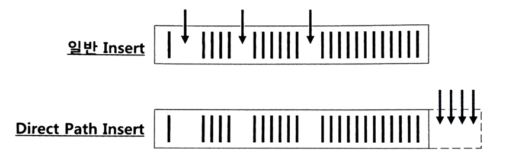

# 6.2 Direct Path I/O 활용

- 버퍼캐시
  - 온라인 트랜잭션: **기존성 데이터**, 특정 고객, 특정 상품, 최근 거래 등을 반복적으로 읽기 때문에 성능 향상에 도움을 준다.
  - 정보계 시스템(DW/OLAP 등)이나 배치 프로그램: 주로 대량 데이터를 처리하기 때문에 버퍼캐시를 경유하는 I/O 메커니즘이 오히려 성능을 떨어뜨릴 수 있다. 

그래서 오라클은 버퍼캐시를 경유하지 않고 곧바로 데이터 블록을 읽고 쓸 수 있는 Direct Path I/O 기능을 제공하는데, 지금부터 살펴보자.

## 6.2.1 Direct Path I/O

> Direct Path I/O 기능: 버퍼캐시를 경유하지 않고 곧바로 데이터 블록을 읽고 쓸 수 있는 기능

- 일반적인 블록 I/O
  - DB 버퍼캐시를 경유(읽고자 하는 블록을 먼저 버퍼캐시에서 찾아보고, 찾지 못할 때만 디스크에서 읽는다.) 
  - 데이터를 변경할 때도 먼저 블록을 버퍼캐시에서 찾는다. 
  - 찾은 버퍼블록에 변경을 가하고 나면, DBWR 프로세스가 변경된 블록(Dirty 블록)들을 주기적으로 찾아 데이터파일에 반영해 준다.

- 대량 데이터를 읽고 쓸 때 건건이 버퍼캐시를 탐색한다면 개별 프로그램 성능에는 오히려 안 좋다. (버퍼캐시에서 블록을 찾을 가능성이 거의 없다.)
  - 대량 블록을 건건이 디스크로부터 버퍼캐시에 적재하고서 읽는 부담
  - 재사용성이 낮음(Full Scan 위주로 가끔 수행되는 대용량 처리 프로그램이 읽어 들인 데이터는 재사용성 낮음) 
  - 이런 경우, 데이터 블록들이 버퍼캐시를 점유한다면 다른 프로그램 성능에도 나쁜 영향을 미친다.

### Direct Path I/O 기능 작동하는 경우

1. 병렬 쿼리로 Full Scan 을 수행할 때
2. 병렬 DML 을 수행할 때(Direct Path Read, Direct Path Insert)
3. Direct Path Insert 를 수행할 때
4. Temp 세그먼트 블록들을 읽고 쓸 때
5. direct 옵션을 지정하고 export 를 수행할 때
6. nocache 옵션을 지정한 LOB 컬럼을 읽을 때

#### 병렬 쿼리

- 1번 병렬 쿼리 설명

쿼리문에 아래처럼 parallel 또는 parallel index 힌트를 사용하면, 지정한 병렬도(Parallel Degree)만큼 병렬 프로세스가 떠서 동시에 작업을 진행한다.

```
select /*+ full(t) parallel(t 4) */ * 
from big_table t;

select /*+ index_ffs(t big_table_x1) parallel_index(t big_table_x1 4) */ 
count(*) 
from big_table t;
```

위처럼 병렬도를 4로 지정하면 성능이 네 배 빨라지는 게 아니라 수십 배 빨라진다. 

Direct Path I/O 때문에 
- 버퍼캐시를 탐색하지 않고, 
- 디스크로부터 버퍼캐시에 적재하는 부담도 없으니 빠른 것이다.

> 참고로, Order By, Group By, 해시 조인, 소트 머지 조인 등을 처리할 때는 힌트로 지정한 병렬도보다 두 배 많은 프로세스가 사용된다.

### 6.2.2 Direct Path Insert

### 일반적인 INSERT 가 느린 이유

1. 데이터를 입력할 수 있는 블록을 Freelist 에서 찾는다.
   > Freelist: 테이블 HWM(High-Water Mark) 아래쪽에 있는 블록 중 데이터 입력이 가능한(여유 공간이 있는) 블록 목록
2. Freelist 에서 할당받은 블록을 버퍼캐시에서 찾는다.
3. 버퍼캐시에 없으면 데이터파일에서 읽어 버퍼캐시에 적재한다.
4. INSERT 내용을 Undo 세그먼트에 기록한다.
5. INSERT 내용을 Redo 로그에 기록한다.

Direct Path Insert 방식을 사용하면, 대량 데이터를 일반적인 INSERT 보다 훨씬 더 빠르게 입력할 수 있다. 

### 데이터를 Direct Path Insert 방식으로 입력하는 방법

* INSERT … SELECT 문에 append 힌트 사용
* parallel 힌트를 이용해 병렬 모드로 INSERT
* direct 옵션을 지정하고 SQL*Loader(sqlldr) 로 데이터 적재
* CTAS(create table as select) 문 수행

### Direct Path Insert 방식이 빠른 이유

1. Freelist 를 참조하지 않고 HWM 바깥 영역에 데이터를 순차적으로 입력한다.
2. 블록을 버퍼캐시에서 탐색하지 않는다.
3. 버퍼캐시에 적재하지 않고, 데이터파일에 직접 기록한다.
4. Undo 로깅을 안 한다.
   > Undo 로깅을 최소화할 수 있다. (Undo 의 용도는 1절 1항(6.1)에서 설명)
   > 
   > HWM 뒤쪽에 입력한 데이터는 커밋하기 전까지 다른 세션이 읽지 않아 Read Consistency 를 위해 Undo 데이터를 남기지 않아도 된다. 
   > 
   > INSERT 작업을 
   > - 커밋하면 HWM 을 이동하고, 
   > - 롤백하면 할당된 익스텐트에 대한 딕셔너리 정보만 롤백하면 된다. 
   > 
   > 따라서 Transaction Rollback 또는 Transaction Recovery 를 위한 Undo 는 남길 필요가 없다. 할당된 익스텐트 정보만 로깅하면 된다.

5. Redo 로깅을 안 하게 할 수 있다.(정확히 표현하면, 데이터 딕셔너리 변경 사항만 로깅하기 때문에 "Redo 로깅을 ‘최소화’할 수 있다." 이다.)
   테이블을 아래와 같이 nologging 모드로 전환한 상태에서 Direct Path Insert 하면 된다.
    ```
    alter table t nologging;
    ```
    > 참고로, Direct Path Insert 가 아닌 일반 INSERT 문을 로깅하지 않게 하는 방법은 없다.
    > 
    > (Redo 로깅은 데이터베이스 연속성(Durability)을 위한 필수 기능)

     > #### 작동하지 않는 nologging Insert
     > 
     > nologging 은 T 테이블에 대한 별칭(Alias)일 뿐 nologging 기능과는 무관하다.
     > 
     > ```
     > insert into t NOLOGGING select * from test;
     > ```
     > 
     > 아래와 같이 코딩하는 개발자도 볼 수 있는데, 오라클은 nologging 힌트를 제공하지 않는다.
     > 
     > ```
     > insert /*+ APPEND NOLOGGING */ into t 
     > select * from test;
     > ```


### Array Processing 도 Direct Path Insert 방식으로 처리하기

append_values 힌트를 사용하면 된다. 1절 3항(6.1.3) ‘Array Processing 활용’에서 사용한 PL/SQL 코드를 예로 들면 아래와 같이 하면 된다.

```
procedure insert_target(p_source in typ_source) is
begin
  forall i in p_source.first .. p_source.last
    insert /*+ append_values */ into target 
    values p_source(i);
end insert_target;
```

### Direct Path Insert 를 사용할 때 주의할 점이 두 가지

1. 이 방식을 사용하면 성능은 비교할 수 없이 빨라지지만 **Exclusive 모드 TM Lock** 이 걸린다. 
   - ➡️ 커밋하기 전까지 다른 트랜잭션은 해당 테이블에 DML 을 수행하지 못한다. 
     - 트랜잭션이 빈번한 시간대에 이 옵션을 사용하는 것은 금물
   >   TM Lock 은 4절 1항(6.4.1) ‘DML 테이블 Lock’에서 설명
2. Freelist 를 조회하지 않고 HWM 바깥 영역에 입력하므로 테이블에 여유 공간이 있어도 재활용하지 않는다.
   - 
   - 과거 데이터를 주기적으로 DELETE 해서 여유 공간이 생겨도 계속 INSERT 하는 테이블은 사이즈가 줄지 않고 계속 늘어나기만 한다. 
     - Range 파티션 테이블이면 과거 데이터를 DELETE 가 아닌 파티션 DROP 방식으로 지워야 공간 반환이 제대로 이루어짐
       - 비파티션 테이블이면 주기적으로 Reorg 작업을 수행해 줘야 한다.
         > Reorg(리오그, Reorganization) 작업: 테이블이나 인덱스가 불필요하게 커지거나 단편화(프래그멘테이션) 되었을 때, 불필요한 공간을 회수하고 구조를 정리해 주는 작업