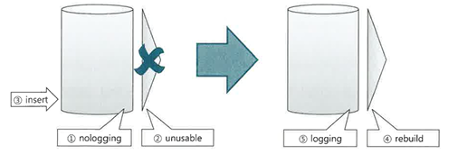
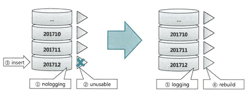

### 6.3.4 파티션을 활용한 대량 DELETE 튜닝

```oracle-sql
delete from 거래
where 거래일자 < '20150101';
```
수천만건의 데이터를 삭제할때도, 인덱스를 실시간으로 관리하려면 많은 시간이 소요된다.

그렇다고 대용량 인덱스를 모두 DROP 했다가 다시 생성하기도 어렵다
UPDATE는 변경 대상 컬럼을 포함하는 인덱스만 재생성하면 되지만, DELETE는 모든 인덱스를 재생성 해야한다.

**DELETE가 느린 이유**

1. 테이블 레코드 삭제
2. 테이블 레코드 삭제에 대한 Undo 로깅
3. 테이블 레코드 삭제에 대한 Redo 로깅
4. 인덱스 레코드 삭제
5. 인덱스 레코드 삭제에 대한 Undo 로깅
6. 테이블 레코드 삭제에 대한 Redo 로깅
7. Undo(2번,5번)에대한 Redo로깅

특히 각 인덱스 레코드를 찾아서 삭제해주는 작업에 대한 부담이 크다.  
-> 건건이 수직적 탐색을 거쳐 대상 레코드를 찾아야 하기 때문이다.
(인덱스 개수는 DML성능에 미치는 영향이 매우 크다)

**파티션 Drop을 이용한 대량 데이터 삭제**

테이블이 삭제 조건절(`거래일자 < '20150101'`) 컬럼 기준으로 파티셔닝 되어있고 인덱스 또한 로컬 파티션이라면 
아래와 같이 같단하게 대량 데이터를 순삭 할 수있다
```sql
alter table 거래 drop partition p201412;

--오라클 11g 부터는 값을 이용해서 파티션 지정 가능
alter table 거래 drop partition for(20150101);
```

**파티션 Truncate을 이용한 대량 데이터 삭제**

또 다른 삭제 조건이 있는 경우 

- (상태 코드 <> 'ZZZ' or 상태코드 is null)조건을 만족하는 데이터가 소수일때

  아래 DELETE문 그대로 사용하면 된다.
  
  
  ```sql
  delete from 거래
  where 거래일자 < '20150101'
  and (상태 코드 <> 'ZZZ' or 상태코드 is null);
  ```
- (상태 코드 <> 'ZZZ' or 상태코드 is null)조건을 만족하는 데이터가 대다수일때

  대량 데이터를 지울 게 아니라 남길 데이터만 백업했다가 재입력 하는 방식이 빠르다

  1. 임시 테이블 생성하고 남길 데이터만 복제
      ```sql
      crate table 거래_t
      as 
      select *
      from 거래
      where 거래일자 < '20150101'
      and 상태코드 = 'ZZZ';
      ```
  2. 삭제 대상 테이블 파티션을 Truncate 한다.

      ```sql
      alter table 거래 truncate partition p201412;

      --오라클 11g 부터는 값을 이용해서 파티션 지정 가능
      alter table 거래 truncate partition for(20150101);
      ```
  3. 임시 테이블에 복제해둔 데이터를 원본 테이블에 입력

      ```sql
        insert into 거래
        select * from 거래_t; -- 남길 데이터만 입력
      ```
  4. 임시 테이블 Drop
      ```sql
        drop table 거래_t
      ```
서비스 중단 없이 파티션을 Drop 또는 Truncate하려면 아래 조건을 만족해야 한다.

1. 파티션 키와 커팅 기준 컬럼이 일치해야함 <br>
  -> 예를 들어 파티션 키와 커팅 기준 컬럼이 모두 '신청일자'

2. 파티션 단위와 커티 주기가 일치해야함 <br>
  -> 예를 들어, 월 단위 파티션을 월 주기로 커팅

3. 모든 인덱스가 로컬 파티션 인덱스여야 함 <br>
  -> 예를 들어, 파티션 키는 '신청일자', PK는 '신청일자 + 신청순번' <br>
  -> PK 인젝스는 지금처럼 삭제 기준 컬럼이 인덱스 구성컬럼이어야 로컬 파티셔닝 가능

### 6.3.5 파티션을 활용한 대량 INSERT 튜닝

**비파티션 테이블 일떄**
비파티션 테이블에 손익분기점을 넘는 대량 데이터를 INSERT 하려면 
인덱스를 Unusable시켰다가 재생성하는 방식이 빠를 수 있다.


1. 테이블을 nologging 모드로 전환
    ```sql
    alter table target_t nologging;
    ```
2. 인덱스를 Unusable 상태로 전환
    ```sql
    alter index target_t_x01 unusable;
    ```
3. 대량 데이터를 입력 (가능하면 Direct Path Insert방식)
    ```sql
    index /*+ append */ into targer_t
    select * from source_t;
    ```
4. 인덱스 재생성 (가능하면 nologging모드로)
    ```sql
    alter table target_t_x01 rebuild nologging;
    ```
5. (nologging모드로 작업했다면) logging모드로 전환
   ```sql
   alter table target_t logging;
   alter table target_t_x01 rebuild logging;
   ```


**파티션 테이블 일떄**

초대용량 인덱스를 재생성하는 부담이 커서 실무세서 웬만하면 인덱스를 그대로 둔 상태로 Insert한다. <br>
하지만 그림처럼 테이블이 파티셔닝 되어있고 인덱스가 로컬 파티션이라면 파티션 단위로 인덱스를 재생성 할 수 있다.



1. 작업 대상 테이블 파티션을 nologging모드로 전환
    ```sql
    alter index target_t modify partition p_201712 nologging;
    ```
2. 작업 대상 테이블 파티션과 매칭 되는 인덱스 파티션을 Unusable상태로 전환
    ```sql
    alter index target_t_x01 modify partition p_201712 unusable;
    ```
3. 대량 데이터를 입력 (가능하면 Direct Path Insert방식)
    ```sql
    index /*+ append */ into targer_t
    select * from source_t where dt betweend '20171201' and '20171231;
    ```
4. 인덱스 재생성 (가능하면 nologging모드로)
    ```sql
      alter table target_t_x01 rebuild partition p_201712 nologging;
    ```
5. (nologging모드로 작업했다면) logging모드로 전환
   ```sql
   alter table target_t modify partition p_201712 logging;
   alter table target_t_x01 modify partition p_201712 logging;
   ```