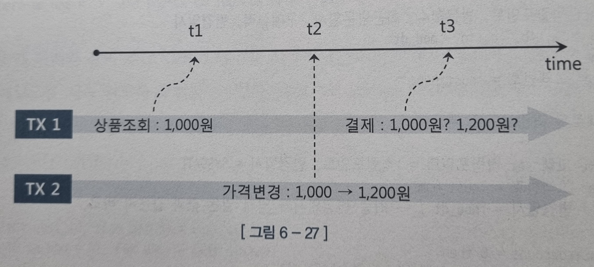
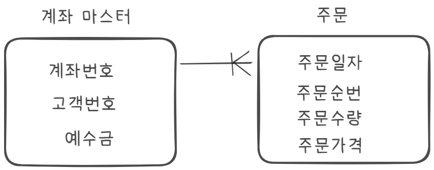

### 6.4.2 트랜잭션의 동시성 제어
동시성 제어는 비관적 동시성 제어와 낙관적 동시성 제어로 나뉜다.

`비관적 동시성 제어`는 첫번째 사용자가 트랜잭션을 완료하기 전 다른 사용자들이 같은 데이터를 수정할 수 없게 만들기 때문에 자칫 잘못 사용하면 동시성이 나빠진다.<br>

`낙관적 동시성 제어`는 데이터를 읽을때 Lock을 설정하지 않고 데이터를 수정하고자 하는 시점에 앞서 읽은 데이터가 다른사용자에 의해 변경되었는지 검사한다.

**비관적 동시성 제어**

우수고객 대상으로 적립 포인트를 제공하는 이벤트를 실시한다고 가정

아래 코딩 예시처럼 고객의 실적정보를 읽고 복잡한 산출 공식을 이용해 계산하는 동안 다른 트랜잭션이 같은 고객의 실적정보를 변경한다면 문제가 생길 수 있다.

```sql
select 적립포인트, 방문횟수, 최근방문일시, 구매실적 from 고객
where 고객번호 =:cust_num;

--새로운 적립 포인트 계산

update 고객 set 적립포인트 = :적립포인트 where 고객번호 =:cust_num
```

하지만 아래와 같이 `FOR UPDATE`를 사용하면 고객레코드에 Lock을 설정하므로 데이터가 잘못 갱신되는 문제를 방지할 수 있다

```sql
select 적립포인트, 방문횟수, 최근방문일시, 구매실적 from 고객
where 고객번호 =:cust_num for update;
```
자칫 시스템 동시성을 심각하게 떨어뜨릴 우려가 있지만 FOR UPDATE에 WAIT 또는 NOWAIT 옵션을 사용하면 Lock을 얻기 위해 무한정 기다리지 않아도 된다.

```sql
for update nowait -> 대기없이 Exception을 던짐
for update wait 3 -> 3초 대기 후 Exception을 던짐
```
위 옵션을 사용하면 다른 트랜잭션에 의해 Lock이 걸렸을때 Exception을 만나게 되므로 트랜잭션을 종료할 수 있다 따라서 동시성을 증가시키게 된다.

**큐 테이블 동시성 제어**

Queue 테이블에 쌀인 고객 입금 정보를 일정한 시간 간격으로 읽어서 입금 테이블에 반영하는 데몬 프로그램이 있다고 가정

데몬이 여러 개이므로 Lock이 걸릴수 있는데 Lock걸릴때 3초간 대기 했다가 다음에 다시 시도하기 위해 아래와 같이 작성하였고 Lock이 풀릴 때 까지 다른 데몬이 오래 걸릴수 있으므로 고객 정보를 100씩 읽도록 했다

```sql
select cust_id, rcpt_amt from cust_recpt_Q
where yn_upd = 'Y' and rownum <= 100 for update wait 3;
```

이럴 때  skip locked 옵션을 사용하면 lock이 걸린 레코드는 생략하고 다음 레코드를 계속 읽도록 구현 가능하다

```sql
select cust_id, rcpt_amt from cust_recpt_Q
where yn_upd = 'Y' for update skip locked;
```

**낙관적 동시성 제어**

SELECT-LIST에서 네개의 컬럼을 참조했을때 예시

```sql
select 적립포인트, 방문횟수, 최근방문일시, 구매실적 into :a, :b, :c, :d
from 고객
where 고객번호 =:cust_num;

--새로운 적립포인트 계산

update 고객 set 적립포인트 = :적립포인트 
where 고객번호 =:cust_num
and 적립포인트 = :a
and 방문횟수 = :b
and 최근방문일시 = :c
and 구매실적 = :d

if sql%rowcount = 0 then
  alert('다른 사용자에 의해 변경되었습니다.');
end if
```
select문에서 읽은 컬럼이 많다면 update문에 조건절을 일일이 기술하는것을 상당이 귀찮다 만약 UPDATE문에 최종변경일시를 관리하는 컬럼이 있다면, 이를 조건절에 넣어 간단히 판단할 수 있다.


```sql
select 적립포인트, 방문횟수, 최근방문일시, 구매실적, 변경일시 into :a, :b, :c, :d, :mod_at
from 고객
where 고객번호 =:cust_num;

--새로운 적립포인트 계산

update 고객 set 적립포인트 = :적립포인트, 변경일시 = SYSDATE
where 고객번호 =:cust_num
and 변경일시 =:mod_at; -> 최종 변경일시가 앞서 읽은 값과 같은지 비교

if sql%rowcount = 0 then
  alert('다른 사용자에 의해 변경되었습니다.');
end if
```

 위 예시에거도 update 전에 아래 select문을 한번 더 수행함으로써 Lock에 대한 예외 처리를 한다면 Lock을 기다리지 않게 구현이 가능하다

 ```sql
select 적립포인트, 방문횟수, 최근방문일시, 구매실적, 변경일시 into :a, :b, :c, :d, :mod_at
from 고객
where 고객번호 =:cust_num;
and 변경일시 =:mod_at
for update nowait
```

**동시성 제어 없는 낙관적 프로그래밍**

낙관적 동시성 제어를 사용하면Lock이 유지되는 시간이 매우 짧아져 동시성을 높이는 데 매우 유리하다. 하지만 다른 사용자가 같은 데이터를 변경했는지 검사하고 그에 따라 처리하는 것이 귀찮다 

정말 귀찮을 걸까? 아니면 동시성 제어의 필요성을 몰라서 일까?

온라인 쇼핑몰에서 상품조회 -> 결제완료 순간까지 예시를 들어 보자


위와 같은 상황에서  가격의 변경 여부를 체크함으로써 해당 주문을 취소하거나 변경사실을 알려야 한다

```sql
insert into 주문 
select :상품코드, :고객Id, :주문일시, 등등...
from 상품
where 상품코드 =:상품코드
and 가격 =: 가격 --주문시점가격

if sql%rowcount = 0 then 
  alert('상품가격이 변경되었습니다.');
end if;
```

그런데 그런 로직을 찾기 힘들다 왜냐면 개발자들이 주문을 진행하는 동안 상품 업체에서 가격을 변경하지 않을거라고 낙관적으로 생각하기 떄문

**데이터 품질과 동시성 향상을 위한 제언**

이 책은 성능을 다루는 책이지만 성능보다 데이터 품질이 더 중요하다는 사실을 강조하지 않을수 없다 동의한다면 *"for update 사용을 두려워 하지 말라."*

*"불필요하게 lock을 오래 유지하지 않고 원자성을 보장하는 범위 내에서 가급적 빨리 커밋해라."*

*"꼭 주간에 수행할 필요가 없는 배치 프로그램은 야간에 해라."*


먼저 낙관적락을 적용했다가 다른 트랜잭션에 의해 데이터가 변경되면 롤백하고 다시 시도할때 비관적 동시성 제어를 사용하는 방식으로 *"낙관적, 비관적 제어를 같이 사용하는 방법도 있다."*

*"동시성 향상시 SQL튜닝은 기본이다 효율적으로 인덱스를 구성하고 데이터 량에 맞는 조인 메소드를 선택해라"*<br>

Lock에 대한 고민은 트랜잭션 내 모든 SQL을 완벽히 튜닝하고 해도 늦지 않다.

**로우 Lock대상 테이블 지정**



쿼리를 아래와 같이 작성하면 양쪽 모두에 로우 Lock이 걸린다.
```sql
select b.주문수량
from 계좌마스터 a, 주문 b,
where a.고객번호 = :cust_no
and b.계좌번호 = a.계좌번호
and b.주문일자 = :ord_dt
for update

--아래와 같이 작성하면 주문수량이 있는 주문 데이블 에서만 로우 Lock이 걸린다.

select b.주문수량
from 계좌마스터 a, 주문 b,
where a.고객번호 = :cust_no
and b.계좌번호 = a.계좌번호
and b.주문일자 = :ord_dt
for update of b.주문수량
```