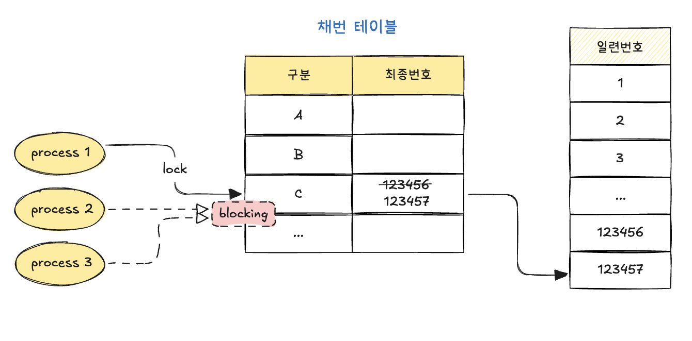
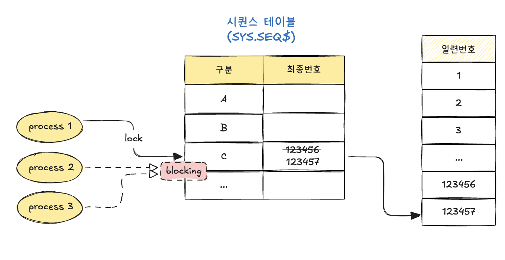
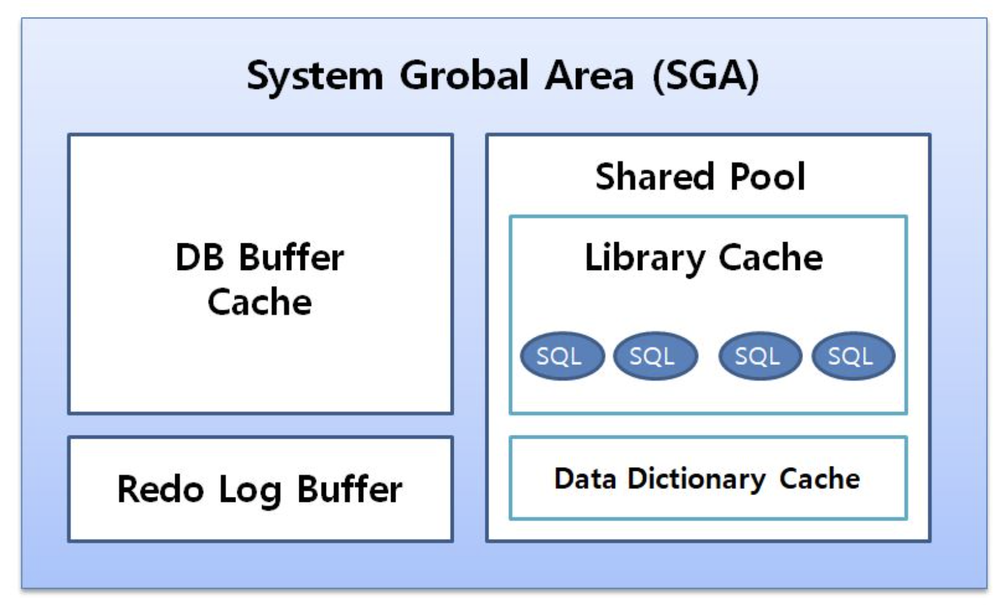

## 6.4.3 채번 방식에 따른 INSERT 성능 비교

INSERT, UPDATE, DELETE, MERGE 중 가장 중요하고 튜닝 요소가 많은 것은 INSERT다. 수행빈도가 가장 높아서 그렇기도 하지만, 채번 방식에 따른 성능 차이가 매우 크기 때문이다.
> 채번: 새로 들어갈 데이터에 `겹치지 않는 번호`를 하나 정해주는 것

신규 데이터를 입력하려면 PK 중복을 방지하기 위한 채번이 선행되어야 하는데, 가장 많이 사용하는 아래 세 가지 채번 방식이 있다.

- 채번 테이블
- 시퀀스 오브젝트
- MAX + 1 조회

설명의 편의를 위해 용어부터 정리할 필요가 있다. 예를 들어, PK가 `상담원ID + 상담일자 + 상담순번`처럼 복합컬럼으로 구성돼 있을 때, 순번 이외의 컬럼(상담원ID, 상담일자)을 지금부터 `구분 속성`이라고 부르기로 하자.

---

### 채번 테이블

테이블 식별자의 단일컬럼 일련번호 또는 구분 속성별 `순번을 채번하기 위해 별도 테이블을 관리하는 방식`이다.
채번 레코드를 읽어서 1을 더한 값으로 변경하고, 그 값을 새로운 레코드를 입력하는 데 사용한다. 이 방식은 채번 레코드를 변경하는 과정에 자연스럽게 액세스 직렬화가 이루어지므로 두 트랜잭션이 중복 값을 채번할 가능성을 원천적으로 방지해 준다.

이 방식의 장점부터 나열하면 아래와 같다.

- 범용성이 좋다.
- INSERT 과정에 중복 레코드 발생에 대비한 예외 처리에 크게 신경쓰지 않아도 되므로 채번 함수만 잘 정의하면 편리하게 사용할 수 있다.  (→ MAX+1 방식과 비교)
- INSERT 과정에 결번을 방지할 수 있다. (→ 시퀀스 방식과 비교)
- PK가 복합컬럼일 때도 사용할 수 있다. (→ 시퀀스 방식과 비교)

가장 큰 단점은 다른 채번 방식에 비해 성능이 안 좋다는 데 있다. 채번 레코드를 변경하기 위한 로우 Lock 경합 때문이다. 로우 Lock은 기본적으로(자율 트랜잭션 기능을 활용하지 않으면) 대상 테이블에 INSERT를 마치고 커밋 또는 롤백할 때까지 지속된다.



---

동시 INSERT가 아주 많으면 채번 레코드뿐만 아니라 채번 테이블 블록 자체에도 경합이 발생한다. 서로 다른 레코드를 변경하는 프로세스끼리도 경합할 수 있다는 뜻이다.

>구체적으로 말하면, 버퍼 Lock과 ITL() 경합을 의미한다.
>- ITL : 같은 데이터 블록을 동에 수정하려는 트랜잭션 리스트,  트랜잭션 정보 일부를 데이터 블록 헤더에 직접 기록한 것
>- ITL 경합 : 한 블록에 동시에 접근하려는 트랜잭션 수가  ITL 슬롯 수를 초과했을 때 발생하는 대기

PK가 복합컬럼인 경우, 즉 구분 속성별 순번을 채번하는 경우에는 Lock 경합이 줄어들지만, 구분 속성 레코드 수가 소수일 때만 이 방식을 사용하므로 Lock 경합이 발생할 가능성은 다른 채번 방식에 비해 여전히 높다. 따라서 동시 INSERT가 아주 많은 테이블에는 사실상 이 방식을 사용하기 어렵다.

>예를 들어, 고객별 순번을 채번 테이블을 사용하면, 고객 수만큼 채번 레코드가 필요하므로 이 방식을 사용하기에 무리가 따른다. (구분속성이 고유할수록 lock경합 발생은 적지만 레코드 수가 늘어난다)

---

#### 자율 트랜잭션

PL/SQL의 자율(Autonomous) 트랜잭션 기능을 이용하면 메인 트랜잭션에 영향을 주지 않고 서브 트랜잭션에서 일부 자원만 Lock을 해제할 수 있다. 방법은 간단하다. PL/SQL 선언부에 아래와 같이 `pragma autonomous_transaction`이라고 선언하기만 하면 된다.

```sql
create or replace function seq_nextval(l_gubun number) return number
as
  pragma autonomous_transaction  /*이 함수는 독립 트랜잭션임을 선언*/
  l_new_seq seq_tab.seq%type;
begin
  update seq_tab
  set    seq = seq + 1
  where  gubun = l_gubun; /*채번 테이블 수정 - 이떄 잠깐 로우락발생*/

  select seq into l_new_seq
  from   seq_tab
  where  gubun = l_gubun;

  commit; /*메인트랜잭션과 별도로 커밋*/
  return l_new_seq;
end;
```

PL/SQL 함수/프로시저를 자율 트랜잭션으로 선언하면, 그 내부에서 커밋을 수행해도 메인 트랜잭션은 커밋하지 않은 상태로 남는다. 메인 트랜잭션 INSERT 문에서 아래와 같이 채번 함수를 호출하고 최종적으로 커밋하기 전까지 다른 작업을 많이 수행하더라도 채번 테이블 로우 Lock은 이미 해제한 상태이므로 다른 트랜잭션을 블로킹하지 않는다.

```sql
insert into target_tab values ( seq_nextval(123), :x, :y, :z );
```

- as-is
```
채번 UPDATE → (Lock 유지) → INSERT → 기타 작업 → COMMIT
```

- to-be
```
채번 UPDATE → COMMIT (즉시 Lock 해제)
                ↓
          INSERT + 기타 작업
                ↓
             COMMIT
```

그래서 채번 테이블 lock 보유시간이 짧아질 수 있다. (원자성은 보장안됨 - 메인트랜잭션 롤백되어도 번호는 소비됨)

---

### 시퀀스 오브젝트

시퀀스(Sequence)의 가장 큰 장점은 성능이 빠르다는 데 있다. 채번 테이블과 마찬가지로 INSERT 과정에 중복 레코드 발생에 대비한 예외처리에 크게 신경 쓰지 않아도 된다. 테이블별로 시퀀스 오브젝트를 생성하고 관리하는 부담은 있지만, 개발팀 입장에서는 사용하기에 매우 편리하다.

시퀀스의 가장 큰 장점이 성능이지만, 성능 이슈가 없는 것은 아니다. 시퀀스 채번 과정에 발생하는 Lock 때문이다. 시퀀스의 성능 이슈를 이해하려면, 시퀀스 오브젝트가 `오라클 내부에서 관리하는 채번 테이블`이라는 사실을 이해해야 한다. 구체적으로 SYS.SEQ$ 테이블을 말하며, DBA_SEQUENCES 뷰를 통해 조회할 수 있다.




시퀀스 오브젝트도 결국 테이블이므로 값을 읽고 변경하는 과정에 Lock 메커니즘이 작동한다. 시퀀스 Lock에 의한 성능 이슈가 있지만, 캐시 사이즈를 적절히 설정하면 가장 빠른 성능을 제공한다. (기본적으로 시퀀스는 한번에 여러개 번호를 메모리에 미리할당해 두어 디스크 access가 적을 수 있다.) 시퀀스에는 자율 트랜잭션 기능도 기본적으로 구현돼 있다.

---
#### 시퀀스 Lock

> 오라클이 시퀀스 오브젝트에 사용하는 Lock으로는 세 가지가 있다. `로우 캐시 Lock`, `시퀀스 캐시 Lock`, `SV Lock`이 그것이다.

---

##### 로우 캐시 Lock

딕셔너리 정보를 매번 디스크에서 읽고 쓰면 성능이 매우 느리므로 오라클은 로우 캐시를 사용한다. 로우 캐시는 공유 캐시(SGA)의 구성요소이므로 정보를 읽고 쓸 때 액세스를 직렬화해야 한다. 이를 위해 사용하는 Lock이 `로우 캐시 Lock`이다.



> 테이블, 인덱스 테이블스페이스, 데이터파일, 세그먼트, 익스텐트, 사용자, 제약, 시퀀스, DB link 등에 대한 정보를 딕셔너리라고 한다.
> 이러한 딕셔너리 정보를 빠르게 읽고 쓰기 위해 캐시를 사용하는데, 이를 데이터 딕셔너리캐시, 또는 로우캐시라고 부른다.
> 로우캐시라고 부르는 이유는 딕셔너리캐시가 로우단위로 I/O 하기 때문이다.
> 일반적인 데이터 블록은 블록단위로 I/O 한다.

로우 캐시를 사용하는 대표적인 오브젝트가 시퀀스(SYS.SEQ$)이므로 로우 캐시 Lock 경합이 나타날 수 있다. 즉, nextval을 호출할 때마다 로우 캐시에서 시퀀스 레코드(last_number 컬럼)를 변경해야 하는데, 많은 사용자가 동시에 nextval을 호출하면 로우 캐시 Lock 경합이 발생한다.

시퀀스 채번으로 인한 로우 캐시 Lock 경합을 줄이기 위해 오라클은 기본적으로 CACHE 옵션을 사용한다. 옵션을 명시적으로 설정하지 않았을 때 기본값은 20이다. 시퀀스 채번에 의한 로우 캐시 Lock 경합을 줄이고 싶다면, 이 값을 크게 설정하면 된다. 반대로, 채번 빈도가 낮아 굳이 캐시를 사용하고 싶지 않다면 NOCACHE 옵션을 지정하면 된다. 아래 스크립트 결과를 참조하면 CACHE 옵션을 더 정확히 이해할 수 있다.

```sql
SQL> create sequence MYSEQ cache 1000; /*1000개의 번호 미리 확보*/

SQL> select cache_size, last_number
  2  from user_sequences
  3  where sequence_name = 'MYSEQ';
  
  
CACHE_SIZE LAST_NUMBER
---------- -----------
      1000           1

SQL> select MYSEQ.NEXTVAL from dual;

NEXTVAL
-------
      1 /*이후 1000번까지 시퀀스 캐시에서 가져옴*/
      
- last_number: 다음에 캐시로 가져올 시작 번호
- nextval: 지금 사용자에게 주는 번호
```


```sql
SQL> select cache_size, last_number
  2  from user_sequences
  3  where sequence_name = 'MYSEQ';

CACHE_SIZE LAST_NUMBER
---------- -----------
      1000        1001
```

CACHE 크기를 1,000으로 지정한 시퀀스를 생성하고 nextval을 호출했더니 last_number 값이 1에서 1,001로 증가했다. 이제 nextval을 호출할 때마다 시퀀스 레코드를 변경하지 않아도 된다. 값을 시퀀스 캐시에서 얻으면 되기 때문이다. 시퀀스 캐시에서 1,000개의 값을 모두 소진한 직후 nextval을 호출하면 그때 다시 로우 캐시에서 시퀀스 레코드를 2,001로 변경한다.

---

##### 시퀀스 캐시 Lock
시퀀스 캐시도 공유 캐시에 위치한다. 따라서 시퀀스 캐시에서 값을 얻을 때도 액세스 직렬화가 필요하며, 이를 ‘SQ Lock’이라고 부른다.

---

##### SV Lock
시퀀스 캐시는 한 인스턴스 내에서 공유된다. nextval을 호출하는 순서대로 값을 제공하므로 인스턴스 내에서는 번호 순서를 보장한다.

데이터베이스 하나에 인스턴스가 여러 개인 RAC 환경에서는 인스턴스마다 시퀀스 캐시를 따로 갖는다. 따라서 인스턴스 간에는 번호 순서를 기본적으로 보장하지 않는다.

예를 들어, 첫 번째 nextval을 1번 인스턴스 A 프로세스가 호출하고, 이어서 두 번째 nextval은 2번 인스턴스 B 프로세스가 호출한다. 그때부터 1번 인스턴스 시퀀스 캐시는 1부터 1,000까지의 값을 순서대로 반환하고, 2번 인스턴스 시퀀스 캐시는 1,001부터 2,000까지의 값을 순서대로 반환한다. 따라서 1번과 2번 인스턴스에 있는 프로세스들이 교차로 nextval을 호출하면, 테이블에는 아래와 같은 순서로 값이 입력된다.

```
1 → 1001 → 2 → 1002 → 3 → 1003 → 4 → 1004 → 5 → 1005 → …
```


식별자가 갖추어야 하는 기본 조건을 상기해 보자. 식별자는 값이 유일(Unique)해야 하고, 반드시 값이 있어야(Not Null) 한다. 식별자에 값을 순서대로 입력해야 한다는 조건은 어디에도 없다. 위와 같이 입력해도 식별자로서 조건을 전혀 위배하지 않는다. 그런데 식별자 번호를 레코드 입력순으로 넣어주길 원하는 업무 담당자가 많다. 즉, 식별자가 일련번호(Serial Number)이길 원한다.

어떤 이유에서든 업무적으로 순서를 보장해야 한다면, 즉 어떤 인스턴스에서 nextval을 호출하더라도 순서대로 일련번호를 제공해야 한다면, ORDER 옵션을 사용하면 된다. 그러면 시퀀스 캐시 하나를 모든 RAC((Real Application Clusters - 하나의 DB를 여러 서버가 동시에 붙어서 쓰는 구조)) 노드가 공유한다.

그런데 자원을 공유할 때는 항상 Lock 메커니즘이 필요하다. RAC 환경에서 ORDER 옵션을 사용하면 오라클은 ‘SV Lock’을 통해 시퀀스 캐시에 대한 액세스를 직렬화한다. RAC 각 노드는 네트워크 상에 서로 분리된 서버인데, 어떻게 시퀀스 캐시를 공유할까? 네트워크를 통해 시퀀스 캐시를 서로 주고 받으면서 공유한다. 문제는 성능이다.

1번 인스턴스에서 nextval을 연속해서 1,000번 호출하고, 이어서 2번 인스턴스에서 연속해서 1,000번을 호출하고, 이어서 다시 1번 인스턴스가 1,000번을 호출하는 트랜잭션 패턴이라면 ORDER 옵션을 사용해도 성능이 나빠지진 않는다. 하지만, 1번과 2번 인스턴스가 교대로 nextval을 빠르게 호출하는 트랜잭션 패턴이라면 ORDER 옵션을 사용하는 순간 INSERT 성능은 급격히 나빠진다. 업무적으로 꼭 필요할 때만 ORDER 옵션을 사용해야 하는 이유가 여기에 있다.

마지막으로 가장 많이 받는 질문 하나. “RAC 환경에서 ORDER 옵션을 사용했더니 성능이 급격히 나빠졌다. 해결방법은?” 방법은 단 한 가지다. ORDER 옵션을 제거하는 것뿐이다.

그럼 다른 채번 방식을 사용해야겠다고 생각하겠지만, 다른 방식을 사용해도 아래와 같은 부작용이 나타난다.

>시퀀스 : 시퀀스 캐시를 인스턴스 간에 주고 받아야 함 
> 
> 채번 테이블 : 채번 레코드가 저장된 데이터 및 인덱스 블록을 인스턴스 간에 주고 받아야 함 
> 
>MAX + 1 : MAX 값을 찾는 데 필요한 인덱스 블록을 인스턴스 간에 주고 받아야 함

RAC 환경에서 ORDER 옵션을 주고 안 주고에 따라 성능 차이가 많이 나지만, 그래도 시퀀스를 이용한 채번이 가장 빠르다. 결론적으로, 시퀀스의 가장 큰 장점은 성능이다. 동시 INSERT가 많은 테이블에 단일속성의 일련번호 식별자를 두었다면, 시퀀스를 활용하는 것보다 나은 솔루션은 없다.

시퀀스의 가장 큰 단점은 기본적으로 PK가 단일컬럼일 때만 사용 가능하다는 데 있다. PK가 복합컬럼일 때도 사용할 수는 있지만, 각 레코드를 유일하게 식별하는(유일성을 보장하는) 최소 컬럼으로 PK를 구성해야 한다는 최소성(Minimality) 요건을 위배하게 된다.
