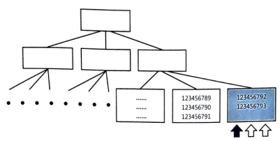
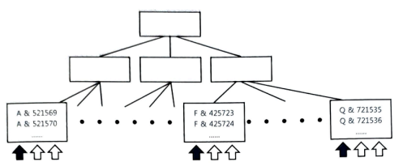

## 시퀀스보다 좋은 솔루션

### 입력일시 활용한 PK 구조 설계

한 개 이상의 구분 속성과 함께 뒤쪽에 순번 대신 입력일시를 두는 방식으로 PK 구조를 설계하면 채번 또는 INSERT 과정에서 발생하는 Lock 이슈를 거의 해소할 수 있다.

채번 과정을 생략하고 SYSDATE 또는 SYSTIMESTAMP 함수만 호출 ➡️ 빠르고 간편

구분 속성의 값 종류 개수가 
- 많으면 입력일시에 DATE 타입을 써도 됨. 
- 적으면 TIMESTAMP 타입을 써야 할 수도 있다.
  > - TIMESTAMP
  >   - OS에 따라 지원하는 소수 자릿수가 다름
  >     - 최대 소수점 9자리까지 가능하지만 OS 플랫폼에 따라 차이가 있다. 
  >       - 대부분 유닉스와 리눅스: 소수점 6자리(microsecond)까지 지원
  >       - MS 윈도우: 3자리(millisecond)까지만 지원
  >     - ➡️ 데이터 중복은 거의 발생하지 않음

- 적절한 데이터 타입을 선택하면 중복 가능성은 희박하지만, 예외 처리는 필요
  > MAX+1 방식도 기본적으로 예외 처리가 필요하고, 시퀀스 방식에도 예외 처리를 하는 것이 좋다. 
  > 
  > > 시퀀스 객체를 재생성한 후 최종 값(last_number)을 늘려주지 않으면 중복이 생길 수 있다(개발 환경에서 흔히 발생하는 오류 유형 중 하나)

### 데이터 삭제의 중요성

정보 생명주기(ILM)를 효과적으로 관리하는 데 있어 데이터 삭제는 매우 중요하다(6.3). 

- 시스템을 오픈하고 하루 평균 10억 건씩 데이터가 쌓인다면 후에는 지울 데이터도 하루 평균 10억 건(빠르게 삭제할 수 있는 구조로 설계해야 하는 이유)

빠른 삭제 뿐 아니라, 공간을 바로 시스템에 반납함으로써 재활용할 수 있어야 한다. 

그런 의미에서 입력일시를 PK에 포함하려는 노력은 매우 의미 있다.

> 서비스 중단 없이 파티션 단위로 커팅(파티션 DROP 또는 TRUNCATE)하려면((6.3.4) ‘파티션을 활용한 대량 DELETE 튜닝’)
> - 기본적으로 **PK 인덱스가 로컬 파티션**이어야 함 
> - PK 인덱스를 로컬 파티셔닝하려면 **삭제 기준 컬럼(파티션 키)이 PK에 포함**돼 있어야 함.(삭제 기준은 대개 입력일시 컬럼)

## 인덱스 블록 경합 문제(INSERT 성능이 너무 빨라도 문제 )
- 특징
  - 채번 테이블 로우 Lock이나 시퀀스 Lock이 앞에서 길을 가로막고 있으면(채번 과정이 병목 지점이면) 잘 나타나지 않지만, 위의 방식으로 채번 과정을 생략하는 순간부터 인덱스 블록 경합이 나타나기 시작
    - MAX+1 방식을 사용할 때도 자주 나타남
  - Right Growing 인덱스에서 가장 흔히 볼 수 있다.
  >   - ‘Right Growing 인덱스’: 맨 우측 블록에만 데이터가 입력되는 인덱스
  >  >    
  >  >    - 인덱스는 키 순으로 정렬된 상태를 유지하며 값이 입력되기 때문에 ‘일련번호’나 ‘입력일시/변경일시’처럼 순차적으로 값이 증가하는 단일 컬럼 인덱스는 항상 맨 우측 블록에만 데이터가 입력
  >  >    - 구분 속성을 앞에 두면 Right Growing 인덱스는 아니다. 
  >  >      - 그래도 동시성이 매우 높으면 인덱스 블록 경합은 생길 수 있다. 구분 속성의 값 종류 개수가 적을수록 경합도 심하다.
  >  >        - 
    - Right Growing 인덱스에는 입력하는 값이 달라도 같은 블록을 갱신하려는 프로세스 간 버퍼 Lock 경합이 발생할 수 있다. ➡️ 여러 프로세스에 의한 동시 INSERT가 많을 때 트랜잭션 성능을 떨어뜨리는 주범
  - 의외로 흔히 발생
  - 여러 노드가 동시에 Current 블록 하나를 서로 주고받으며 값을 입력하기 때문에 RAC 환경에서 심각한 성능 저하를 일으킴
- 인덱스 블록 경합을 해소하는 방법
  - 인덱스를 해시 파티셔닝하는 것(가장 일반적인 방법)
    - 인덱스를 해시 파티셔닝하면 값이 순차적으로 증가하더라도 해시 함수가 반환한 값에 따라 서로 다른 파티션에 입력되므로 경합을 줄일 수 있다. 
  - 인덱스를 리버스(Reverse) 키 인덱스로 전환하는 방법도 고려할 수 있다.

## 시퀀스 신기능 활용

### 12c 시퀀스 신기능으로 일련번호에 대한 Right Growing 인덱스 성능 문제를 해결

- 아래와 같이 글로벌 시퀀스와 세션 시퀀스를 각각 하나씩 만든다.
  ```sql
  create sequence g_seq global;
  create sequence s_seq session;
  ```
  - 글로벌 시퀀스: 데몬 프로세스 또는 커넥션 풀에 등록된 프로세스가 **DB에 접속하는 순간 아래와 같이 호출**
    ```sql
    select g_seq.nextval from dual;
    ```
  - 세션 시퀀스: INSERT를 수행할 때마다 호출(즉, 아래와 같이 글로벌 시퀀스 currval과 세션 시퀀스 nextval을 조합한 값으로 INSERT)
    ```sql
    insert into t(id, c1, c2)
    values (
      to_char(g_seq.currval, 'fm0000') ||
      to_char(s_seq.nextval, 'fm0000'),
      'A', 'B'
    );
    ```
  - ➡️ 각 프로세스가 서로 다른 리프 블록에 값을 입력하여 인덱스 경합이 발생하지 않음

### 오라클 18c 버전 ‘Scalable 시퀀스’ 이용

시퀀스를 생성할 때 아래와 같이 `SCALE` 또는 `SCALE EXTEND` 옵션을 지정하면 된다.

> 참고로 12.2 버전에서도 테스트는 가능하지만 숨겨진 기능이므로 운영 시스템에 적용하기에는 이르다.

- Scalable 시퀀스에서 nextval을 호출하면 인스턴스 번호, 세션 ID, 시퀀스 번호를 조합한 값을 반환
  ```sql
  create sequence my_seq maxvalue 9999 scale extend;
  
  select my_seq.nextval as last_value,
         substr(my_seq.nextval, 1, 3) as val1,
         substr(my_seq.nextval, 4, 3) as val2,
         substr(my_seq.nextval, 7)     as val3,
         sys_context('userenv', 'instance') as inst_id,
         sys_context('userenv', 'sid')      as sid
  from dual;
  ```
  | LAST_VALUE | VAL1 | VAL2 | VAL3 | INST_ID | SID |
  | ---------- | ---- | ---- | ---- | ------- | --- |
  | 1011410001 | 101  | 141  | 0001 | 1       | 141 |

EXTEND 옵션을 생략하면 맨 우측 시퀀스 번호(VAL3)가 1, 2, 3 순으로 증가한다. 즉, 리딩 제로(leading zero) 없는 숫자를 반환한다.

> 18c Scalable 시퀀스를 참고해 하위 버전에서도 아래 값들을 조합하면 같은 기능 구현 가능
> 
> ```sql
> select sys_context('userenv', 'instance') as 인스턴스번호,
>        sys_context('userenv', 'sid')      as 세션ID,
>        my_seq.nextval                    as 시퀀스번호
> from dual;
> ```
