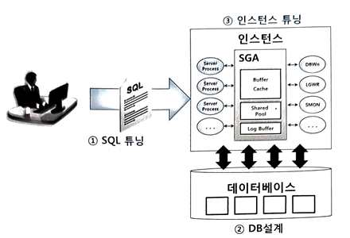

# (1) 필요한 최소 블록만 읽도록 쿼리 작성

SQL 작성자 스스로 결과 집합을 논리적으로 잘 정의하고, 
그 결과 집합을 만들기 위해 DB 프로세스가 최소한의 일만 하도록 
쿼리를 효율적으로 작성하는 것이 무엇보다 중요하다.

데이터베이스 성능은 I/O 효율에 달려있어 동일한 레코드를 반복적으로 읽지 않고, 필요한 최소 블록만 읽도록 해야 한다.

### 사례: 웹 게시판 구현 페이징 쿼리

```sql
SELECT *
FROM (
  SELECT ROWNUM NO, 등록일자, 번호, 제목, 회원명, 게시판유형명, 질문유형명, 아이콘, 댓글개수
  FROM (
    SELECT A.등록일자, A.번호, A.제목, B.회원명, C.게시판유형명, D.질문유형명,
           GET_ICON(D.질문유형코드) 아이콘, (SELECT ... FROM ...) 댓글개수
    FROM 게시판 A, 회원 B, 게시판유형 C, 질문유형 D
    WHERE A.게시판유형 = :TYPE
      AND B.회원번호 = A.작성자번호
      AND C.게시판유형 = A.게시판유형
      AND D.질문유형 = A.질문유형
    ORDER BY A.등록일자 DESC, A.질문유형, A.번호
  )
  WHERE ROWNUM <= (:page * 10)
)
WHERE NO >= (:page - 1) * 10 + 1;
```

- 성능 관점에서 불합리한 요소들
  - 화면에 출력할 대상이 아닌 게시물에 대해서도 `GET_ICON` 함수와 댓글 개수를 세는 스칼라 서브쿼리를 수행한다.
  - 회원, 게시판유형, 질문유형 테이블 조인 부분
    - 의미적 판단으로, 출력 대상 집합 확정 후에 조인해도 되는 테이블들

아래처럼 쿼리를 바꾼다면 DBMS가 처리해야 할 일량을 획기적으로 줄일 수 있다.

```sql
SELECT /*+ ORDERED USE_NL(B) USE_NL(C) USE_NL(D) */
       A.등록일자, A.번호, A.제목,
       B.회원명, C.게시판유형명, D.질문유형명,
       GET_ICON(D.질문유형코드) 아이콘,
       (SELECT ... FROM ...) 댓글개수
FROM (
  SELECT A.*, ROWNUM NO
  FROM (
    SELECT 등록일자, 번호, 제목, 작성자번호,
           게시판유형, 질문유형
    FROM 게시판
    WHERE 게시판유형 = :TYPE
      AND 작성자번호 IS NOT NULL
      AND 게시판유형 IS NOT NULL
      AND 질문유형 IS NOT NULL
    ORDER BY 등록일자 DESC, 질문유형, 번호
  ) A
  WHERE ROWNUM <= (:page * 10)
) A, 회원 B, 게시판유형 C, 질문유형 D
WHERE A.NO >= (:page - 1) * 10 + 1
  AND B.회원번호 = A.작성자번호
  AND C.게시판유형 = A.게시판유형
  AND D.질문유형 = A.질문유형
ORDER BY A.등록일자 DESC, A.질문유형, A.번호;
```
> 최종 결과 집합 10건에 대해서만
> 함수를 호출하고, 스칼라 서브쿼리를 수행

> 최종 결과 집합 10건에 대해서만 NL 조인 수행

# (2) 최적의 옵티마이징 팩터 제공

> 옵티마이징(Optimizing)도 ‘최적화’의 뜻을 갖는데, 그 앞에 ‘최적의’라는 수식어를 또 붙였다.

옵티마이저가 최적화를 잘할 수 있도록 적절한 수단을 제공하는 것은 사용자의 몫이다.

쿼리를 논리적으로 잘 구성(불필요한 일을 하지 않고 필요한 최소 블록만 읽도록)했다면, 옵티마이저에 넘어간다.

- 옵티마이저는 주어진 환경에서 가장 빠른 처리 경로를 찾아줄 뿐, 없는 길을 스스로 만들어 내지는 못한다.
  > ex. 옵티마이저가 필요하다고 판단하는 인덱스, 파티션, 클러스터 등을 실시간으로 만들면서 SQL을 최적화할 수는 없다. 
  >  - 기능을 활용할 수 있도록 물리적으로 DB를 구성하는 건 어디까지나 사람의 몫

## 대표적인 옵티마이징 팩터

### • 전략적인 인덱스 구성

- 전략적인 인덱스 구성은 옵티마이저를 돕는 가장 기본적인 옵티마이징 팩터다. 
  - 인덱스도 없이 1,000만 건 중에서 특정 레코드를 빠르게 찾을 방법은 없다. 
- 인덱스를 전략적으로 구성해 줄 책임은 DBA가 아닌 개발팀에 있다. 
  - 인덱스는 항상 SQL 조건절을 기준으로 설계해야 한다
  - 어떤 테이블을 어떤 조건으로 자주 액세스하는지는 DBA보다 개발자가 훨씬 잘 안다. 

인덱스와 SQL 수행 원리를 개발자가 더 많이 공부해야 한다.

### • DBMS가 제공하는 다양한 기능 활용

> 1억 건 중 조건절에 해당하는 100만 건을 읽어 집계된 결과를 출력해야 하는데, 
> 인덱스만 제공해 주고 단시간에 결과가 나오기를 바란다면 옵티마이저에게 무리한 요구를 하는 것. 

- 인덱스 외에도 DBMS가 제공하는 다양한 기능을 적절히 활용할 줄 알아야 한다.
  - 파티션, 클러스터, IOT, MV, Result Cache 등 DBMS가 제공하는 기능들을 활용하는 것이 좋다.

### • 옵티마이저 모드 설정

- 전략과 목표 명확, 분명한 목적을 전달해야 한다.
- 그렇지 않으면 예기치 않은 상황에 적절히 대처할 수 없다.

> 옵티마이저 모드가 왜 중요한지는 앞에서 이미 설명하였다.

### • 정확하고 안정적인 통계정보

정보력이 뒷받침되지 않으면 이기기 어렵다.

통계정보가 무엇이고, 옵티마이저가 이를 어떻게 활용하는지는 1절에서 이미 다루었다.

### 정리

1️⃣ 옵티마이저 모드를 포함해 각종 파라미터를 적절한 값으로 설정하고 통계정보를 잘 수집해 주는 것이 무엇보다 중요하다.

2️⃣ 전략적인 인덱스 구성이 필수적으로 뒷받침되어야 한다.

3️⃣ DBMS가 제공하는 기능을 적극적으로 활용해 옵티마이저가 최적의 선택을 할 수 있도록 해야 한다.

# (3) 옵티마이저 힌트를 사용해 최적의 액세스 경로로 유도

옵티마이저는 생각만큼 완벽하지 않다. 

- 옵티마이저가 최적의 실행계획을 수립하지 못할 때, 
개발자가 힌트를 이용해 직접 데이터 액세스 경로를 선택해 줄 수 있다. 

- 이미 최적으로 실행되고 있더라도 절대 다른 방식으로 바뀌지 않게 실행계획을 고정해야 하는 시스템들도 있다.

DB 애플리케이션 개발자라면 옵티마이저가 미처 생각하지 못한 최적의 액세스 경로를 찾아내고, 
실행계획을 그 방식으로 유도할 수 있는 능력을 갖추어야 한다.

# 7.2.6 튜닝 전문가 되는 공부 방법

DB 튜닝 전문가로 거듭나기위해 더 공부해야 하는 것들을 소개한다.

## 데이터베이스 튜닝이란?

> ‘데이터베이스 튜닝’의 튜닝은 일반적으로 ‘성능(Performance) 튜닝’을 말한다. 
> 
> 데이터베이스는 데이터 파일, 리두 로그 파일, 컨트롤 파일 등 파일들의 집합을 의미하지만, 
> 우리가 튜닝하고자 하는 대상은 파일이 아니다.
> 
> 파일에 데이터를 읽고 쓰는 소프트웨어 애플리케이션, 즉 DBMS가 대상이다. 
> 
> 따라서 ‘데이터베이스 성능 튜닝’보다는 ‘DBMS 성능 튜닝’을 의미한다고 가정하에 설명한다.

데이터베이스(DBMS)는 데이터를 읽고 쓰는 소프트웨어 엔진이다. 

데이터를 읽고 쓸 때 SQL을 이용 ➡️ SQL이 병목이나 지연 없이 빠르고 안정적으로 수행되도록 조치하는 모든 활동을 데이터베이스 튜닝이라고 정의할 수 있다.

데이터베이스 튜닝은 크게 다음 세 가지로 나뉜다.



1. SQL 튜닝 : I/O 효율화, DB Call 최소화, SQL 파싱 최소화 등
2. DB 설계 : 논리적 데이터 구조 설계, 물리적 저장 구조 설계 등
3. 인스턴스 튜닝 : Lock/Latch 모니터링 및 해소, 메모리 설정, 프로세스 설정 등

## 데이터베이스 튜닝 – ‘전광석화처럼 빠르게’

> 좋은 소리를 듣기 위해서 소스와 공간이 중요하듯, 데이터베이스에서도 소스와 공간이 중요하다. 

데이터베이스에서 
- 좋은 소스란, 옵티마이저가 효율적으로 처리할 수 있게 작성한 SQL을 말한다.(Garbage In, Garbage Out!)
- 좋은 공간이란, (좋은 하드웨어가 아닌) 효과적인 데이터 구조가 좋은 공간에 해당한다.

> 좋은 하드웨어가 필요 없다는 뜻은 아니다. 
> 
> 필요하지만, 좋은 소스와 좋은 데이터 구조가 선행되어야 한다는 뜻이다. 
> 
> (소리 울림을 만들어 줄 최적의 공간이 선행되어야 좋은 사운드를 재생)

## 튜닝 전문가가 되려면 무엇을 어떻게 공부해야 하는가?

대부분 SI 프로젝트에서 데이터베이스 개발 및 운영 지원을 위해 두 개 팀을 구성한다. 

하나는 DBA 팀, 다른 하나는 SQL 튜닝 팀

역할에 따라 공부 방법도 다르다.

> ※ 소규모 프로젝트에서는 DBA 팀이 두 가지 역할을 다 담당하기도 한다. 
> 
> 반대로, 대규모 프로젝트에서는 성능 검증(부하 테스트) 팀을 추가로 구성하기도 하는데, 이 팀에는 DB 전문가뿐만 아니라 WAS, OS, 네트워크, 스토리지 등 다양한 분야 전문가가 참여한다.

### DBA가 되고 싶다면 데이터베이스 자체 연구가 중요하다. 

- 데이터베이스 설치, 백업/복구, 오브젝트 생성/변경, 보안 등 기술력 
- 데이터베이스 아키텍처를 완벽히 숙지
- 데이터베이스를 운영하면서 생기는 여러 장애 상황을 모니터링하고 해결하는 기술력과 스크립트 개발

### SQL 튜닝 팀에서 일하고 싶다면 데이터베이스 자체보다 SQL 중심으로 공부해야 한다. 

가장 필요한 지식과 기술력은 다음과 같다.

- 옵티마이저가 **SQL을 파싱하고 통계정보**를 활용해 실행계획을 생성하는 원리
- 옵티마이저 쿼리 변환 원리를 바탕으로 **실행계획을 분석**하는 방법
- 옵티마이저 **힌트를 이용**해 실행계획을 제어하는 방법
- 옵티마이저가 **좋은 실행계획을 생성하도록 유도**하기 위한 효과적인 SQL 작성법
- 애플리케이션에서 SQL을 실행할 때 사용하는 **프로그래밍 인터페이스**
- SQL을 빠르게 처리할 수 있는 좋은 데이터 구조와 **파티션/인덱스** 설계
- 정확성과 안정성을 확보할 수 있는 **통계정보 수집** 정책

> 뷰와 서브쿼리로 복잡하게 얽혀 있는 SQL
> 
> - 실행계획을 분석해서 튜닝하는 과정도 매우 복잡
> - 힌트로 튜닝 시도하고 안되면 SQL을 다른 구조로 변환(이때부터는 말이 튜닝이지 프로그램 개발에 가까움)

디버깅을 통해 결과가 맞는지도 반드시 확인해야 한다. 틀린 결과를 빠르게 조회하도록 돕는 것은 튜닝이 아니다.

## SQL 튜닝이 곧 데이터베이스 튜닝

데이터베이스 튜닝은 SQL이 병목이나 지연 없이 빠르고 안정적으로 수행되도록 조치하는 모든 활동을 말한다.

데이터베이스 튜닝 전문가가 되고 싶다면, 수많은 SQL과 실행계획을 분석해 (데이터베이스를 움직이게 하는 소스인)SQL과 좋은 데이터 구조를 설계에 관심을 가지자.


