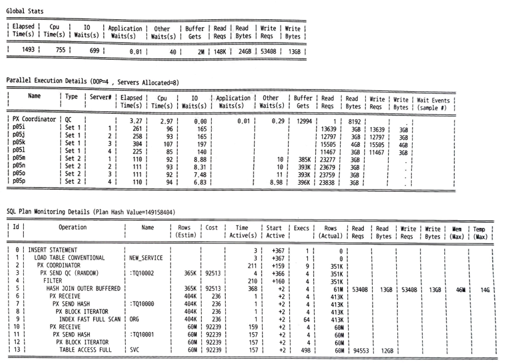

## 캐싱된 커서의 Row Source별 수행 통계 출력

방금 설명한 `dbms_xplan.display_cursor` 함수를 이용해 SQL 트레이스처럼 각 오퍼레이션 단계별 수행 통계도 확인할 수 있다. 

- 세션 레벨에서 `statistics_level` 파라미터를 `all`로 설정하거나, 
- 분석 대상 SQL문에 `gather_plan_statistics` 힌트를 사용하면 된다. 

그러면 오라클은 SQL을 수행하는 동안 각 오퍼레이션 단계별 수행 통계를 수집한다.

수집된 정보는 아래와 같이 `dbms_xplan.display_cursor` 함수로 확인할 수 있다.

```sql
select * from table(dbms_xplan.display_cursor('7f5y19ywtkwgt', 0, 'IOSTATS'));
select * from table(dbms_xplan.display_cursor('7f5y19ywtkwgt', 0, 'MEMSTATS'));
select * from table(dbms_xplan.display_cursor('7f5y19ywtkwgt', 0, 'ALLSTATS'));
select * from table(dbms_xplan.display_cursor(null, null, 'ALLSTATS'));
```

아래는 출력된 결과 샘플인데, SQL 트레이스에서 본 실행계획 통계(Plan Statistics)와 같은 정보를 보여준다.

| Id | Operation | Name    | Starts | E-Rows | A-Rows | A-Time   | Buffers | Reads |
| -- | --------- | ------- | ------ | ------ | ------ | -------- | ------- | ----- |
| 1  | TABLE ACC | DEPT    | 1      | 1      | 12     | 00:00.04 | 20      | 18    |
| 2  | NESTED L  |         | 1      | 12     | 25     | 00:00.93 | 8       | 17    |
| 3  | TABLE A   | EMP     | 1      | 12     | 12     | 00:00.04 | 4       | 16    |
| 4  | INDEX     | EMP_SAL | 1      | 12     | 12     | 00:00.02 | 2       | 8     |
| 5  | INDEX R   | PK_DEPT | 12     | 1      | 12     | 00:00.01 | 4       | 1     |

**Predicate Information (identified by operation id):**

```
4 - access("E"."SAL" >= 1000)
5 - access("D"."DEPTNO" = "E"."DEPTNO")
```

- Starts 항목: 각 오퍼레이션 단계를 몇 번 실행했는지를 나타낸다. 
  - ex. 단계(ID=5)(PK_DEPT 인덱스 액세스)의 Starts 12 = 이 단계를 열두 번 실행했음
    - 이는 단계(ID=3)(EMP 테이블 액세스)에서 얻은 결과 건수 12(=A-Rows)와 관련 있다. 
      - NL 조인은 드라이빙 집합에서 얻은 결과 건수만큼 반대쪽 집합을 액세스하기 때문이다.(4장 설명)

- E-Rows: SQL 트레이스에는 없는 정보, SQL을 수행하기 전 옵티마이저가 각 실행 단계별로 예상했던 로우 수를 의미
  - 예상 실행계획에서 보여주는 로우 수(Rows 또는 Card(Cardinality))와 일치

나머지 항목은 이름만 다를 뿐, SQL 트레이스 실행계획 통계와 같다. 일치하는 항목을 매핑해 보면 아래와 같다.

| DBMS_XPLAN  | SQL 트레이스            | 설명                         |
|-------------|---------------------|----------------------------|
| A-Rows      | rows                | 각 단계에서 읽거나 갱신한 건수          |
| A-Time      | time                | 각 단계별 소요 시간                |
| Buffers     | cr(=query), current | SQL 수행 과정에 읽은 총 블록 수       |
| Reads       | pr                  | SQL 수행 과정에 디스크에서 읽은 총 블록 수 |

각 항목은 기본적으로 누적값을 보여줌 

- 아래처럼 format 옵션에 `last`를 추가하면 마지막 수행했을 때의 일량을 보여준다.
   ```sql
   select * from table(dbms_xplan.display_cursor(null, null, 'ALLSTATS LAST'));
   ```

> Buffers = SQL 수행 과정에 읽은 총 블록 수
> 
> 일반적으로 DB 버퍼 캐시를 경유해서 블록을 I/O 하므로 오라클이 ‘Buffers’라는 표현을 사용했지만, Direct Path Read 방식으로 읽은 블록 수도 여기에 포함

> 권한
> 
> 방금 설명한 명령어가 잘 실행되지 않는다면, `v$session`, `v$sql`, `v$sql_plan_statistics_all` 뷰에 대한 조회 권한이 없기 때문
> 
> DBA에게 아래 명령을 실행해 달라고 요청필요
> 
> ```sql
> grant select on v_$session to scott;
> grant select on v_$sql to scott;
> grant select on v_$sql_plan_statistics_all to scott;
> ```

> 지훈이가 말했듯 SQL*Plus에서 `dbms_xplan.display_cursor` 함수를 실행하면서 `sql_id`와 `child_number` 인자에 `null`을 입력하고 싶다면, 아래와 같이 `serveroutput`을 off 상태로 전환해야 한다.
> 
> ```sql
> SQL> set serveroutput off;
> SQL> select * from emp;
> SQL> select * from table(dbms_xplan.display_cursor(null, null, 'allstats last'));
> ```

# 5. 실시간 SQL 모니터링

11g부터 제공되는 실시간 SQL 모니터링(Real-Time SQL Monitoring) 기능도 매우 유용하다. 

- 오라클이 실시간으로 모니터링하는 대상
  - CPU time 또는 I/O time을 5초 이상 소비한 SQL(※ `_sqlmon_threshold` 파라미터로 조정 가능)
  - 병렬 SQL
  - `monitor` 힌트를 지정한 SQL
- 위 조건에 해당해도 SQL 실행계획이 300라인을 넘으면 모니터링 대상에서 제외
  - 이 제약을 피하려면 `_sqlmon_max_planlines` 파라미터를 300 이상으로 설정하면 된다.
- 수집 정보는 `V$SQL_MONITOR`, `V$SQL_PLAN_MONITOR` 뷰를 통해 확인
- SQL을 실행하는 동안 1초마다 자동 갱신
- SQL 수행을 마치고 적어도 1분간은 정보를 유지
  - 캐시 공간이 부족하면 언제든 캐시에서 밀려날 수 있다.

- `dbms_sqltune.report_sql_monitor` 함수로 정보 확인 방법
  - 
   ```sql
   select dbms_sqltune.report_sql_monitor(sql_id => '6x50yqwz81sfa') from dual;
   select dbms_sqltune.report_sql_monitor(sql_id => '6x50yqwz81sfa', type => 'html') from dual;
   ```
  - 이 함수를 수행하면 I/O 발생량과 수행 시간을 전체와 실행계획 단계별로 구분해서 보여준다. 
  - 병렬 쿼리를 분석할 때 특히 유용
    - 모든 병렬 프로세스의 실행계획 단계별 일량을 집계해서 보여줄 뿐만 아니라 (=같은 실행계획 단계(ID)를 모든 병렬 프로세스(PX 서버)의 작업량을 합산해서 보여주는 것)
    - 병렬 프로세스별 일량을 따로 요약(Parallel Execution Details)해서 보여주기 때문

리포트 결과 참조



- Global Stats = 이 SQL 하나가 수행되면서 발생한 전체 일량의 총합(집계본)
- Parallel Execution Details는 “그 일을 병렬 프로세스들이 어떻게 나눠서 했는지”
- SQL Plan Monitoring Details "SQL이 어떤 단계에서 얼마나 일을 했는지"

🔹 먼저 아래를 본다
➡ HASH JOIN OUTER BUFFERED

Rows: 61M

Buffer Gets: 53,408

Read Bytes: 13GB

👉 “이 SQL에서 제일 무거운 단계”

🔹 그 다음 위를 본다

➡ PX 서버별 Read Bytes

대부분 3GB 내외

큰 편차 없음

👉 “병렬 분배는 비교적 균등”


## 6. V$SQL

`v$sql`은 라이브러리 캐시에 캐싱돼 있는 각 SQL에 대한 수행 통계를 보여준다. 

-  쿼리가 수행을 마칠 때마다 갱신되
- 오랫동안 수행되는 쿼리는 5초마다 갱신

```sql
select
  sql_id,  child_number,  sql_text,  sql_fulltext,  parsing_schema_name,  -- ①
  loads,  invalidations,  parse_calls,  executions,  fetches,  rows_processed,       -- ②
  cpu_time,  elapsed_time,         -- ③
  buffer_gets,  disk_reads,  sorts,                -- ④
  first_load_time,  last_active_time      -- ⑤
from v$sql;
```

① 라이브러리 캐시에 적재된 SQL 커서 자체에 대한 정보
② 하드 파싱 및 무효화 발생 횟수, Parse/Execute/Fetch Call 발생 횟수, Execute 또는 Fetch Call 시점에 처리한 로우 건수 등
③ CPU 사용 시간과 DB 구간 소요 시간(microsecond)
④ 논리적 블록 읽기와 디스크 읽기, 그리고 소트 발생 횟수
⑤ 커서가 라이브러리 캐시에 처음 적재된 시점, 가장 마지막에 수행된 시점

- 이 뷰에서 제공하는 수치는 모두 누적값
  - ➡️ SQL 수행 횟수로 나눈 평균값, 즉 SQL 한 번 수행당 일량과 시간을 계산해야 의미 있는 분석이 가능
    - 이를 통해 개별 SQL의 수행 통계를 분석할 수 있고, 집중 튜닝이 필요한 대상 선정에 활용

> ex. 튜닝할 스키마 선정을 위한 스키마별 쿼리 수행 통계를 집계하는 SQL과 결과표
> 
> ```sql
> select
>   parsing_schema_name "업무",
>   count(*) "SQL 개수",
>   sum(executions) "수행 횟수",
>   round(avg(buffer_gets / executions)) "논리적 I/O",
>   round(avg(disk_reads / executions)) "물리적 I/O",
>   round(avg(rows_processed / executions)) "처리 건수",
>   round(avg(elapsed_time / executions / 1000000), 2) "평균 소요 시간",
>   count(case when elapsed_time / executions / 1000000 >= 10 then 1 end) "악성 SQL",
>   round(max(elapsed_time / executions / 1000000), 2) "최대 소요 시간"
> from v$sql
> where parsing_schema_name in ('원무', '공통', '진료', '사업/행정', '진료지원')
> and last_active_time >= to_date('20090315', 'yyyymmdd')
> and executions > 0
> group by parsing_schema_name;
> ```
> 
> | 업무    | SQL 개수 | 수행 횟수      | 논리적 I/O | 물리적 I/O | 처리 건수 | 평균 소요 시간 | 악성 SQL | 최대 소요 시간 |
> | ----- | ------ | ---------- | ------- | ------- | ----- | -------- | ------ | -------- |
> | 원무    | 360    | 21,111,011 | 624     | 6       | 16    | 0.02     | 0      | 2.93     |
> | 공통    | 83     | 26,542,028 | 11,688  | 1,236   | 1,665 | 2.93     | 14     | 18.93    |
> | 진료    | 142    | 846,818    | 19      | 1       | 1     | 0.01     | 0      | 0.71     |
> | 사업/행정 | 2,027  | 4,399,019  | 320     | 128     | 1     | 0.05     | 3      | 48.79    |
> | 진료지원  | 8,680  | 12,064,156 | 3,228   | 216     | 2     | 0.56     | 94     | 273.35   |
> 
> 📊 스키마별 튜닝 우선순위 종합 정리표
> | 튜닝 우선순위      | 스키마      | 주요 특징 요약            | 핵심 위험 신호                                    | 판단 근거                           | 튜닝 전략                            |
> | ------------ | -------- | ------------------- | ------------------------------------------- | ------------------------------- | -------------------------------- |
> | **1순위**      | **진료지원** | SQL 개수·수행 횟수 모두 많음  | 🔴 악성 SQL **94건**<br>🔴 최대 소요 **273초**      | 빈번 + 느림 + 최악값 큼 → **시스템 전체 영향** | 구조적 튜닝 필요<br>(조인/인덱스/병렬/SQL 재작성) |
> | **2순위**      | **공통**   | SQL 수는 적지만 실행 횟수 최다 | 🔴 논리 I/O **11,688**<br>🔴 물리 I/O **1,236** | 공통 모듈 SQL → **작은 개선 = 큰 효과**    | 핵심 SQL 집중 튜닝<br>(인덱스/액세스 경로)     |
> | **3순위 (선별)** | 사업/행정    | 전체 평균은 빠름           | 🟠 최대 소요 **48초**                            | 일부 SQL만 문제                      | 악성 SQL **개별 선별 튜닝**              |
> | 제외           | 원무       | 전반적으로 매우 안정         | 🟢 악성 SQL 0                                 | 평균·최대 모두 양호                     | 튜닝 불필요                           |
> | 제외           | 진료       | 가장 건강               | 🟢 평균 0.01초                                 | 문제 없음                           | 튜닝 불필요                           |
